# OpenCode 模块架构详解

本文档基于源码分析，详细说明 `opencode/packages/opencode/src` 下各模块的功能、导出、依赖关系和核心流程图。

> 💡 **流程图说明**: 本文档使用 Mermaid 语法绘制流程图，展示各模块的核心工作流程和模块间交互。

---

## 目录

- [核心模块](#核心模块)
  - [acp/](#acp---agent-client-protocol)
  - [agent/](#agent---ai-代理管理)
  - [auth/](#auth---认证管理)
  - [bus/](#bus---事件总线)
  - [command/](#command---命令系统)
- [配置与环境](#配置与环境)
  - [config/](#config---配置管理)
  - [env/](#env---环境变量)
  - [flag/](#flag---功能标志)
  - [global/](#global---全局路径)
- [文件与格式化](#文件与格式化)
  - [file/](#file---文件操作)
  - [format/](#format---代码格式化)
  - [patch/](#patch---补丁系统)
  - [snapshot/](#snapshot---快照管理)
- [项目与实例](#项目与实例)
  - [project/](#project---项目管理)
  - [worktree/](#worktree---git-worktree)
- [AI 提供商与工具](#ai-提供商与工具)
  - [provider/](#provider---ai-提供商)
  - [mcp/](#mcp---model-context-protocol)
  - [tool/](#tool---工具系统)
  - [skill/](#skill---技能管理)
- [会话与交互](#会话与交互)
  - [session/](#session---会话管理)
  - [permission/](#permission---权限系统)
  - [question/](#question---问答交互)
  - [share/](#share---会话分享)
- [服务与通信](#服务与通信)
  - [server/](#server---http-服务器)
  - [lsp/](#lsp---语言服务协议)
  - [pty/](#pty---伪终端)
  - [shell/](#shell---shell-环境)
- [基础设施](#基础设施)
  - [storage/](#storage---数据持久化)
  - [plugin/](#plugin---插件系统)
  - [scheduler/](#scheduler---任务调度)
  - [id/](#id---标识符生成)
  - [installation/](#installation---安装管理)
  - [ide/](#ide---ide-集成)
  - [bun/](#bun---bun-运行时)
  - [util/](#util---工具函数)
- [CLI 命令](#cli-命令)
  - [cli/](#cli---命令行界面)

---

## 核心模块

### acp/ - Agent Client Protocol

**核心功能**: 实现 Agent Client Protocol 协议，提供代理服务器端的会话管理和事件处理。负责与外部 ACP 客户端通信，处理权限请求、消息更新等事件。

| 导出 | 类型 | 说明 |
|------|------|------|
| `ACP.init()` | 函数 | 初始化 ACP 代理工厂 |
| `ACP.Session` | 类 | 管理 ACP 会话状态 |
| `SessionState` | 类型 | 会话状态类型定义 |
| `Config` | 类型 | ACP 配置类型 |

**依赖**: `@agentclientprotocol/sdk`, `@opencode-ai/sdk`, `agent/`, `provider/`, `config/`, `permission/`

#### ACP 会话生命周期流程

```mermaid
sequenceDiagram
    participant Client as ACP 客户端
    participant ACP as ACP.Session
    participant Agent as Agent
    participant Session as Session
    participant Bus as Event Bus

    Client->>ACP: 建立连接
    ACP->>Agent: Agent.get(agentName)
    Agent-->>ACP: agentInfo
    ACP->>Session: Session.create()
    Session-->>ACP: sessionID
    
    loop 消息处理循环
        Client->>ACP: 发送消息
        ACP->>Session: Session.prompt()
        Session->>Bus: publish(MessageV2.Event.Updated)
        Bus-->>ACP: 事件通知
        ACP-->>Client: 流式响应
    end
    
    alt 权限请求
        Session->>Bus: publish(Permission.Event.Asked)
        Bus-->>ACP: 权限请求事件
        ACP-->>Client: 请求权限
        Client->>ACP: 权限响应
        ACP->>Session: Permission.reply()
    end
    
    Client->>ACP: 关闭连接
    ACP->>Session: 清理资源
```

---

### agent/ - AI 代理管理

**核心功能**: 定义和管理 AI 代理配置。提供多种内置代理类型（build、plan、explore、general 等），每种代理具有不同的权限规则和功能定位。支持从配置文件自定义代理，并提供代理生成功能。

| 导出 | 类型 | 说明 |
|------|------|------|
| `Agent.Info` | Zod Schema | 代理信息结构 |
| `Agent.get(name)` | 函数 | 根据名称获取代理配置 |
| `Agent.list()` | 函数 | 获取所有代理列表 |
| `Agent.default()` | 函数 | 获取默认代理名称 |
| `Agent.generate()` | 函数 | 使用 AI 生成新代理配置 |

**内置代理类型**:
- `build` - 默认全权限开发代理
- `plan` - 只读分析代理
- `explore` - 代码探索代理
- `general` - 通用子代理
- `review` - 代码审查代理

#### Agent 加载流程

```mermaid
flowchart TD
    A[Agent.list 调用] --> B[Config.get 加载配置]
    B --> C[遍历内置代理]
    C --> D{配置中有自定义代理?}
    D -->|是| E[扫描 .opencode/agents/*.md]
    D -->|否| F[返回内置列表]
    E --> G[Markdown.parse 解析 frontmatter]
    G --> H[合并覆盖内置代理]
    H --> I[设置权限规则集]
    I --> J[返回完整代理列表]
    
    K[Agent.get name] --> L{缓存命中?}
    L -->|是| M[返回缓存代理]
    L -->|否| N[查找匹配代理]
    N --> O[设置模型/提供商]
    O --> P[返回 Agent.Info]
```

**依赖**: `config/`, `provider/`, `permission/`, `project/instance`

---

### auth/ - 认证管理

**核心功能**: 管理认证信息的存储和检索。支持三种认证类型：OAuth（含 refresh/access token）、API Key 和 WellKnown 认证。认证信息以 JSON 格式存储在本地数据目录。

| 导出 | 类型 | 说明 |
|------|------|------|
| `Auth.OAuth` | Zod Schema | OAuth 认证结构 |
| `Auth.Api` | Zod Schema | API Key 认证结构 |
| `Auth.WellKnown` | Zod Schema | WellKnown 认证结构 |
| `Auth.Info` | 类型 | 统一认证信息（discriminated union） |
| `Auth.get(provider)` | 函数 | 获取指定 provider 的认证信息 |
| `Auth.all()` | 函数 | 获取所有认证信息 |
| `Auth.set()` | 函数 | 保存认证信息 |
| `Auth.remove()` | 函数 | 删除认证信息 |

**依赖**: `global/`

#### 认证存储流程

```mermaid
flowchart LR
    subgraph 认证类型
        A1[OAuth] --> |access/refresh token| S
        A2[API Key] --> |key| S
        A3[WellKnown] --> |key + token| S
    end
    
    S[(Storage<br/>auth.json)] --> G[Global.Path.data]
    
    subgraph 读取流程
        R1[Auth.get provider] --> S
        R2[Auth.all] --> S
    end
    
    subgraph 写入流程
        W1[Auth.set info] --> S
        W2[Auth.remove provider] --> S
    end
```

---

### bus/ - 事件总线

**核心功能**: 提供发布-订阅（Pub/Sub）事件系统，用于模块间的解耦通信。支持事件定义、发布、订阅和一次性订阅。包含全局事件发射器用于跨实例通信。

| 导出 | 类型 | 说明 |
|------|------|------|
| `Bus.publish()` | 函数 | 发布事件 |
| `Bus.subscribe()` | 函数 | 订阅指定类型事件 |
| `Bus.once()` | 函数 | 订阅一次性事件 |
| `Bus.all()` | 函数 | 订阅所有事件（通配符） |
| `Bus.event()` | 函数 | 定义新事件类型 |
| `InstanceDestroyed` | 事件 | 实例销毁事件 |
| `GlobalBus` | 对象 | 全局 EventEmitter 实例 |

**依赖**: `project/instance`, `util/log`

#### 事件总线架构

```mermaid
flowchart TB
    subgraph Instance1[实例 1]
        P1[Publisher] -->|publish| B1[Bus]
        B1 -->|notify| S1[Subscribers]
    end
    
    subgraph Instance2[实例 2]
        P2[Publisher] -->|publish| B2[Bus]
        B2 -->|notify| S2[Subscribers]
    end
    
    B1 -->|emit| GB[GlobalBus]
    B2 -->|emit| GB
    
    GB -->|broadcast| SSE[SSE /event]
    GB -->|broadcast| WS[WebSocket]
    
    subgraph 事件类型
        E1[session.updated]
        E2[message.updated]
        E3[permission.asked]
        E4[file.edited]
    end
```

---

### command/ - 命令系统

**核心功能**: 管理可执行命令的定义和模板。提供内置命令（init、review）和支持从配置文件及 MCP prompts 加载自定义命令。

| 导出 | 类型 | 说明 |
|------|------|------|
| `Command.Info` | Zod Schema | 命令信息结构 |
| `Command.Executed` | 事件 | 命令执行事件 |
| `Command.get(name)` | 函数 | 根据名称获取命令 |
| `Command.list()` | 函数 | 获取所有命令列表 |
| `Command.extractHints()` | 函数 | 从模板提取参数提示 |
| `INIT`, `REVIEW` | 常量 | 默认命令 |

**依赖**: `bus/`, `config/`, `project/instance`, `mcp/`, `id/`

---

## 配置与环境

### config/ - 配置管理

**核心功能**: 提供多层级配置加载和合并系统。支持从远程、全局用户配置、项目配置、环境变量等多个来源加载配置，并按优先级合并。

| 导出 | 类型 | 说明 |
|------|------|------|
| `Config.state` | 状态管理器 | 配置状态 |
| `Config.get()` | 函数 | 获取合并后的配置 |
| `Config.Info` | Zod Schema | 配置信息结构 |
| `Config.Agent` | 类型 | 代理配置 |
| `Config.Command` | 类型 | 命令配置 |
| `Config.Permission` | 类型 | 权限配置 |
| `Config.Mcp` / `Config.McpLocal` / `Config.McpRemote` | 类型 | MCP 服务器配置 |
| `Config.Keybind` | 类型 | 快捷键配置 |
| `Markdown.parse()` | 函数 | Markdown frontmatter 解析器 |

**依赖**: `flag/`, `project/instance`, `auth/`, `global/`, `bus/`, `bun/`

#### 配置加载流程

```mermaid
flowchart TD
    A[Config.get 调用] --> B[Auth.all 获取认证]
    B --> C{有 wellknown 认证?}
    C -->|是| D[fetch 远程配置]
    C -->|否| E[加载全局配置]
    D --> E
    
    E --> F[~/.config/opencode/]
    F --> G{OPENCODE_CONFIG 设置?}
    G -->|是| H[加载自定义路径配置]
    G -->|否| I[查找项目配置]
    H --> I
    
    I --> J[Filesystem.findUp opencode.jsonc]
    J --> K[加载项目配置文件]
    K --> L[扫描 .opencode 目录]
    
    L --> M[加载 agents/*.md]
    L --> N[加载 commands/*.md]
    L --> O[加载 plugins/]
    
    M & N & O --> P[合并所有配置]
    P --> Q{托管配置存在?}
    Q -->|是| R[最高优先级覆盖]
    Q -->|否| S[应用环境变量标志]
    R --> S
    
    S --> T[返回最终配置]
```

#### 配置来源优先级

```mermaid
flowchart LR
    subgraph 优先级从低到高
        L1[远程 wellknown] --> L2[全局用户配置]
        L2 --> L3[自定义路径配置]
        L3 --> L4[项目 opencode.jsonc]
        L4 --> L5[.opencode 目录]
        L5 --> L6[内联配置]
        L6 --> L7[托管配置]
        L7 --> L8[环境变量覆盖]
    end
```

#### 配置热更新流程

```mermaid
sequenceDiagram
    participant User as 用户/API
    participant Config as Config
    participant Storage as 文件系统
    participant Instance as Instance
    participant Bus as GlobalBus

    User->>Config: updateGlobal(patch)
    Config->>Storage: 读取现有配置
    Storage-->>Config: 配置内容
    
    alt .jsonc 文件
        Config->>Config: patchJsonc 保留注释
    else .json 文件
        Config->>Config: mergeDeep 合并
    end
    
    Config->>Config: parseConfig 验证
    Config->>Storage: Bun.write 写入
    Config->>Config: global.reset 重置缓存
    Config->>Instance: disposeAll 销毁实例
    Config->>Bus: emit config.updated
    Bus-->>User: 配置更新完成
```

---

### env/ - 环境变量

**核心功能**: 轻量级环境变量管理模块，基于项目实例状态封装 `process.env`。

| 导出 | 类型 | 说明 |
|------|------|------|
| `Env.get(key)` | 函数 | 获取环境变量 |
| `Env.set(key, value)` | 函数 | 设置环境变量 |
| `Env.delete(key)` | 函数 | 删除环境变量 |
| `Env.all()` | 函数 | 获取所有环境变量 |

**依赖**: `project/instance`

---

### flag/ - 功能标志

**核心功能**: 集中管理所有环境变量驱动的功能开关。定义了大量 `OPENCODE_*` 环境变量的读取逻辑。

| 导出 | 类型 | 说明 |
|------|------|------|
| `OPENCODE_CONFIG_PATH` | 常量 | 自定义配置路径 |
| `OPENCODE_CONFIG_DIR` | Getter | 配置目录 |
| `OPENCODE_DISABLE_PROJECT_CONFIG` | Getter | 禁用项目配置 |
| `OPENCODE_DISABLE_AUTO_UPDATE` | 常量 | 禁用自动更新 |
| `OPENCODE_EXPERIMENTAL` | 常量 | 实验性功能总开关 |
| `OPENCODE_EXPERIMENTAL_*` | 常量 | 各实验性功能开关 |
| `OPENCODE_CLIENT` | 常量 | 客户端类型 |
| `OPENCODE_PERMISSION_*` | 常量 | 权限覆盖 |
| `OPENCODE_MODEL_API` | 常量 | 模型服务 URL |

**依赖**: 无

---

### global/ - 全局路径

**核心功能**: 管理 opencode 应用程序的全局路径配置。基于 XDG 规范定义数据、缓存、配置和状态目录路径。

| 导出 | 类型 | 说明 |
|------|------|------|
| `Global.Path.data` | 字符串 | 数据目录 |
| `Global.Path.cache` | 字符串 | 缓存目录 |
| `Global.Path.config` | 字符串 | 配置目录 |
| `Global.Path.state` | 字符串 | 状态目录 |
| `Global.Path.log` | 字符串 | 日志目录 |
| `Global.Path.mcp` | 字符串 | MCP 缓存目录 |
| `Global.Path.parsers` | 字符串 | 解析器目录 |

**依赖**: `xdg-basedir`

---

## 文件与格式化

### file/ - 文件操作

**核心功能**: 提供文件系统操作的核心功能，包括文件读取、目录列表、文件搜索（模糊匹配）、Git 状态跟踪。支持 Ripgrep 搜索和文件变更监控。

| 导出 | 类型 | 说明 |
|------|------|------|
| `File.read()` | 函数 | 读取文件内容（支持 diff） |
| `File.list()` | 函数 | 列出目录内容 |
| `File.search()` | 函数 | 模糊搜索文件 |
| `File.gitStatus()` | 函数 | 获取 Git 变更状态 |
| `File.Info` | Zod Schema | 文件信息结构 |
| `File.Edited` | 事件 | 文件编辑事件 |
| `Ripgrep.search()` / `Ripgrep.grep()` | 函数 | 代码搜索 |
| `Watcher.Changed` | 事件 | 文件变更事件 |

**依赖**: `project/instance`, `global/`, `bus/`, `fzf`, `diff`

---

### format/ - 代码格式化

**核心功能**: 代码格式化服务，支持多种格式化工具（prettier、biome、gofmt、zig fmt 等）。监听文件编辑事件自动触发格式化。

| 导出 | 类型 | 说明 |
|------|------|------|
| `Format.init()` | 函数 | 初始化格式化服务 |
| `Format.status()` | 函数 | 获取格式化器状态列表 |
| `Formatter.Status` | Zod Schema | 格式化器状态结构 |
| `Formatter` | 接口 | 格式化器接口 |

**内置格式化器**: `PrettierFormatter`, `BiomeFormatter`, `GoFmtFormatter`, `ZigFmtFormatter`, `RuffFormatter`, `RustFmtFormatter`

**依赖**: `config/`, `bus/`, `project/instance`, `flag/`

---

### patch/ - 补丁系统

**核心功能**: 提供完整的补丁解析和应用系统，使用自定义的补丁格式（类似 unified diff）。支持文件的添加、删除、更新和移动操作。

| 导出 | 类型 | 说明 |
|------|------|------|
| `Patch.Input` | Zod Schema | 补丁输入参数 |
| `Hunk` | 类型 | 单个补丁块 |
| `UpdateHunk` | 接口 | 文件更新块 |
| `Action` | 接口 | 补丁应用动作 |
| `parsePatch()` | 函数 | 解析补丁文本 |
| `applyPatch()` | 函数 | 应用补丁到文件系统 |
| `applyHunks()` | 函数 | 将 hunks 应用到文件 |

**依赖**: `util/log`

---

### snapshot/ - 快照管理

**核心功能**: 基于 Git 实现工作区文件快照功能。用于追踪会话期间的文件变更，支持创建快照、计算差异、恢复文件状态。

| 导出 | 类型 | 说明 |
|------|------|------|
| `Snapshot.init()` | 函数 | 初始化定时清理任务 |
| `Snapshot.track()` | 函数 | 追踪当前工作区状态 |
| `Snapshot.changedFiles()` | 函数 | 获取变更文件列表 |
| `Snapshot.diff()` | 函数 | 获取 unified diff |
| `Snapshot.details()` | 函数 | 获取详细文件差异 |
| `Snapshot.restore()` | 函数 | 恢复到指定快照 |
| `Snapshot.revert()` | 函数 | 还原指定文件变更 |
| `Snapshot.prune()` | 函数 | 清理过期快照 |

**依赖**: `global/`, `project/instance`, `scheduler/`

#### 快照管理流程

```mermaid
flowchart TD
    A[Snapshot.track 调用] --> B[获取 snapshotDir]
    B --> C[git init 初始化仓库]
    C --> D[git add -A 添加所有文件]
    D --> E[git commit 创建提交]
    E --> F[返回 commitHash]
    
    G[Snapshot.diff] --> H[git diff 比较]
    H --> I[返回 unified diff]
    
    J[Snapshot.restore] --> K[git checkout 恢复文件]
    K --> L[触发 File.Edited 事件]
    
    M[Snapshot.prune] --> N[遍历快照目录]
    N --> O{超过保留期?}
    O -->|是| P[删除快照]
    O -->|否| Q[保留]
```

---

## 项目与实例

### project/ - 项目管理

**核心功能**: 负责项目/工作区的识别和管理。通过 Git 仓库根提交生成唯一项目 ID，支持 Git worktree，管理项目元数据。

| 导出 | 类型 | 说明 |
|------|------|------|
| `Project.Info` | Zod Schema | 项目信息结构 |
| `Project.Updated` | 事件 | 项目更新事件 |
| `Project.infer()` | 函数 | 从目录推导项目信息 |
| `Instance.provide()` | 函数 | 提供实例上下文 |
| `Instance.cwd` | Getter | 当前工作目录 |
| `Instance.worktree` | Getter | Git worktree 路径 |
| `Instance.project` | Getter | 当前项目信息 |
| `Instance.state()` | 函数 | 创建实例级状态 |
| `Bootstrap.init()` | 函数 | 初始化实例 |
| `Vcs.branch()` | 函数 | 获取当前分支 |

**依赖**: `storage/`, `bus/`, `plugin/`, `lsp/`, `format/`, `share/`, `snapshot/`

#### 实例初始化流程

```mermaid
flowchart TD
    A[Instance.provide directory] --> B[Project.infer 推导项目]
    B --> C[查找 Git 根目录]
    C --> D[获取根提交 Hash]
    D --> E[生成唯一项目 ID]
    
    E --> F[Bootstrap.init 初始化]
    F --> G[Plugin.init 加载插件]
    G --> H[LSP.init 初始化 LSP]
    H --> I[Format.init 初始化格式化]
    I --> J[Snapshot.init 初始化快照]
    J --> K[ShareNext.init 初始化分享]
    
    K --> L[返回 Instance 上下文]
```

---

### worktree/ - Git Worktree

**核心功能**: 管理 Git worktree 功能，允许创建多个独立工作目录。支持创建、删除和重置 worktree。

| 导出 | 类型 | 说明 |
|------|------|------|
| `Worktree.Info` | Zod Schema | worktree 信息结构 |
| `Worktree.create()` | 函数 | 创建新 worktree |
| `Worktree.remove()` | 函数 | 删除 worktree |
| `Worktree.reset()` | 函数 | 重置 worktree |
| `Worktree.Ready` | 事件 | 准备就绪事件 |
| `Worktree.Failed` | 事件 | 创建失败事件 |

**依赖**: `project/instance`, `storage/`, `bus/`, `global/`

#### Worktree 创建流程

```mermaid
flowchart TD
    A[Worktree.create sessionID] --> B[获取当前分支]
    B --> C[生成 worktree 目录路径]
    C --> D[git worktree add 命令]
    
    D --> E{创建成功?}
    E -->|否| F[Bus.publish Failed]
    E -->|是| G[Storage.write 保存信息]
    
    G --> H[Bus.publish Ready]
    H --> I[返回 Worktree.Info]
```

---

## AI 提供商与工具

### provider/ - AI 提供商

**核心功能**: 统一管理多种 AI 模型提供商（OpenAI、Anthropic、Google、Azure、AWS Bedrock 等）的集成。负责 SDK 初始化、模型加载、认证凭证管理。

| 导出 | 类型 | 说明 |
|------|------|------|
| `Provider` 命名空间 | - | 核心提供商管理逻辑 |
| `Provider.list()` | 函数 | 获取所有提供商 |
| `Provider.sdk()` | 函数 | 获取提供商 SDK |
| `Provider.parseModel()` | 函数 | 解析模型标识符 |
| `ModelsDev` 命名空间 | - | 模型定义数据（从 models.dev 获取） |
| `ProviderAuth` 命名空间 | - | 提供商认证管理 |
| `Transforms` 命名空间 | - | 消息和参数转换 |

**依赖**: `config/`, `auth/`, `env/`, `plugin/`, `project/instance`, 多个 `@ai-sdk/*` 包

#### 提供商初始化流程

```mermaid
flowchart TD
    A[Provider.state 调用] --> B[Config.get 加载配置]
    A --> C[ModelsDev.get 获取模型数据库]
    
    C --> D[fetch models.dev/api.json]
    D --> E{缓存存在?}
    E -->|是| F[使用本地缓存]
    E -->|否| G[使用编译时快照]
    
    F & G --> H[fromModelsDevProvider 转换]
    H --> I[database 构建]
    
    B --> J[遍历 config.provider]
    J --> K[合并/覆盖 database]
    
    K --> L[Env.all 扫描环境变量]
    L --> M[Auth.all 加载认证]
    M --> N[Plugin.list 执行插件 loader]
    N --> O[CUSTOM_LOADERS 执行]
    
    O --> P[mergeProvider 合并]
    P --> Q[过滤 disabled/whitelist]
    Q --> R[返回 providers 对象]
```

#### SDK 创建流程

```mermaid
flowchart TD
    A[getLanguage model] --> B[getSDK model]
    B --> C[构建 options]
    C --> D{缓存命中?}
    
    D -->|是| E[返回缓存 SDK]
    D -->|否| F[包装 fetch 函数]
    
    F --> G{BUNDLED_PROVIDERS 包含?}
    G -->|是| H[调用内置工厂函数]
    G -->|否| I[BunProc.install npm包]
    
    I --> J[import 动态加载]
    J --> K[调用 createXxx]
    H --> L[缓存 SDK]
    K --> L
    
    L --> M{modelLoaders 自定义?}
    M -->|是| N[customLoader]
    M -->|否| O[sdk.languageModel]
    
    N & O --> P[返回 LanguageModelV2]
```

#### Provider OAuth 认证流程

```mermaid
sequenceDiagram
    participant User as 用户
    participant Auth as ProviderAuth
    participant Plugin as Plugin
    participant Browser as 浏览器
    participant Storage as Auth Storage

    User->>Auth: authorize(providerID)
    Auth->>Plugin: plugin.auth.methods.authorize()
    Plugin-->>Auth: {url, method, instructions}
    
    Auth->>Browser: 打开授权 URL
    Browser->>User: 显示授权页面
    User->>Browser: 授权确认
    Browser-->>Auth: callback(code)
    
    Auth->>Plugin: match.callback(code)
    Plugin-->>Auth: tokens
    Auth->>Storage: Auth.set(oauth 信息)
    Storage-->>Auth: 保存成功
    Auth-->>User: 认证完成
```

---

### mcp/ - Model Context Protocol

**核心功能**: 实现 Model Context Protocol 客户端功能，用于连接和管理外部 MCP 服务器。支持多种传输协议（Stdio、HTTP、SSE），提供 OAuth 认证流程。

| 导出 | 类型 | 说明 |
|------|------|------|
| `MCP.Resource` | Zod Schema | MCP 资源定义 |
| `MCP.Status` | Zod Union | 连接状态 |
| `MCP.ToolsChanged` | 事件 | 工具列表变化事件 |
| `MCP.BrowserOpenFailed` | 事件 | 浏览器打开失败事件 |
| `MCP.add()` | 函数 | 动态添加 MCP 服务器 |
| `MCP.status()` | 函数 | 获取所有服务器状态 |
| `MCP.clients()` | 函数 | 获取所有连接的客户端 |
| `MCP.tools()` | 函数 | 获取所有可用工具 |
| `MCP.prompts()` | 函数 | 获取所有可用提示 |
| `MCP.resources()` | 函数 | 获取所有可用资源 |
| `MCP.auth()` | 函数 | 启动 OAuth 认证 |
| `McpOAuthProvider` | 类 | OAuth 认证提供者 |

**依赖**: `config/`, `project/instance`, `bus/`, `installation/`

#### MCP 客户端初始化流程

```mermaid
flowchart TD
    A[MCP.state 初始化] --> B[Config.get 加载配置]
    B --> C[遍历 config.mcp]
    
    C --> D{isMcpConfigured?}
    D -->|否| E[跳过无效配置]
    D -->|是| F{enabled === false?}
    
    F -->|是| G[status = disabled]
    F -->|否| H[create 创建客户端]
    
    H --> I{type === local?}
    I -->|是| J[创建 Stdio 传输]
    I -->|否| K[创建 HTTP/SSE 传输]
    
    J --> L[StdioClientTransport]
    K --> M[StreamableHTTPClientTransport]
    M --> N{连接成功?}
    N -->|否| O[SSEClientTransport]
    N -->|是| P[Client.connect]
    O --> P
    
    P --> Q{UnauthorizedError?}
    Q -->|是| R[status = needs_auth]
    Q -->|否| S[status = connected]
    
    S --> T[注册 tools/changed 通知]
    T --> U[listTools 获取工具]
```

#### MCP 传输协议选择

```mermaid
flowchart LR
    subgraph 本地服务器
        L1[type: local] --> L2[StdioClientTransport]
        L2 --> L3[子进程通信]
    end
    
    subgraph 远程服务器
        R1[type: remote] --> R2[尝试 HTTP]
        R2 -->|失败| R3[尝试 SSE]
        R2 -->|成功| R4[StreamableHTTP]
        R3 --> R5[SSEClientTransport]
    end
```

#### MCP OAuth 认证流程

```mermaid
sequenceDiagram
    participant User as 用户
    participant MCP as MCP
    participant Callback as OAuth Callback :19876
    participant Browser as 浏览器
    participant Server as MCP 服务器

    User->>MCP: MCP.auth(serverName)
    MCP->>Callback: startCallbackServer()
    MCP->>MCP: 生成 state/codeVerifier
    MCP->>MCP: McpOAuthProvider 创建
    
    MCP->>Server: 尝试连接
    Server-->>MCP: UnauthorizedError
    MCP->>Browser: 打开授权 URL
    
    Browser->>User: 显示授权页面
    User->>Browser: 授权确认
    Browser->>Callback: 回调 /callback?code=xxx
    
    Callback->>MCP: 触发回调
    MCP->>Server: finishAuth 交换令牌
    Server-->>MCP: tokens
    MCP->>MCP: McpAuth.saveTokens
    MCP->>Server: 重新连接
    Server-->>MCP: status = connected
```

---

### tool/ - 工具系统

**核心功能**: 定义 AI 代理可使用的工具系统。提供工具的类型定义、工具注册表管理，以及各种内置工具。

| 导出 | 类型 | 说明 |
|------|------|------|
| `Tool.Info` | 类型 | 工具信息接口 |
| `Tool.Context` | 类型 | 工具执行上下文 |
| `Tool.define()` | 函数 | 定义新工具的工厂函数 |
| `Tool.register()` | 函数 | 注册自定义工具 |
| `Tool.list()` | 函数 | 获取可用工具列表 |
| `Tool.all()` | 函数 | 获取所有工具 ID |

**内置工具**:
- `bash` - 执行 shell 命令
- `read` / `write` / `edit` - 文件读写编辑
- `glob` / `grep` / `list` - 文件搜索
- `codesearch` - 语义代码搜索
- `webfetch` / `websearch` - 网络操作
- `task` - 子任务执行
- `todoread` / `todowrite` - 待办管理

**依赖**: `agent/`, `session/`, `permission/`, `config/`, `plugin/`

#### 工具定义流程

```mermaid
flowchart TD
    A[Tool.define id, init] --> B[创建 Tool.Info]
    B --> C[包装 init 函数]
    
    C --> D[init 被调用]
    D --> E{init 是函数?}
    E -->|是| F[调用 init ctx]
    E -->|否| G[直接使用对象]
    
    F & G --> H[包装 execute]
    H --> I[parameters.parse 验证]
    
    I --> J{验证通过?}
    J -->|否| K[抛出验证错误]
    J -->|是| L[执行原始 execute]
    
    L --> M[获取结果]
    M --> N{已截断?}
    N -->|是| O[返回原结果]
    N -->|否| P[Truncate.output]
    
    P --> Q[返回最终结果]
```

#### 工具执行流程 (以 bash 为例)

```mermaid
flowchart TD
    A[BashTool.execute] --> B[tree-sitter 解析命令]
    B --> C[提取目录和命令模式]
    
    C --> D{外部目录?}
    D -->|是| E[ctx.ask external_directory]
    D -->|否| F[ctx.ask bash 权限]
    E --> F
    
    F --> G{权限通过?}
    G -->|否| H[抛出 DeniedError]
    G -->|是| I[spawn 执行命令]
    
    I --> J[收集 stdout/stderr]
    J --> K[ctx.metadata 更新输出]
    
    K --> L{超时/中止?}
    L -->|是| M[终止进程]
    L -->|否| N[等待完成]
    
    M & N --> O[返回输出结果]
```

#### 工具注册流程

```mermaid
flowchart TD
    A[ToolRegistry.state 初始化] --> B[Glob 扫描自定义工具]
    B --> C[扫描 .opencode/tool/*.ts]
    C --> D[动态 import 模块]
    D --> E[fromPlugin 转换]
    
    E --> F[Plugin.list 加载]
    F --> G[遍历 plugin.tool]
    G --> H[转换为 Tool.Info]
    
    H --> I[合并内置工具]
    I --> J[ToolRegistry.all]
    
    subgraph 内置工具
        K1[BashTool]
        K2[ReadTool]
        K3[WriteTool]
        K4[EditTool]
        K5[GlobTool]
        K6[GrepTool]
        K7[TaskTool]
    end
```

---

### skill/ - 技能管理

**核心功能**: 管理和加载 AI 技能配置。从项目目录、`.opencode/skill/`、`.claude/skills/` 等位置扫描 SKILL.md 文件。

| 导出 | 类型 | 说明 |
|------|------|------|
| `Skill.Info` | Zod Schema | 技能信息结构 |
| `Skill.get(name)` | 函数 | 按名称获取技能 |
| `Skill.list()` | 函数 | 获取所有技能 |

**依赖**: `config/`, `project/instance`, `global/`, `flag/`

---

## 会话与交互

### session/ - 会话管理

**核心功能**: 管理用户与 AI 交互的会话生命周期。负责创建、更新、删除、fork 会话，处理消息和消息部分的存储与检索。

| 导出 | 类型 | 说明 |
|------|------|------|
| `Session.Info` | Zod Schema | 会话信息结构 |
| `Session.Created` / `Session.Updated` / `Session.Deleted` | 事件 | 会话事件 |
| `Session.create()` / `Session.createID()` | 函数 | 创建会话 |
| `Session.fork()` | 函数 | 分叉会话 |
| `Session.get()` / `Session.list()` | 函数 | 获取/列出会话 |
| `Session.share()` / `Session.unshare()` | 函数 | 分享管理 |
| `Session.messages()` | 函数 | 获取消息 |
| `Session.updatePart()` | 函数 | 更新消息部分 |
| `Session.cost()` | 函数 | 计算 token 使用和成本 |
| `Session.BusyError` | 错误类 | 会话忙碌错误 |

**依赖**: `bus/`, `storage/`, `id/`, `provider/`, `share/`, `snapshot/`

#### 会话创建流程


#### 会话 Chat 主循环

```mermaid
flowchart TD
    A[SessionPrompt.loop] --> B{获取 AbortController}
    B -->|已存在| C[等待现有任务]
    B -->|新建| D[进入主循环]
    
    D --> E[设置状态: busy]
    E --> F[获取过滤后的消息]
    F --> G[解析 lastUser/lastAssistant]
    
    G --> H{有待处理任务?}
    H -->|SubtaskPart| I[执行 TaskTool]
    H -->|CompactionPart| J[执行压缩]
    H -->|上下文溢出| K[创建压缩任务]
    H -->|正常处理| L[创建 Processor]
    
    I --> D
    J --> D
    K --> D
    
    L --> M[解析工具集]
    M --> N[processor.process]
    N --> O{处理结果}
    
    O -->|continue| D
    O -->|stop| P[退出循环]
    O -->|compact| K
    
    P --> Q[prune 旧输出]
    Q --> R[返回最后消息]
```

#### 会话 Fork 分叉流程

```mermaid
flowchart TD
    A[Session.fork input] --> B[Session.get 原会话]
    B --> C[getForkedTitle 生成新标题]
    C --> D[Session.createNext 创建新会话]
    
    D --> E[Session.messages 获取原消息]
    E --> F[遍历消息直到 messageID]
    
    F --> G[Identifier.ascending 生成新 ID]
    G --> H[idMap.set 记录映射]
    H --> I[Session.updateMessage 复制消息]
    
    I --> J[遍历每个 Part]
    J --> K[Session.updatePart 复制 Part]
    K --> L{还有消息?}
    
    L -->|是| F
    L -->|否| M[返回新 Session.Info]
```

#### 成本计算流程

```mermaid
flowchart LR
    A[LLM Response] --> B[LanguageModelUsage]
    A --> C[ProviderMetadata]
    D[Provider.Model] --> E[cost config]
    
    B --> F[Session.getUsage]
    C --> F
    E --> F
    
    F --> G[计算 tokens]
    G --> H[调整缓存 tokens]
    H --> I{tokens > 200K?}
    
    I -->|是| J[使用 over200K 价格]
    I -->|否| K[使用标准价格]
    
    J --> L[Decimal.js 计算]
    K --> L
    
    L --> M[返回 cost + tokens]
    M --> N[累加到 Message.cost]
```

---

### permission/ - 权限系统

**核心功能**: 实现权限管理系统，控制工具调用的权限请求。支持单次授权、永久授权和拒绝操作。

| 导出 | 类型 | 说明 |
|------|------|------|
| `Permission.Info` | Zod Schema | 权限请求信息 |
| `Permission.Updated` | 事件 | 权限更新事件 |
| `Permission.Responded` | 事件 | 权限响应事件 |
| `Permission.Response` | Zod Enum | 响应类型（once/always/reject） |
| `Permission.ask()` | 函数 | 请求用户授权 |
| `Permission.respond()` | 函数 | 处理用户响应 |
| `Permission.list()` | 函数 | 列出待处理权限 |
| `Permission.Denied` | 错误类 | 权限拒绝错误 |
| `PermissionRuleset.fromConfig()` | 函数 | 从配置生成规则集 |
| `BashArity.parse()` | 函数 | 解析 Bash 命令 |

**依赖**: `project/instance`, `plugin/`, `bus/`, `util/wildcard`, `id/`, `config/`

#### 权限请求流程

```mermaid
flowchart TD
    A[ctx.ask 请求权限] --> B[PermissionNext.ask]
    B --> C[合并规则集]
    C --> D[遍历每个 pattern]
    
    D --> E[PermissionNext.evaluate]
    E --> F[Wildcard.match 匹配]
    F --> G[findLast 查找规则]
    
    G --> H{action 类型?}
    H -->|deny| I[抛出 DeniedError]
    H -->|allow| J[直接返回]
    H -->|ask| K[创建 pending 请求]
    
    K --> L[Bus.publish Asked]
    L --> M[等待用户响应]
```

#### 权限响应流程

```mermaid
sequenceDiagram
    participant UI as TUI/Web/CLI
    participant SDK as SDK
    participant Perm as PermissionNext
    participant Bus as Event Bus
    participant State as State

    UI->>SDK: permission.respond()
    SDK->>Perm: reply(requestID, reply)
    Perm->>State: pending.get(requestID)
    State-->>Perm: pending 请求
    
    Perm->>State: pending.delete(requestID)
    Perm->>Bus: publish(Event.Replied)
    
    alt reject
        Perm->>Perm: 拒绝同 session 其他请求
        Perm-->>UI: 抛出 RejectedError
    else once
        Perm->>State: pending.resolve()
        Perm-->>UI: 本次允许
    else always
        Perm->>State: approved.push(规则)
        Perm->>Perm: 自动解决匹配的其他请求
        Perm->>State: pending.resolve()
        Perm-->>UI: 永久允许
    end
```

#### Bash 命令解析流程

```mermaid
flowchart TD
    A[Bash 命令输入] --> B[tree-sitter-bash 解析]
    B --> C[提取命令节点]
    C --> D[提取 token 数组]
    
    D --> E[BashArity.prefix 计算]
    E --> F{匹配 ARITY 字典}
    
    F --> G[git = 2]
    F --> H[npm = 2]
    F --> I[npm run = 3]
    F --> J[docker = 2]
    
    G & H & I & J --> K[返回语义前缀]
    K --> L[生成权限请求]
    
    L --> M[patterns: 完整命令]
    L --> N[always: 前缀 + *]
```

---

### question/ - 问答交互

**核心功能**: 提供异步问题-应答机制，允许 AI 或系统向用户提问并等待回复。

| 导出 | 类型 | 说明 |
|------|------|------|
| `Question.Info` | Zod Schema | 问题信息结构 |
| `Question.Request` | 类型 | 问题请求结构 |
| `Question.ask()` | 函数 | 发起问题请求 |
| `Question.reply()` | 函数 | 提交答案 |
| `Question.reject()` | 函数 | 拒绝/取消问题 |
| `Question.Rejected` | 错误类 | 拒绝异常 |
| `Question.Asked` / `Question.Replied` | 事件 | 问答事件 |

**依赖**: `bus/`, `id/`, `project/instance`

---

### share/ - 会话分享

**核心功能**: 提供会话分享功能，允许用户将会话内容同步到云端并生成可分享的 URL。

| 导出 | 类型 | 说明 |
|------|------|------|
| `Share.init()` | 函数 | 初始化分享事件订阅 |
| `Share.share()` | 函数 | 创建分享链接 |
| `Share.delete()` | 函数 | 删除分享 |
| `Share.sync()` | 函数 | 同步数据到云端 |
| `ShareNext.init()` | 函数 | 新版初始化 |
| `ShareNext.share()` / `ShareNext.delete()` | 函数 | 新版分享管理 |

**依赖**: `bus/`, `session/`, `storage/`, `provider/`, `installation/`

---

## 服务与通信

### server/ - HTTP 服务器

**核心功能**: 基于 Hono 框架构建的 HTTP/WebSocket API 服务器，提供 RESTful API 和 SSE 实时事件推送。

| 导出 | 类型 | 说明 |
|------|------|------|
| `Server.app` | Hono 应用 | HTTP 应用实例 |
| `Server.listen()` | 函数 | 启动服务器监听 |
| `Server.url()` | 函数 | 获取服务器 URL |
| `Server.openapi()` | 函数 | 生成 OpenAPI 规范 |

**子路由**: config、experimental、file、global、mcp、permission、project、provider、pty、question、session、tui

**依赖**: `hono`, `@hono/zod-openapi`, `bus/`, `provider/`, `pty/`, `project/`, 其他路由模块

#### 服务器启动流程

```mermaid
flowchart TD
    A[Server.listen] --> B[设置 CORS 白名单]
    B --> C[创建 ServerOptions]
    C --> D{尝试端口 4096}
    
    D -->|成功| E[保存服务器 URL]
    D -->|失败| F[尝试端口 0 随机]
    F --> E
    
    E --> G{非 loopback 地址?}
    G -->|是| H[启动 mDNS 发布]
    G -->|否| I[跳过 mDNS]
    
    H --> J[包装 stop 方法]
    I --> J
    J --> K[返回 Bun 服务器]
```

#### 请求处理中间件链

```mermaid
flowchart TD
    A[HTTP 请求] --> B[onError 错误处理]
    B --> C{设置 basicAuth?}
    C -->|是| D[Basic Auth 验证]
    C -->|否| E[跳过认证]
    
    D --> F[请求日志记录]
    E --> F
    F --> G[CORS 验证]
    
    G --> H{Origin 合法?}
    H -->|否| I[拒绝请求]
    H -->|是| J[Instance.provide 注入上下文]
    
    J --> K[路由匹配]
    K --> L[Zod 参数验证]
    L --> M[业务处理]
    M --> N[响应生成]
```

#### SSE 事件推送流程

```mermaid
sequenceDiagram
    participant Client as 客户端
    participant Server as /event 端点
    participant Bus as Event Bus
    participant Timer as 心跳定时器

    Client->>Server: GET /event
    Server->>Server: streamSSE 创建
    Server->>Client: 初始事件 connected
    
    Server->>Bus: Bus.all 订阅所有事件
    Server->>Timer: 启动 30s 心跳
    
    loop 事件循环
        alt 收到事件
            Bus-->>Server: 事件通知
            Server->>Client: SSE event
        else 心跳
            Timer-->>Server: 30s 触发
            Server->>Client: ping 事件
        end
        
        alt Instance.Destroyed
            Bus-->>Server: 销毁事件
            Server->>Client: 关闭流
        end
    end
    
    Client->>Server: 断开连接
    Server->>Bus: 取消订阅
    Server->>Timer: 清除定时器
```

---

### lsp/ - 语言服务协议

**核心功能**: 实现完整的 Language Server Protocol 客户端功能。管理多种语言服务器的生命周期，提供代码诊断、符号查找、定义跳转等 IDE 功能。

| 导出 | 类型 | 说明 |
|------|------|------|
| `LSP.Updated` | 事件 | LSP 状态更新事件 |
| `LSP.init()` | 函数 | 初始化 LSP 系统 |
| `LSP.status()` | 函数 | 获取所有客户端状态 |
| `LSP.diagnostics()` | 函数 | 获取诊断信息 |
| `LSP.hover()` | 函数 | 悬停信息 |
| `LSP.definition()` | 函数 | 定义跳转 |
| `LSP.references()` | 函数 | 引用查找 |
| `LSP.implementations()` | 函数 | 实现查找 |
| `LSP.workspaceSymbols()` | 函数 | 工作区符号搜索 |
| `LSP.documentSymbols()` | 函数 | 文档符号 |
| `LSP.incomingCalls()` / `LSP.outgoingCalls()` | 函数 | 调用层次 |

**支持的语言服务器**: TypeScript, Python, Go, Rust, Vue, Deno, C/C++, Java

**依赖**: `bus/`, `config/`, `project/instance`, `flag/`, `vscode-jsonrpc`

#### LSP 初始化流程

```mermaid
flowchart TD
    A[LSP.init 调用] --> B[state 初始化]
    B --> C[Config.get 加载配置]
    
    C --> D{cfg.lsp === false?}
    D -->|是| E[返回空状态]
    D -->|否| F[遍历内置 LSPServer]
    
    F --> G[filterExperimentalServers]
    G --> H{有自定义 LSP 配置?}
    
    H -->|是| I[遍历 cfg.lsp]
    I --> J{item.disabled?}
    J -->|是| K[delete servers name]
    J -->|否| L[合并覆盖配置]
    
    H -->|否| M[返回状态]
    K & L --> M
```

#### 语言服务器启动流程

```mermaid
sequenceDiagram
    participant Caller as 调用者
    participant LSP as LSP
    participant Server as LSPServer
    participant Client as LSPClient
    participant Process as 子进程

    Caller->>LSP: getClients(file)
    LSP->>LSP: 解析文件扩展名
    
    loop 每个匹配的服务器
        LSP->>Server: server.extensions.includes(ext)?
        Server-->>LSP: 匹配结果
        
        alt 不匹配
            LSP->>LSP: continue
        end
        
        LSP->>Server: server.root(file)
        Server->>Server: Filesystem.findUp(配置文件)
        Server-->>LSP: root 目录
        
        alt 已存在客户端
            LSP-->>Caller: 返回缓存客户端
        else 正在 spawning
            LSP->>LSP: await spawning.get(key)
        else 需要新建
            LSP->>Server: server.spawn(root)
            Server->>Process: Bun.spawn(命令)
            Process-->>Server: Handle
            Server-->>LSP: {process, initialization}
            LSP->>Client: LSPClient.create()
            Client-->>LSP: client 实例
        end
    end
    
    LSP-->>Caller: LSPClient.Info[]
```

#### LSP 初始化握手

```mermaid
sequenceDiagram
    participant Client as LSPClient
    participant Conn as MessageConnection
    participant Server as LSP Server

    Client->>Conn: createMessageConnection(stdout, stdin)
    
    Client->>Conn: 注册通知处理器
    Note over Client,Conn: publishDiagnostics<br/>workDoneProgress/create<br/>workspace/configuration
    
    Client->>Conn: connection.listen()
    
    Client->>Server: initialize 请求
    Note over Client,Server: capabilities<br/>rootUri<br/>workspaceFolders
    
    alt 超时 45s
        Client->>Client: throw InitializeError
    else 成功
        Server-->>Client: InitializeResult
        Client->>Server: initialized 通知
        
        alt 有初始化配置
            Client->>Server: didChangeConfiguration
        end
    end
```

#### 诊断获取流程

```mermaid
flowchart TD
    A[服务器分析文档] --> B[publishDiagnostics 推送]
    B --> C[LSPClient 接收]
    C --> D[fileURLToPath 转换]
    D --> E[diagnostics.set 存储]
    
    E --> F{首次 TypeScript?}
    F -->|是| G[跳过事件发布]
    F -->|否| H[Bus.publish Diagnostics]
    
    I[LSP.diagnostics 调用] --> J[runAll 遍历客户端]
    J --> K[client.diagnostics 获取]
    K --> L[合并所有诊断]
    L --> M[返回结果]
    
    N[waitForDiagnostics] --> O[订阅 Event.Diagnostics]
    O --> P[debounce 150ms]
    P --> Q[resolve Promise]
```

---

### pty/ - 伪终端

**核心功能**: 管理伪终端（PTY）会话的创建、数据读写和生命周期。支持通过 WebSocket 进行实时终端连接。

| 导出 | 类型 | 说明 |
|------|------|------|
| `Pty.Info` | 类型 | 终端会话信息 |
| `Pty.create()` | 函数 | 创建新 PTY 会话 |
| `Pty.write()` | 函数 | 向终端写入数据 |
| `Pty.websocket()` | 函数 | WebSocket 连接处理 |
| `Pty.resize()` | 函数 | 调整终端大小 |
| `Pty.remove()` | 函数 | 删除会话 |
| `Pty.Created` / `Pty.Updated` / `Pty.Exited` / `Pty.Deleted` | 事件 | 终端事件 |

**依赖**: `bun-pty`, `bus/`, `project/instance`, `shell/`

---

### shell/ - Shell 环境

**核心功能**: 提供跨平台的 shell 环境检测和进程管理。负责确定用户首选和可接受的 shell。

| 导出 | 类型 | 说明 |
|------|------|------|
| `Shell.killTree()` | 函数 | 终止进程及其子进程树 |
| `Shell.preferred` | Getter | 获取用户首选 shell |
| `Shell.acceptable` | Getter | 获取可接受的 shell |

**依赖**: `flag/`, `child_process`

---

## 基础设施

### storage/ - 数据持久化

**核心功能**: 基于文件系统的 JSON 数据持久化层。管理应用程序数据的 CRUD 操作，包含数据迁移机制。

| 导出 | 类型 | 说明 |
|------|------|------|
| `Storage.read()` | 函数 | 读取指定 key 的 JSON 数据 |
| `Storage.write()` | 函数 | 写入 JSON 数据 |
| `Storage.update()` | 函数 | 读取并更新数据 |
| `Storage.remove()` | 函数 | 删除数据 |
| `Storage.list()` | 函数 | 列出指定前缀下的所有数据 |
| `Storage.NotFoundError` | 错误类 | 资源未找到错误 |

**依赖**: `util/log`, `util/filesystem`, `util/lazy`, `util/lock`, `global/`

---

### plugin/ - 插件系统

**核心功能**: 实现插件系统，支持加载内置插件和外部 npm 插件。通过钩子机制扩展认证、权限和配置功能。

| 导出 | 类型 | 说明 |
|------|------|------|
| `Plugin.trigger()` | 函数 | 触发插件钩子 |
| `Plugin.hooks()` | 函数 | 列出所有已加载钩子 |
| `Plugin.init()` | 函数 | 初始化插件系统 |
| `codex` | 插件 | OpenAI Codex OAuth 认证插件 |
| `copilot` | 插件 | GitHub Copilot OAuth 认证插件 |

**依赖**: `config/`, `project/instance`, `bus/`, `bun/`, `flag/`

---

### scheduler/ - 任务调度

**核心功能**: 提供简单的定时任务调度功能，支持两种作用域：`instance`（实例级别）和 `global`（全局级别）。

| 导出 | 类型 | 说明 |
|------|------|------|
| `Task` | 类型 | 任务定义（id, interval, run, scope） |
| `Scheduler.register()` | 函数 | 注册定时任务 |

**依赖**: `project/instance`

---

### id/ - 标识符生成

**核心功能**: 提供唯一标识符的生成与验证功能。支持生成带时间戳的单调递增/递减 ID。

| 导出 | 类型 | 说明 |
|------|------|------|
| `Identifier.schema()` | 函数 | 创建 Zod 验证 schema |
| `Identifier.ascending()` | 函数 | 生成递增 ID |
| `Identifier.descending()` | 函数 | 生成递减 ID |
| `Identifier.create()` | 函数 | 核心 ID 创建函数 |
| `Identifier.timestamp()` | 函数 | 从 ID 提取时间戳 |

**依赖**: `zod`, `crypto`

---

### installation/ - 安装管理

**核心功能**: 管理 opencode 的安装、升级和版本信息。支持检测安装方式并提供跨平台的自动升级功能。

| 导出 | 类型 | 说明 |
|------|------|------|
| `Installation.Updated` | 事件 | 更新完成事件 |
| `Installation.UpgradeAvailable` | 事件 | 可用更新事件 |
| `Installation.VERSION` | 常量 | 当前版本 |
| `Installation.CHANNEL` | 常量 | 发布渠道 |
| `Installation.method()` | 函数 | 检测安装方式 |
| `Installation.upgrade()` | 函数 | 执行升级 |
| `Installation.latest()` | 函数 | 获取最新版本 |
| `Installation.info()` | 函数 | 获取版本信息 |
| `Installation.UpgradeFailedError` | 错误类 | 升级失败错误 |

**依赖**: `bus/`, `flag/`, `util/log`

---

### ide/ - IDE 集成

**核心功能**: 处理 IDE 的检测与扩展安装。支持检测 VS Code、Cursor、Windsurf、VSCodium 等。

| 导出 | 类型 | 说明 |
|------|------|------|
| `IDE.ExtensionInstalled` | 事件 | 扩展安装完成事件 |
| `IDE.detect()` | 函数 | 检测当前 IDE 类型 |
| `IDE.isInstalled()` | 函数 | 检查是否已安装 |
| `IDE.install()` | 函数 | 安装 IDE 扩展 |

**依赖**: `bus/`, `util/log`

---

### bun/ - Bun 运行时

**核心功能**: 封装 Bun 运行时的进程执行和包管理功能。

| 导出 | 类型 | 说明 |
|------|------|------|
| `BunProc.run()` | 函数 | 执行 Bun 命令 |
| `BunProc.path()` | 函数 | 获取 Bun 可执行文件路径 |
| `BunProc.install()` | 函数 | 安装 npm 包到全局缓存 |
| `BunProc.InstallFailed` | 错误类 | 包安装失败错误 |

**依赖**: `global/`, `util/log`, `util/lock`

---

### util/ - 工具函数

**核心功能**: 包含多个独立的工具模块，提供跨模块复用的基础设施功能。

| 文件 | 导出 | 说明 |
|------|------|------|
| log.ts | `Log`, `Log.create()` | 日志记录器 |
| filesystem.ts | `readdir`, `exists`, `stat` | 文件系统操作 |
| lock.ts | `Lock`, `Mutex` | 读写锁实现 |
| lazy.ts | `lazy` | 懒加载/延迟初始化 |
| queue.ts | `AsyncQueue`, `ParallelExecutor` | 异步队列和并发执行器 |
| zod.ts | `withZod` | Zod schema 验证包装器 |
| context.ts | `Context` | 基于 AsyncLocalStorage 的上下文 |
| disposable.ts | `using` | 资源清理工具 |
| token.ts | `estimateTokens` | Token 数量估算 |
| rpc.ts | `Rpc.server`, `Rpc.client` | Worker RPC 封装 |
| color.ts | `hexToAnsi`, `ansiToHex` | 颜色处理 |

---

## CLI 命令

### cli/ - 命令行界面

**核心功能**: 基于 yargs 构建的命令行界面，包含所有用户交互命令和 TUI（终端用户界面）。

#### 根级文件

| 文件 | 功能 | 关键导出 |
|------|------|---------|
| bootstrap.ts | 初始化项目实例，包装命令执行流程 | `bootstrap()` |
| error.ts | 格式化各类错误为用户友好消息 | `FormatError()` |
| network.ts | 网络选项配置（端口、主机名、mDNS、CORS） | `withNetworkOptions()`, `resolveNetworkOptions()` |
| ui.ts | 终端 UI 工具集：ANSI 样式、打印函数、用户输入 | `UI.Style`, `UI.println()`, `UI.logo()` |
| upgrade.ts | 自动升级检测与执行 | `checkUpgrade()` |

#### cmd/ - 命令模块

| 命令 | 功能 |
|------|------|
| `opencode [project]` | 启动 TUI（默认命令） |
| `opencode run [message...]` | 执行对话/命令 |
| `opencode attach <url>` | 连接到远程服务器 |
| `opencode auth login/logout/list` | 认证管理 |
| `opencode agent create/list` | Agent 管理 |
| `opencode mcp add/list/auth/logout/debug` | MCP 服务器管理 |
| `opencode models [provider]` | 列出可用模型 |
| `opencode session list` | 会话列表 |
| `opencode export [sessionID]` | 导出会话 |
| `opencode import <file>` | 导入会话 |
| `opencode serve` | 启动无界面服务器 |
| `opencode web` | 启动 Web 界面 |
| `opencode acp` | ACP 服务器 |
| `opencode github install/run` | GitHub Actions 集成 |
| `opencode pr <number>` | 检出 GitHub PR |
| `opencode stats` | 统计信息 |
| `opencode upgrade [target]` | 升级 |
| `opencode uninstall` | 卸载 |
| `opencode debug *` | 调试工具集 |

#### cmd/tui/ - 终端用户界面

基于 **SolidJS + @opentui** 构建的交互式终端 UI。

| 目录 | 内容 |
|------|------|
| component/ | UI 组件（对话框、提示、边框等） |
| context/ | 状态上下文（SDK、主题、路由、快捷键等） |
| routes/ | 路由页面（首页、会话页面） |
| ui/ | 通用 UI 组件（对话框、Toast、Spinner 等） |
| util/ | 工具函数（剪贴板、编辑器、终端等） |

---

## 模块依赖关系图

```
                              ┌─────────────────────────────────────┐
                              │              cli/                   │
                              │  (命令入口、TUI、网络、错误处理)      │
                              └──────────────────┬──────────────────┘
                                                 │
                    ┌────────────────────────────┼────────────────────────────┐
                    │                            │                            │
                    ▼                            ▼                            ▼
           ┌────────────────┐           ┌────────────────┐           ┌────────────────┐
           │    server/     │           │    session/    │           │    agent/      │
           │  (HTTP/WS API) │           │   (会话管理)    │           │   (代理配置)    │
           └───────┬────────┘           └───────┬────────┘           └───────┬────────┘
                   │                            │                            │
        ┌──────────┼──────────┐                 │                            │
        │          │          │                 ▼                            ▼
        ▼          ▼          ▼          ┌────────────────┐           ┌────────────────┐
  ┌──────────┐ ┌──────────┐ ┌──────────┐ │   snapshot/    │           │   provider/    │
  │   pty/   │ │   mcp/   │ │   lsp/   │ │   (文件快照)    │           │  (AI 提供商)   │
  │ (伪终端) │ │  (MCP)   │ │  (LSP)   │ └───────┬────────┘           └───────┬────────┘
  └──────────┘ └──────────┘ └──────────┘         │                            │
                   │                             │                            │
                   ▼                             ▼                            ▼
           ┌────────────────┐           ┌────────────────┐           ┌────────────────┐
           │    config/     │           │    storage/    │           │     auth/      │
           │   (配置管理)    │◄──────────│  (数据持久化)   │           │   (认证管理)    │
           └───────┬────────┘           └────────────────┘           └────────────────┘
                   │
        ┌──────────┼──────────┐
        │          │          │
        ▼          ▼          ▼
  ┌──────────┐ ┌──────────┐ ┌──────────┐
  │  flag/   │ │ global/  │ │ project/ │
  │(功能标志)│ │(全局路径)│ │(项目管理)│
  └──────────┘ └──────────┘ └────┬─────┘
                                 │
                                 ▼
                          ┌────────────────┐
                          │     bus/       │
                          │   (事件总线)    │
                          └────────────────┘

   ┌────────────┐  ┌────────────┐  ┌────────────┐  ┌────────────┐
   │   tool/    │  │   skill/   │  │  plugin/   │  │permission/ │
   │  (工具系统) │  │  (技能)    │  │  (插件)    │  │  (权限)    │
   └────────────┘  └────────────┘  └────────────┘  └────────────┘

   ┌────────────┐  ┌────────────┐  ┌────────────┐  ┌────────────┐
   │   util/    │  │    id/     │  │ scheduler/ │  │   bun/     │
   │  (工具函数) │  │ (标识符)   │  │  (调度器)   │  │ (Bun运行时) │
   └────────────┘  └────────────┘  └────────────┘  └────────────┘
```

---

## 总结

| 模块分类 | 模块数量 | 核心职责 |
|---------|---------|---------|
| 核心模块 | 5 | ACP 协议、代理管理、认证、事件总线、命令系统 |
| 配置与环境 | 4 | 配置加载、环境变量、功能标志、全局路径 |
| 文件与格式化 | 4 | 文件操作、代码格式化、补丁、快照 |
| 项目与实例 | 2 | 项目识别、Git worktree |
| AI 提供商与工具 | 4 | 多提供商集成、MCP 协议、工具系统、技能管理 |
| 会话与交互 | 4 | 会话管理、权限控制、问答交互、会话分享 |
| 服务与通信 | 4 | HTTP 服务器、LSP、伪终端、Shell 环境 |
| 基础设施 | 8 | 存储、插件、调度、ID 生成、安装管理、IDE 集成、Bun 运行时、工具函数 |
| CLI | 1 | 命令行界面与 TUI |

**总计**: 36 个模块

---

## 系统整体架构流程图

### 完整请求处理流程

```mermaid
flowchart TB
    subgraph 入口层
        CLI[CLI 命令行]
        TUI[TUI 终端界面]
        API[HTTP API]
        ACP[ACP 协议]
    end
    
    subgraph 服务层
        Server[server/ HTTP 服务器]
        Bus[bus/ 事件总线]
    end
    
    subgraph 会话层
        Session[session/ 会话管理]
        Permission[permission/ 权限系统]
        Question[question/ 问答交互]
    end
    
    subgraph AI层
        Provider[provider/ AI 提供商]
        Agent[agent/ 代理管理]
        Tool[tool/ 工具系统]
        MCP[mcp/ MCP 客户端]
    end
    
    subgraph 基础层
        Config[config/ 配置管理]
        Storage[storage/ 数据持久化]
        Project[project/ 项目管理]
        LSP[lsp/ 语言服务]
    end
    
    CLI --> Server
    TUI --> Server
    API --> Server
    ACP --> Session
    
    Server --> Bus
    Server --> Session
    
    Session --> Permission
    Session --> Agent
    Session --> Provider
    
    Agent --> Tool
    Agent --> MCP
    
    Tool --> Permission
    Tool --> LSP
    
    Provider --> Config
    Session --> Storage
    Project --> Storage
```

### AI 对话完整流程

```mermaid
sequenceDiagram
    participant User as 用户
    participant CLI as CLI/TUI
    participant Session as Session
    participant Agent as Agent
    participant Provider as Provider
    participant Tool as Tool
    participant Permission as Permission
    participant LSP as LSP

    User->>CLI: 输入消息
    CLI->>Session: Session.prompt(message)
    Session->>Session: 创建用户消息
    Session->>Agent: Agent.get(agentName)
    Agent-->>Session: Agent.Info
    
    loop 主循环
        Session->>Provider: LLM.stream(messages, tools)
        Provider->>Provider: getLanguage(model)
        Provider-->>Session: 流式响应
        
        alt 工具调用
            Session->>Tool: tool.execute(args)
            Tool->>Permission: ctx.ask(permission)
            
            alt 需要用户确认
                Permission->>CLI: 显示权限请求
                CLI->>User: 请求确认
                User->>CLI: 确认/拒绝
                CLI->>Permission: reply(response)
            end
            
            Permission-->>Tool: 权限结果
            
            alt bash 工具
                Tool->>Tool: 执行命令
            else read/write 工具
                Tool->>Tool: 文件操作
                Tool->>LSP: touchFile()
                LSP-->>Tool: 诊断信息
            end
            
            Tool-->>Session: 工具结果
            Session->>Session: 继续循环
        else 文本响应
            Session->>Session: 更新消息
        else 停止
            Session->>Session: 退出循环
        end
    end
    
    Session->>Storage: 持久化消息
    Session-->>CLI: 返回结果
    CLI-->>User: 显示响应
```

### 模块依赖关系图

```mermaid
flowchart TD
    subgraph 顶层模块
        CLI[cli/]
        Server[server/]
        ACP[acp/]
    end
    
    subgraph 业务模块
        Session[session/]
        Agent[agent/]
        Tool[tool/]
        Permission[permission/]
        MCP[mcp/]
        Provider[provider/]
        LSP[lsp/]
    end
    
    subgraph 基础模块
        Config[config/]
        Storage[storage/]
        Bus[bus/]
        Project[project/]
        Auth[auth/]
    end
    
    subgraph 工具模块
        ID[id/]
        Flag[flag/]
        Global[global/]
        Util[util/]
        Bun[bun/]
    end
    
    CLI --> Session
    CLI --> Server
    Server --> Session
    Server --> Bus
    ACP --> Session
    
    Session --> Agent
    Session --> Provider
    Session --> Permission
    Session --> Storage
    Session --> Bus
    
    Agent --> Config
    Agent --> Provider
    
    Tool --> Permission
    Tool --> LSP
    Tool --> MCP
    
    Provider --> Config
    Provider --> Auth
    
    MCP --> Config
    
    LSP --> Config
    LSP --> Bus
    
    Config --> Flag
    Config --> Global
    Config --> Auth
    
    Storage --> Global
    
    Project --> Storage
    Project --> Bus
    
    Auth --> Global
    
    Bus --> Project
```

---

## 模块调用关系详解

### 各模块调用图

以下展示每个核心模块的调用关系：谁调用它（上游），它调用谁（下游）。

#### session/ 模块调用图

```mermaid
flowchart LR
    subgraph 调用 session 的模块
        CLI[cli/]
        Server[server/]
        ACP[acp/]
        Share[share/]
    end
    
    subgraph session
        S[session/]
    end
    
    subgraph session 调用的模块
        Agent[agent/]
        Provider[provider/]
        Permission[permission/]
        Storage[storage/]
        Bus[bus/]
        ID[id/]
        Snapshot[snapshot/]
        Tool[tool/]
        Config[config/]
    end
    
    CLI --> S
    Server --> S
    ACP --> S
    Share --> S
    
    S --> Agent
    S --> Provider
    S --> Permission
    S --> Storage
    S --> Bus
    S --> ID
    S --> Snapshot
    S --> Tool
    S --> Config
```

#### provider/ 模块调用图

```mermaid
flowchart LR
    subgraph 调用 provider 的模块
        Session[session/]
        Agent[agent/]
        ACP[acp/]
        Server[server/]
        Share[share/]
    end
    
    subgraph provider
        P[provider/]
    end
    
    subgraph provider 调用的模块
        Config[config/]
        Auth[auth/]
        Env[env/]
        Plugin[plugin/]
        Project[project/]
        Bun[bun/]
        ModelsDev[models.dev API]
    end
    
    Session --> P
    Agent --> P
    ACP --> P
    Server --> P
    Share --> P
    
    P --> Config
    P --> Auth
    P --> Env
    P --> Plugin
    P --> Project
    P --> Bun
    P --> ModelsDev
```

#### tool/ 模块调用图

```mermaid
flowchart LR
    subgraph 调用 tool 的模块
        Session[session/]
        ACP[acp/]
        Server[server/]
    end
    
    subgraph tool
        T[tool/]
    end
    
    subgraph tool 调用的模块
        Permission[permission/]
        LSP[lsp/]
        MCP[mcp/]
        File[file/]
        Config[config/]
        Project[project/]
        Bus[bus/]
        Plugin[plugin/]
        Snapshot[snapshot/]
    end
    
    Session --> T
    ACP --> T
    Server --> T
    
    T --> Permission
    T --> LSP
    T --> MCP
    T --> File
    T --> Config
    T --> Project
    T --> Bus
    T --> Plugin
    T --> Snapshot
```

#### config/ 模块调用图

```mermaid
flowchart LR
    subgraph 调用 config 的模块
        Session[session/]
        Provider[provider/]
        Agent[agent/]
        Tool[tool/]
        MCP[mcp/]
        LSP[lsp/]
        Format[format/]
        Permission[permission/]
        Skill[skill/]
        Command[command/]
        Server[server/]
    end
    
    subgraph config
        C[config/]
    end
    
    subgraph config 调用的模块
        Flag[flag/]
        Global[global/]
        Auth[auth/]
        Project[project/]
        Bus[bus/]
        Bun[bun/]
    end
    
    Session --> C
    Provider --> C
    Agent --> C
    Tool --> C
    MCP --> C
    LSP --> C
    Format --> C
    Permission --> C
    Skill --> C
    Command --> C
    Server --> C
    
    C --> Flag
    C --> Global
    C --> Auth
    C --> Project
    C --> Bus
    C --> Bun
```

#### mcp/ 模块调用图

```mermaid
flowchart LR
    subgraph 调用 mcp 的模块
        Tool[tool/]
        Command[command/]
        Server[server/]
        Session[session/]
    end
    
    subgraph mcp
        M[mcp/]
    end
    
    subgraph mcp 调用的模块
        Config[config/]
        Project[project/]
        Bus[bus/]
        Installation[installation/]
        Global[global/]
    end
    
    Tool --> M
    Command --> M
    Server --> M
    Session --> M
    
    M --> Config
    M --> Project
    M --> Bus
    M --> Installation
    M --> Global
```

#### lsp/ 模块调用图

```mermaid
flowchart LR
    subgraph 调用 lsp 的模块
        Tool[tool/]
        Project[project/]
        Server[server/]
    end
    
    subgraph lsp
        L[lsp/]
    end
    
    subgraph lsp 调用的模块
        Config[config/]
        Bus[bus/]
        Project2[project/]
        Flag[flag/]
        Global[global/]
        Bun[bun/]
    end
    
    Tool --> L
    Project --> L
    Server --> L
    
    L --> Config
    L --> Bus
    L --> Project2
    L --> Flag
    L --> Global
    L --> Bun
```

#### permission/ 模块调用图

```mermaid
flowchart LR
    subgraph 调用 permission 的模块
        Tool[tool/]
        Session[session/]
        ACP[acp/]
        Server[server/]
    end
    
    subgraph permission
        P[permission/]
    end
    
    subgraph permission 调用的模块
        Project[project/]
        Plugin[plugin/]
        Bus[bus/]
        ID[id/]
        Config[config/]
        Util[util/wildcard]
    end
    
    Tool --> P
    Session --> P
    ACP --> P
    Server --> P
    
    P --> Project
    P --> Plugin
    P --> Bus
    P --> ID
    P --> Config
    P --> Util
```

#### bus/ 模块调用图

```mermaid
flowchart LR
    subgraph 调用 bus 的模块
        Session[session/]
        Permission[permission/]
        Tool[tool/]
        LSP[lsp/]
        MCP[mcp/]
        Server[server/]
        Project[project/]
        Config[config/]
        File[file/]
        Format[format/]
        Share[share/]
        Worktree[worktree/]
        Command[command/]
        Question[question/]
    end
    
    subgraph bus
        B[bus/]
    end
    
    subgraph bus 调用的模块
        Project2[project/instance]
        Log[util/log]
        GlobalBus[GlobalBus EventEmitter]
    end
    
    Session --> B
    Permission --> B
    Tool --> B
    LSP --> B
    MCP --> B
    Server --> B
    Project --> B
    Config --> B
    File --> B
    Format --> B
    Share --> B
    Worktree --> B
    Command --> B
    Question --> B
    
    B --> Project2
    B --> Log
    B --> GlobalBus
```

#### storage/ 模块调用图

```mermaid
flowchart LR
    subgraph 调用 storage 的模块
        Session[session/]
        Project[project/]
        Worktree[worktree/]
        Share[share/]
        Auth[auth/]
        Permission[permission/]
    end
    
    subgraph storage
        S[storage/]
    end
    
    subgraph storage 调用的模块
        Global[global/]
        Project2[project/instance]
    end
    
    Session --> S
    Project --> S
    Worktree --> S
    Share --> S
    Auth --> S
    Permission --> S
    
    S --> Global
    S --> Project2
```

#### server/ 模块调用图

```mermaid
flowchart LR
    subgraph 调用 server 的模块
        CLI[cli/]
        Index[index.ts]
    end
    
    subgraph server
        SV[server/]
    end
    
    subgraph server 调用的模块
        Session[session/]
        Provider[provider/]
        Permission[permission/]
        Question[question/]
        Config[config/]
        MCP[mcp/]
        Project[project/]
        Bus[bus/]
        Pty[pty/]
        File[file/]
        LSP[lsp/]
        Agent[agent/]
        Skill[skill/]
        Command[command/]
        Worktree[worktree/]
        Tool[tool/]
    end
    
    CLI --> SV
    Index --> SV
    
    SV --> Session
    SV --> Provider
    SV --> Permission
    SV --> Question
    SV --> Config
    SV --> MCP
    SV --> Project
    SV --> Bus
    SV --> Pty
    SV --> File
    SV --> LSP
    SV --> Agent
    SV --> Skill
    SV --> Command
    SV --> Worktree
    SV --> Tool
```

---

### 整体模块调用层次图

```mermaid
flowchart TB
    subgraph 入口层 Layer0
        direction LR
        CLI[cli/]
        TUI[cli/tui/]
    end
    
    subgraph 服务层 Layer1
        direction LR
        Server[server/]
        ACP[acp/]
    end
    
    subgraph 会话层 Layer2
        direction LR
        Session[session/]
        Share[share/]
    end
    
    subgraph 业务层 Layer3
        direction LR
        Agent[agent/]
        Tool[tool/]
        Permission[permission/]
        Question[question/]
        Command[command/]
        Skill[skill/]
    end
    
    subgraph AI层 Layer4
        direction LR
        Provider[provider/]
        MCP[mcp/]
    end
    
    subgraph 文件层 Layer5
        direction LR
        File[file/]
        Format[format/]
        Patch[patch/]
        Snapshot[snapshot/]
        LSP[lsp/]
        Pty[pty/]
    end
    
    subgraph 项目层 Layer6
        direction LR
        Project[project/]
        Worktree[worktree/]
    end
    
    subgraph 基础层 Layer7
        direction LR
        Config[config/]
        Storage[storage/]
        Bus[bus/]
        Plugin[plugin/]
        Auth[auth/]
    end
    
    subgraph 工具层 Layer8
        direction LR
        ID[id/]
        Flag[flag/]
        Global[global/]
        Env[env/]
        Util[util/]
        Bun[bun/]
        Shell[shell/]
        Scheduler[scheduler/]
        Installation[installation/]
        IDE[ide/]
    end
    
    Layer0 --> Layer1
    Layer1 --> Layer2
    Layer2 --> Layer3
    Layer3 --> Layer4
    Layer4 --> Layer5
    Layer5 --> Layer6
    Layer6 --> Layer7
    Layer7 --> Layer8
```

---

### 核心数据流调用图

```mermaid
flowchart TD
    subgraph 用户输入
        User[用户消息]
    end
    
    subgraph CLI层
        CLI[cli/cmd/run.ts]
        TUI[cli/tui/]
    end
    
    subgraph 会话处理
        Session[session/]
        Prompt[session/prompt.ts]
        Processor[session/processor.ts]
        LLM[session/llm.ts]
    end
    
    subgraph AI调用
        Provider[provider/]
        SDK[AI SDK]
        Model[LLM Model]
    end
    
    subgraph 工具执行
        Tool[tool/]
        Bash[tool/bash.ts]
        Read[tool/read.ts]
        Write[tool/write.ts]
        Task[tool/task.ts]
    end
    
    subgraph 权限控制
        Permission[permission/]
        Ruleset[PermissionRuleset]
    end
    
    subgraph 文件系统
        File[file/]
        LSP[lsp/]
        Snapshot[snapshot/]
    end
    
    subgraph 持久化
        Storage[storage/]
        Bus[bus/]
    end
    
    User --> CLI
    CLI --> TUI
    TUI --> Session
    
    Session --> Prompt
    Prompt --> Processor
    Processor --> LLM
    
    LLM --> Provider
    Provider --> SDK
    SDK --> Model
    Model --> SDK
    SDK --> Provider
    Provider --> LLM
    
    LLM --> Tool
    Tool --> Permission
    Permission --> Ruleset
    Ruleset --> Permission
    Permission --> Tool
    
    Tool --> Bash
    Tool --> Read
    Tool --> Write
    Tool --> Task
    
    Read --> File
    Write --> File
    Write --> LSP
    Write --> Snapshot
    
    Processor --> Storage
    Session --> Bus
```

---

### 按客户端类型的数据流（源码分析）

OpenCode 支持多种客户端接入方式，每种方式的数据流路径不同。以下分析基于源码：

#### 1. CLI 终端数据流

直接在终端运行 `opencode` 命令，使用 TUI 界面交互。

**入口调用链** (`cli/cmd/run.ts` → `cli/tui/`):

```
RunCommand.handler()
  ├─ 两种模式：
  │   ├─ args.attach → createOpencodeClient() + SSE 订阅
  │   └─ 本地模式 → bootstrap() → Instance.provide()
  │
  └─ tui(input) → render()
      └─ Provider 组件层级：
          ArgsProvider → ExitProvider → KVProvider → ToastProvider
          → RouteProvider → SDKProvider → SyncProvider → ThemeProvider
          → LocalProvider → KeybindProvider → DialogProvider
          → CommandProvider → App()
```

```mermaid
flowchart TD
    subgraph 用户
        Terminal[终端用户]
    end
    
    subgraph CLI入口
        Yargs["yargs hideBin(process.argv)"]
        RunCmd["cli/cmd/run.ts"]
    end
    
    subgraph TUI渲染层
        Render["@opentui/solid render()"]
        SDKProvider["SDKProvider<br/>创建 OpencodeClient"]
        SyncProvider["SyncProvider<br/>状态同步"]
    end
    
    subgraph TUI组件
        App["app.tsx<br/>事件监听"]
        Chat["chat.tsx"]
        Input["input/<br/>Prompt 组件"]
        Messages["messages.tsx"]
        Permission["permission.tsx<br/>PermissionPrompt"]
    end
    
    subgraph 事件系统
        Bus["Bus.publish()"]
        Subscribe["Bus.subscribeAll()"]
        Emitter["createGlobalEmitter()"]
    end
    
    subgraph 核心层
        Session["session/"]
        SessionPrompt["SessionPrompt.prompt()"]
    end
    
    subgraph AI处理
        Provider["provider/"]
        Tool["tool/"]
        PermissionAsk["PermissionNext.ask()"]
    end
    
    Terminal -->|stdin| Yargs
    Yargs --> RunCmd
    RunCmd -->|"bootstrap()"| Render
    
    Render --> SDKProvider
    SDKProvider -->|"onMount SSE loop"| SyncProvider
    SyncProvider --> App
    
    App --> Chat
    Chat --> Input
    Chat --> Messages
    Chat --> Permission
    
    Input -->|"sdk.session.prompt()"| Session
    Session --> SessionPrompt
    SessionPrompt --> Provider
    Provider --> Tool
    Tool --> PermissionAsk
    
    PermissionAsk -->|"Bus.publish(Event.Asked)"| Bus
    Bus --> Subscribe
    Subscribe --> Emitter
    Emitter -->|"handleEvent()"| SyncProvider
    SyncProvider -->|"setStore('permission')"| Permission
    
    Permission -->|"sdk.permission.reply()"| Session
    
    Session -->|"Bus.publish"| Bus
    Bus --> Subscribe
    Subscribe --> Messages
    
    Messages -->|stdout| Terminal
```

**TUI 事件定义** (`cli/tui/event.ts`):

| 事件 | 类型 | 说明 |
|------|------|------|
| `TuiEvent.PromptAppend` | `tui.prompt.append` | 追加 Prompt 文本 |
| `TuiEvent.CommandExecute` | `tui.command.execute` | 执行命令面板命令 |
| `TuiEvent.ToastShow` | `tui.toast.show` | 显示 Toast 通知 |
| `TuiEvent.SessionSelect` | `tui.session.select` | 选择会话 |

**特点**:
- 直接进程内调用，无网络开销
- SDKProvider 负责 SSE 事件循环，16ms 批量处理
- SyncProvider 维护全局 Store，响应式更新 UI
- 权限请求通过 `PermissionPrompt` 组件交互

---

#### 2. Web 客户端数据流

通过 HTTP API 和 SSE 连接，适用于 Web 应用和远程访问。

**HTTP 服务器启动** (`server/index.ts`):

```
Server.listen(opts)
  ├─ 配置 CORS 白名单 (localhost, 127.0.0.1, tauri://, *.opencode.ai)
  ├─ Bun.serve() 启动 HTTP 服务器 (默认端口 4096)
  ├─ 可选 mDNS 服务发布 (bonjour-service)
  └─ 返回 Server 实例
```

**中间件链** (`server/api.ts`):

```
请求 → onError → basicAuth(可选) → logging → CORS → 路由分发
```

**路由表**:

| 路径 | 模块 | 功能 |
|------|------|------|
| `/global` | `routes/global.ts` | 全局设置 |
| `/app` | `routes/app.ts` | 项目管理 |
| `/session` | `routes/session.ts` | 会话管理 |
| `/permission` | `routes/permission.ts` | 权限处理 |
| `/config` | `routes/config.ts` | 配置管理 |
| `/provider` | `routes/provider.ts` | AI 提供商 |
| `/mcp` | `routes/mcp.ts` | MCP 服务器 |
| `/event` | 内联 | SSE 事件流 |

```mermaid
flowchart TD
    subgraph 用户
        Browser[浏览器/Web App]
    end
    
    subgraph HTTP层
        Fetch["fetch() / sdk.session.prompt()"]
        SSE["EventSource /event"]
    end
    
    subgraph 中间件链
        OnError["onError<br/>错误处理"]
        BasicAuth["basicAuth<br/>可选认证"]
        Logging["logging<br/>请求日志"]
        CORS["CORS<br/>跨域处理"]
    end
    
    subgraph Server
        Hono["Hono HTTP Server<br/>端口 4096"]
        Routes["OpenAPIHono 路由"]
        EventEndpoint["/event SSE 端点"]
    end
    
    subgraph 路由模块
        SessionRoute["POST /session/:id/message<br/>POST /session/:id/prompt_async"]
        PermissionRoute["POST /permission/:id/reply"]
    end
    
    subgraph 核心层
        Session["session/"]
        SessionPrompt["SessionPrompt.prompt()"]
        Bus["Bus.publish()"]
        GlobalBus["GlobalBus.emit()"]
    end
    
    subgraph AI处理
        Provider["provider/"]
        Tool["tool/"]
        PermissionNext["PermissionNext.ask()"]
    end
    
    Browser -->|"POST /session/:id/message"| Fetch
    Browser -->|"GET /event"| SSE
    
    Fetch --> Hono
    Hono --> OnError
    OnError --> BasicAuth
    BasicAuth --> Logging
    Logging --> CORS
    CORS --> Routes
    Routes --> SessionRoute
    
    SessionRoute --> Session
    Session --> SessionPrompt
    SessionPrompt --> Provider
    Provider --> Tool
    Tool --> PermissionNext
    
    PermissionNext -->|"Bus.publish(Event.Asked)"| Bus
    Bus --> GlobalBus
    GlobalBus --> EventEndpoint
    
    EventEndpoint -->|"streamSSE()<br/>JSON 序列化"| SSE
    SSE -->|"permission.asked 事件"| Browser
    
    Browser -->|"POST /permission/:id/reply"| PermissionRoute
    PermissionRoute -->|"PermissionNext.reply()"| PermissionNext
    
    Session -->|"message.part.updated"| Bus
    Bus --> GlobalBus
    GlobalBus --> EventEndpoint
    EventEndpoint -->|"实时消息流"| SSE
```

**SSE 事件端点实现** (`server/api.ts`):

```typescript
// GET /event
streamSSE(c, async (stream) => {
  // 1. 发送连接确认
  stream.writeSSE({ data: JSON.stringify({ type: "server.connected" }) })
  
  // 2. 订阅所有事件
  const unsub = Bus.subscribeAll(async (event) => {
    await stream.writeSSE({ data: JSON.stringify(event) })
  })
  
  // 3. 心跳机制 (30秒防止 WKWebView 超时)
  const heartbeat = setInterval(() => {
    stream.writeSSE({ data: JSON.stringify({ type: "server.heartbeat" }) })
  }, 30000)
  
  // 4. 断开清理
  stream.onAbort(() => { clearInterval(heartbeat); unsub() })
})
```

**特点**:
- RESTful API 进行操作，OpenAPI 规范
- SSE 推送实时事件（消息更新、权限请求）
- 30 秒心跳保活
- 支持 CORS 和 Basic Auth

---

#### 3. Desktop/IDE 集成数据流

通过 SDK 或 IDE 扩展（如 VS Code）集成。

**mDNS 服务发现** (`server/mdns.ts`):

```typescript
// 使用 bonjour-service 发布服务
bonjour.publish({
  name: `opencode-${port}`,  // 服务名称
  type: "http",               // 服务类型
  host: "opencode.local",     // 主机名
  port,                       // 端口号
  txt: { path: "/" },         // TXT 记录
})
```

**VS Code 扩展集成** (`sdks/vscode/src/extension.ts`):

```
1. 创建终端并启动 OpenCode
   vscode.window.createTerminal({
     env: { _EXTENSION_OPENCODE_PORT: port, OPENCODE_CALLER: "vscode" }
   })
   terminal.sendText(`opencode --port ${port}`)

2. 等待服务器就绪 (轮询 /app 端点)
   
3. 通过 HTTP API 与 TUI 交互
   fetch(`http://localhost:${port}/tui/append-prompt`, {
     method: "POST",
     body: JSON.stringify({ text: `@${relativePath}#L${startLine}-${endLine}` })
   })
```

**VS Code 命令**:

| 命令 | 快捷键 | 功能 |
|------|--------|------|
| `opencode.open` | `Cmd+Esc` | 打开/聚焦 OpenCode |
| `opencode.openNewTerminal` | `Cmd+Shift+Esc` | 新建 OpenCode 会话 |
| `opencode.addFilepathToTerminal` | `Cmd+Option+K` | 插入文件引用 |

```mermaid
flowchart TD
    subgraph IDE
        VSCode["VS Code / Cursor / Windsurf"]
        Extension["OpenCode Extension"]
        Terminal["VS Code Terminal"]
    end
    
    subgraph SDK层
        OpenCodeSDK["@opencode-ai/sdk<br/>createOpencodeClient()"]
        TypedClient["类型安全客户端"]
    end
    
    subgraph 服务发现
        mDNS["mDNS (bonjour-service)<br/>opencode-{port}"]
        HealthCheck["轮询 /app 端点"]
    end
    
    subgraph 通信层
        HTTP["HTTP API"]
        SSE["SSE /event"]
    end
    
    subgraph Server
        Hono["Hono Server"]
        TuiRoutes["/tui/append-prompt<br/>/tui/command"]
        EventEndpoint["/event SSE"]
    end
    
    subgraph 核心层
        Session["session/"]
        Bus["bus/"]
        GlobalBus["GlobalBus"]
    end
    
    subgraph AI处理
        Provider["provider/"]
        Tool["tool/"]
        LSP["lsp/<br/>与 IDE LSP 配合"]
    end
    
    VSCode --> Extension
    Extension -->|"启动 opencode --port"| Terminal
    Terminal -->|"进程启动"| Hono
    
    Extension -->|"轮询等待"| HealthCheck
    HealthCheck --> Hono
    
    Extension -->|"可选"| mDNS
    mDNS -->|"服务地址"| Extension
    
    Extension --> OpenCodeSDK
    OpenCodeSDK --> TypedClient
    TypedClient -->|"POST /tui/append-prompt"| HTTP
    TypedClient -->|"订阅事件"| SSE
    
    HTTP --> TuiRoutes
    TuiRoutes -->|"Bus.publish(TuiEvent.PromptAppend)"| Bus
    Bus --> Session
    
    Session --> Provider
    Provider --> Tool
    Tool --> LSP
    
    Session --> Bus
    Bus --> GlobalBus
    GlobalBus --> EventEndpoint
    EventEndpoint --> SSE
    SSE --> TypedClient
    TypedClient --> Extension
```

**IDE 检测** (`ide/index.ts`):

```typescript
const SUPPORTED_IDES = [
  { name: "Windsurf", cmd: "windsurf" },
  { name: "Visual Studio Code - Insiders", cmd: "code-insiders" },
  { name: "Visual Studio Code", cmd: "code" },
  { name: "Cursor", cmd: "cursor" },
  { name: "VSCodium", cmd: "codium" },
]
// 通过 TERM_PROGRAM 和 GIT_ASKPASS 环境变量检测
```

**特点**:
- 使用官方 SDK 进行类型安全调用
- mDNS 自动发现本地 OpenCode 服务
- 文件上下文传递 (`@path#L1-L10` 格式)
- LSP 与 IDE 原生 LSP 配合

---

#### 4. ACP (Agent Client Protocol) 数据流

用于外部 AI 代理客户端（如 Zed 编辑器）的标准协议接入。

**ACP 架构** (`acp/` 目录):

| 文件 | 职责 |
|------|------|
| `agent.ts` | 实现 `@agentclientprotocol/sdk` 的 `Agent` 接口 |
| `session-manager.ts` | 管理 ACP 会话到 OpenCode 会话的映射 |
| `types.ts` | 类型定义 (ACPSessionState, ACPConfig) |

**启动流程** (`cli/cmd/acp.ts`):

```
用户执行 `opencode acp`
  ├─ bootstrap() 初始化环境
  ├─ 启动内部 HTTP Server
  ├─ 创建 OpencodeClient SDK 实例
  ├─ ndJsonStream(stdin, stdout) 设置协议流
  ├─ AgentSideConnection + ACP.Agent
  └─ 等待 stdin 输入 (JSON-RPC 请求)
```

**协议初始化** (`agent.ts` → `initialize()`):

```typescript
return {
  protocolVersion: 1,
  agentCapabilities: {
    loadSession: true,
    mcpCapabilities: { http: true, sse: true },
    promptCapabilities: { embeddedContext: true, image: true },
    sessionCapabilities: { fork: {}, list: {}, resume: {} },
  },
  authMethods: [authMethod],
  agentInfo: { name: "OpenCode", version: Installation.VERSION },
}
```

```mermaid
flowchart TD
    subgraph 外部客户端
        ExternalAgent["外部 AI 代理<br/>(如 Zed)"]
        ACPClient["ACP 客户端"]
    end
    
    subgraph ACP协议层
        NDJSON["ndJsonStream<br/>stdin/stdout"]
        AgentConn["AgentSideConnection"]
        ACPAgent["ACP.Agent<br/>实现 Agent 接口"]
    end
    
    subgraph 会话管理
        SessionManager["ACPSessionManager"]
        ACPState["ACPSessionState<br/>{id, cwd, mcpServers, model}"]
    end
    
    subgraph 事件订阅
        EventLoop["runEventSubscription()<br/>SSE 订阅循环"]
        HandleEvent["handleEvent()"]
    end
    
    subgraph SDK层
        OpenCodeSDK["OpencodeClient"]
        SSE["sdk.global.event()"]
    end
    
    subgraph 核心层
        Session["session/"]
        Permission["PermissionNext"]
        Bus["bus/"]
    end
    
    subgraph AI处理
        Provider["provider/"]
        Tool["tool/"]
    end
    
    ExternalAgent --> ACPClient
    ACPClient -->|"JSON-RPC stdin"| NDJSON
    NDJSON --> AgentConn
    AgentConn --> ACPAgent
    
    ACPAgent -->|"session/new<br/>session/prompt"| SessionManager
    SessionManager --> ACPState
    SessionManager -->|"sdk.session.create()"| OpenCodeSDK
    
    OpenCodeSDK --> Session
    Session --> Provider
    Provider --> Tool
    Tool --> Permission
    
    ACPAgent --> EventLoop
    EventLoop -->|"订阅"| SSE
    SSE -->|"SSE 事件流"| EventLoop
    EventLoop --> HandleEvent
    
    HandleEvent -->|"permission.asked"| ACPAgent
    ACPAgent -->|"requestPermission()"| AgentConn
    AgentConn -->|"JSON-RPC stdout"| NDJSON
    NDJSON --> ACPClient
    
    ACPClient -->|"权限响应"| NDJSON
    ACPAgent -->|"sdk.permission.reply()"| Permission
    
    HandleEvent -->|"message.part.updated"| ACPAgent
    ACPAgent -->|"sessionUpdate()"| AgentConn
```

**事件类型映射**:

| OpenCode 内部事件 | ACP 事件 |
|------------------|----------|
| `permission.asked` | `connection.requestPermission()` |
| `message.part.updated` (tool pending) | `sessionUpdate: tool_call` |
| `message.part.updated` (tool running) | `sessionUpdate: tool_call_update (in_progress)` |
| `message.part.updated` (tool completed) | `sessionUpdate: tool_call_update (completed)` |
| `message.part.updated` (text) | `sessionUpdate: agent_message_chunk` |
| `message.part.updated` (reasoning) | `sessionUpdate: agent_thought_chunk` |

**权限请求处理**:

```typescript
case "permission.asked": {
  // 权限请求串行处理队列
  const prev = this.permissionQueues.get(sessionID) ?? Promise.resolve()
  const next = prev.then(async () => {
    // 向 ACP 客户端发送权限请求
    const res = await this.connection.requestPermission({
      sessionId, toolCall, options: ["once", "always", "reject"]
    })
    
    // 对于 edit 权限，同步文件变更到客户端
    if (permission.permission === "edit" && res.outcome.optionId !== "reject") {
      this.connection.writeTextFile({ sessionId, path, content: newContent })
    }
    
    // 回复权限结果
    await this.sdk.permission.reply({
      requestID: permission.id,
      reply: res.outcome.optionId as "once" | "always" | "reject"
    })
  })
  this.permissionQueues.set(sessionID, next)
}
```

**特点**:
- 标准化的 Agent Client Protocol
- JSON-RPC over stdin/stdout
- 支持权限请求的双向转发
- 文件编辑变更同步到客户端
- 事件驱动的实时通信

---

### 四种客户端数据流对比

```mermaid
flowchart LR
    subgraph 客户端类型
        CLI["CLI 终端<br/>opencode run"]
        Web["Web 浏览器<br/>HTTP + SSE"]
        Desktop["Desktop/IDE<br/>SDK + mDNS"]
        ACP["ACP 代理<br/>JSON-RPC"]
    end
    
    subgraph 接入方式
        Direct["直接进程调用<br/>bootstrap()"]
        HTTP["HTTP API<br/>Hono :4096"]
        SDK["SDK 封装<br/>@opencode-ai/sdk"]
        Protocol["ACP 协议<br/>stdin/stdout"]
    end
    
    subgraph 事件接收
        BusSub["Bus.subscribeAll()<br/>16ms 批处理"]
        SSE1["SSE /event<br/>30s 心跳"]
        SSE2["SSE /event<br/>mDNS 发现"]
        ACPStream["connection.sessionUpdate()<br/>JSON-RPC 推送"]
    end
    
    subgraph 核心服务
        Session["session/<br/>SessionPrompt.prompt()"]
    end
    
    CLI --> Direct
    Web --> HTTP
    Desktop --> SDK
    ACP --> Protocol
    
    Direct --> Session
    HTTP --> Session
    SDK --> HTTP
    Protocol --> Session
    
    Session --> BusSub
    Session --> SSE1
    Session --> SSE2
    Session --> ACPStream
    
    BusSub --> CLI
    SSE1 --> Web
    SSE2 --> Desktop
    ACPStream --> ACP
```

| 特性 | CLI 终端 | Web | Desktop/IDE | ACP |
|------|---------|-----|-------------|-----|
| **入口文件** | `cli/cmd/run.ts` | `server/index.ts` | `sdks/vscode/` | `cli/cmd/acp.ts` |
| **接入方式** | `bootstrap()` | HTTP API | SDK + HTTP | JSON-RPC |
| **网络需求** | 无 | 需要 | 本地/网络 | 需要 |
| **事件机制** | `Bus.subscribeAll()` | SSE `/event` | SSE `/event` | `sessionUpdate()` |
| **事件批处理** | 16ms 防抖 | 无 | 16ms 防抖 | 无 |
| **权限交互** | `PermissionPrompt` 组件 | Web 组件 | IDE 通知 | `requestPermission()` |
| **服务发现** | N/A | URL 配置 | mDNS | URL 配置 |
| **心跳保活** | N/A | 30s | 30s | 无 |
| **适用场景** | 本地开发 | 远程访问 | IDE 集成 | AI 工具链 |

---

### 事件驱动调用图

```mermaid
flowchart TD
    subgraph 事件发布者
        Session[session/]
        Permission[permission/]
        Tool[tool/]
        File[file/]
        MCP[mcp/]
        LSP[lsp/]
        Config[config/]
        Project[project/]
    end
    
    subgraph 事件总线
        Bus[bus/]
        GlobalBus[GlobalBus]
    end
    
    subgraph 事件订阅者
        Server[server/ SSE]
        TUI[cli/tui/]
        Share[share/]
        Format[format/]
        Snapshot[snapshot/]
        ACP[acp/]
    end
    
    Session -->|session.updated<br/>message.updated| Bus
    Permission -->|permission.asked<br/>permission.replied| Bus
    Tool -->|tool.executed| Bus
    File -->|file.edited| Bus
    MCP -->|mcp.tools_changed| Bus
    LSP -->|lsp.diagnostics| Bus
    Config -->|config.updated| Bus
    Project -->|project.updated| Bus
    
    Bus --> GlobalBus
    
    GlobalBus --> Server
    GlobalBus --> TUI
    Bus --> Share
    Bus --> Format
    Bus --> Snapshot
    Bus --> ACP
```

---

### 认证调用链

```mermaid
flowchart LR
    subgraph 入口
        CLI[cli auth]
        Server[server /provider]
    end
    
    subgraph 认证管理
        ProviderAuth[provider/auth.ts]
        McpAuth[mcp/auth.ts]
    end
    
    subgraph 认证存储
        Auth[auth/]
    end
    
    subgraph 外部服务
        OAuth[OAuth Provider]
        Plugin[plugin/ auth]
    end
    
    subgraph 持久化
        Storage[Global.Path.data/auth.json]
    end
    
    CLI --> ProviderAuth
    CLI --> McpAuth
    Server --> ProviderAuth
    
    ProviderAuth --> Plugin
    ProviderAuth --> Auth
    McpAuth --> Auth
    
    Plugin --> OAuth
    OAuth --> Plugin
    
    Auth --> Storage
```

---

### 配置加载调用链

```mermaid
flowchart TD
    subgraph 配置来源
        Remote[远程 wellknown]
        GlobalCfg[~/.config/opencode/]
        EnvVar[OPENCODE_CONFIG]
        ProjectCfg[项目 opencode.jsonc]
        DotOpencode[.opencode/ 目录]
        Managed[托管配置]
        EnvFlags[环境变量标志]
    end
    
    subgraph 配置加载
        Config[config/]
        Loader[loadFile]
        Parser[parseConfig]
        Merge[mergeConfigConcatArrays]
    end
    
    subgraph 配置消费者
        Provider[provider/]
        Agent[agent/]
        MCP[mcp/]
        LSP[lsp/]
        Permission[permission/]
        Tool[tool/]
        Session[session/]
    end
    
    Remote --> Loader
    GlobalCfg --> Loader
    EnvVar --> Loader
    ProjectCfg --> Loader
    DotOpencode --> Loader
    
    Loader --> Parser
    Parser --> Merge
    Managed --> Merge
    EnvFlags --> Merge
    
    Merge --> Config
    
    Config --> Provider
    Config --> Agent
    Config --> MCP
    Config --> LSP
    Config --> Permission
    Config --> Tool
    Config --> Session
```

---

### 模块初始化调用顺序

```mermaid
sequenceDiagram
    participant Main as index.ts
    participant CLI as cli/
    participant Instance as Instance
    participant Bootstrap as Bootstrap
    participant Plugin as Plugin
    participant LSP as LSP
    participant Format as Format
    participant Snapshot as Snapshot
    participant Share as ShareNext
    participant MCP as MCP
    participant Server as Server

    Main->>CLI: 启动 CLI
    CLI->>Instance: Instance.provide(directory)
    Instance->>Instance: Project.infer()
    Instance->>Bootstrap: Bootstrap.init()
    
    Bootstrap->>Plugin: Plugin.init()
    Plugin-->>Bootstrap: 插件加载完成
    
    Bootstrap->>LSP: LSP.init()
    LSP-->>Bootstrap: LSP 初始化完成
    
    Bootstrap->>Format: Format.init()
    Format-->>Bootstrap: 格式化器初始化完成
    
    Bootstrap->>Snapshot: Snapshot.init()
    Snapshot-->>Bootstrap: 快照初始化完成
    
    Bootstrap->>Share: ShareNext.init()
    Share-->>Bootstrap: 分享初始化完成
    
    Bootstrap-->>Instance: 初始化完成
    
    CLI->>MCP: MCP.state()
    MCP-->>CLI: MCP 客户端就绪
    
    CLI->>Server: Server.listen()
    Server-->>CLI: 服务器启动
```

---

### 工具执行调用链

```mermaid
flowchart TD
    subgraph 触发源
        Session[session/processor.ts]
    end
    
    subgraph 工具层
        ToolRegistry[ToolRegistry]
        Tool[tool.execute]
    end
    
    subgraph 权限检查
        Permission[permission/]
        Ask[ctx.ask]
        Evaluate[evaluate]
        Ruleset[PermissionRuleset]
    end
    
    subgraph 具体工具
        Bash[BashTool]
        Read[ReadTool]
        Write[WriteTool]
        Edit[EditTool]
        Glob[GlobTool]
        Grep[GrepTool]
        Task[TaskTool]
        MCP[MCP Tools]
    end
    
    subgraph 底层操作
        Spawn[Bun.spawn]
        FileOps[File.read/write]
        LSP[LSP.touchFile]
        Snapshot[Snapshot.track]
    end
    
    Session --> ToolRegistry
    ToolRegistry --> Tool
    
    Tool --> Ask
    Ask --> Evaluate
    Evaluate --> Ruleset
    Ruleset --> Evaluate
    Evaluate --> Ask
    Ask --> Tool
    
    Tool --> Bash
    Tool --> Read
    Tool --> Write
    Tool --> Edit
    Tool --> Glob
    Tool --> Grep
    Tool --> Task
    Tool --> MCP
    
    Bash --> Spawn
    Read --> FileOps
    Write --> FileOps
    Write --> LSP
    Write --> Snapshot
    Edit --> FileOps
    Edit --> LSP
    Glob --> FileOps
    Grep --> Spawn
```
