# oh-my-opencode Agent 编排逻辑

## 概述
oh-my-opencode 是 OpenCode 的开源插件，提供多模型编排、并行后台代理、LSP/AST 工具以及 Claude Code 兼容层等功能。

## 核心流程
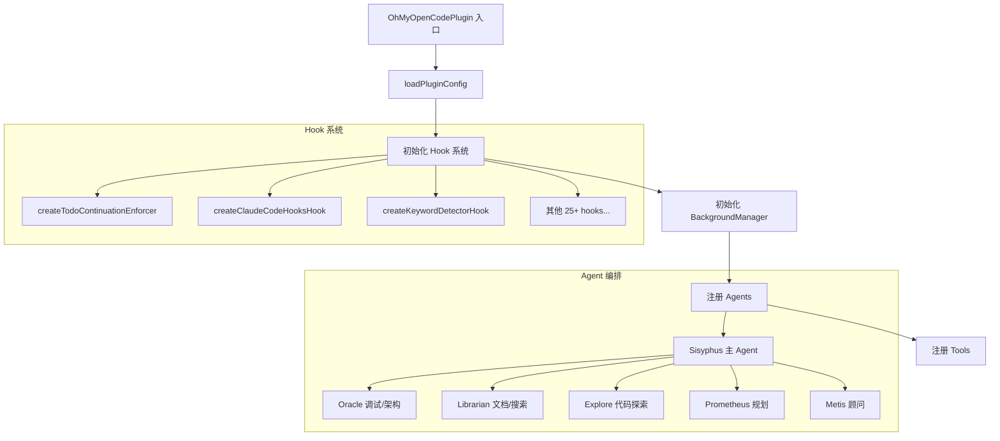

## 关键文件与函数

| 文件 | 类/函数 | 作用 |
|------|---------|------|
| [oh-my-opencode/src/index.ts](../../../oh-my-opencode/src/index.ts) | `OhMyOpenCodePlugin` | 插件主入口，初始化所有 hook 与 agent |
| [oh-my-opencode/src/agents/sisyphus.ts](../../../oh-my-opencode/src/agents/sisyphus.ts) | `createSisyphusAgent`, `buildDynamicSisyphusPrompt` | 主 Agent 定义与动态 Prompt 构建 |
| [oh-my-opencode/src/agents/dynamic-agent-prompt-builder.ts](../../../oh-my-opencode/src/agents/dynamic-agent-prompt-builder.ts) | `buildKeyTriggersSection`, `buildDelegationTable`, `buildToolSelectionTable` | 动态构建 agent prompt 各区块 |
| [oh-my-opencode/src/features/background-agent/manager.ts](../../../oh-my-opencode/src/features/background-agent/manager.ts) | `BackgroundManager.launch`, `BackgroundManager.processKey` | 后台 agent 任务队列与并发管理 |
| [oh-my-opencode/src/features/background-agent/concurrency.ts](../../../oh-my-opencode/src/features/background-agent/concurrency.ts) | `ConcurrencyManager` | 按 provider/model 限制并发数 |
| [oh-my-opencode/src/hooks/todo-continuation-enforcer.ts](../../../oh-my-opencode/src/hooks/todo-continuation-enforcer.ts) | `createTodoContinuationEnforcer` | 强制 agent 完成 TODO 列表 |

## 编排设计要点

### 多 Agent 协作
Sisyphus 为主 agent，根据任务类型调用不同子 agent：
- **Oracle**：调试与架构设计
- **Librarian**：文档查找与开源实现搜索
- **Explore**：代码探索（Contextual Grep）
- **Prometheus**：任务规划
- **Metis**：规划顾问

见 [oh-my-opencode/src/agents/index.ts](../../../oh-my-opencode/src/agents/index.ts)

### 后台并行执行
通过 `BackgroundManager` 管理后台 agent，支持 `run_in_background=true` 并行执行多个探索任务。

关键实现：
- `BackgroundManager.launch()`：创建后台任务，加入队列
- `BackgroundManager.processKey()`：按并发限制处理队列
- `ConcurrencyManager`：按 provider/model 限制并发数

见 [oh-my-opencode/src/features/background-agent/manager.ts](../../../oh-my-opencode/src/features/background-agent/manager.ts)

### Hook 驱动
25+ 可配置 hook，覆盖以下生命周期：
- PreToolUse
- PostToolUse
- UserPromptSubmit
- Stop
- 其他...

见 [oh-my-opencode/src/hooks/index.ts](../../../oh-my-opencode/src/hooks/index.ts)

## Agent 列表

| Agent | 用途 | 源文件 |
|-------|------|--------|
| Sisyphus | 主 Agent，任务编排 | [sisyphus.ts](../../../oh-my-opencode/src/agents/sisyphus.ts) |
| Oracle | 调试/架构 | [oracle.ts](../../../oh-my-opencode/src/agents/oracle.ts) |
| Librarian | 文档/代码搜索 | [librarian.ts](../../../oh-my-opencode/src/agents/librarian.ts) |
| Explore | 快速代码探索 | [explore.ts](../../../oh-my-opencode/src/agents/explore.ts) |
| Prometheus | 规划 | [prometheus-prompt.ts](../../../oh-my-opencode/src/agents/prometheus-prompt.ts) |
| Metis | 规划顾问 | [metis.ts](../../../oh-my-opencode/src/agents/metis.ts) |
| Atlas | 任务编排 | [atlas.ts](../../../oh-my-opencode/src/agents/atlas.ts) |
| Multimodal Looker | 多模态查看 | [multimodal-looker.ts](../../../oh-my-opencode/src/agents/multimodal-looker.ts) |
| Momus | 计划审查 | [momus.ts](../../../oh-my-opencode/src/agents/momus.ts) |
| Sisyphus-Junior | 聚焦执行 | [sisyphus-junior.ts](../../../oh-my-opencode/src/agents/sisyphus-junior.ts) |

---

## Agent 实现原理详解

### Agent 类型与模式

Oh-My-OpenCode 的 Agent 分为两种模式：

| 模式 | 描述 | 代表 Agent |
|------|------|------------|
| `primary` | 主 Agent，遵循用户 UI 选择的模型 | Sisyphus, Atlas |
| `subagent` | 子 Agent，使用自己的 fallback chain | Oracle, Explore, Librarian, Metis, Momus |

### Agent 分类体系

```typescript
type AgentCategory = "exploration" | "specialist" | "advisor" | "utility"
type AgentCost = "FREE" | "CHEAP" | "EXPENSIVE"
```

| 分类 | 描述 | 成本 |
|------|------|------|
| exploration | 代码探索、信息检索 | FREE/CHEAP |
| specialist | 专业领域处理 | CHEAP |
| advisor | 架构咨询、决策支持 | EXPENSIVE |
| utility | 通用工具类 | CHEAP |

---

### 1. Sisyphus - 主编排 Agent

**命名来源**: 希腊神话中不断推石上山的西西弗斯，象征持续不懈的工作。

**核心定位**: 主 Agent，负责任务编排与分发。

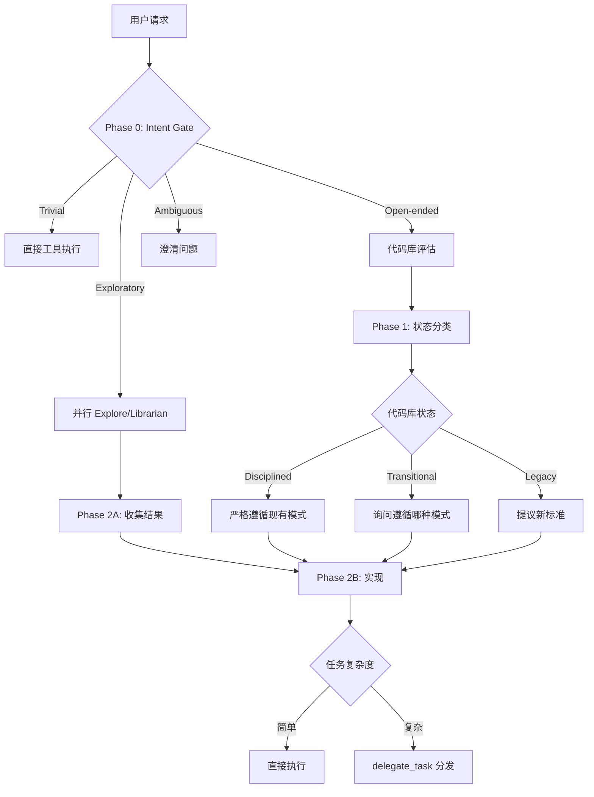

**核心机制**:

1. **Intent Gate (Phase 0)** - 请求分类
   - Trivial: 单文件、已知位置 → 直接工具
   - Explicit: 明确文件/行号 → 直接执行
   - Exploratory: "X 如何工作？" → 并行 Explore
   - Open-ended: "改进"/"重构" → 先评估代码库
   - Ambiguous: 不明确 → 澄清问题

2. **Codebase Assessment (Phase 1)** - 代码库评估
   - Disciplined: 一致模式、配置完整、有测试
   - Transitional: 混合模式、部分结构
   - Legacy/Chaotic: 无一致性、过时模式
   - Greenfield: 新项目

3. **Delegation Check** - 分发决策
   ```typescript
   // 默认偏向: 分发
   if (hasSpecializedAgent) delegate()
   else if (hasCategoryMatch) delegate_task(category, load_skills)
   else workDirectly() // 仅当超级简单时
   ```

**关键配置**:
```typescript
{
  mode: "primary",
  temperature: 0.1,
  thinking: { type: "enabled", budgetTokens: 32000 }
}
```

---

### 2. Atlas - 主编排器 Agent

**命名来源**: 希腊神话中扛起天穹的阿特拉斯，象征支撑整个工作流。

**核心定位**: 任务计划执行器，通过 `delegate_task()` 协调所有工作。

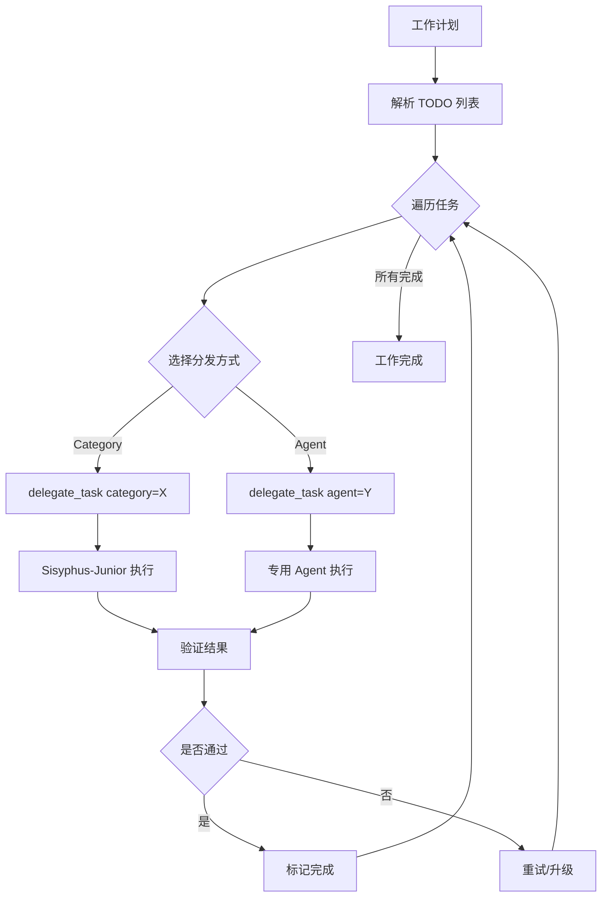

**核心原则**:
- **指挥家而非演奏家**: 从不直接写代码
- **一次一任务**: 每次分发仅处理一个任务
- **独立并行**: 无依赖的任务可并行执行
- **全程验证**: 验证每个任务结果

**分发决策矩阵**:

| 任务领域 | 分发方式 |
|----------|----------|
| 视觉工程 | `category="visual-engineering"` |
| 深度思考 | `category="ultrabrain"` |
| 快速任务 | `category="quick"` |
| 调试问题 | `agent="oracle"` |
| 文档搜索 | `agent="librarian"` |

**Skill 加载**:
```typescript
delegate_task(
  category="visual-engineering",
  load_skills=["react-patterns", "css-best-practices"],
  prompt="实现响应式导航栏..."
)
```

---

### 3. Oracle - 战略顾问 Agent

**命名来源**: 德尔斐神谕，提供智慧指引。

**核心定位**: 只读咨询 Agent，用于复杂架构和调试难题。

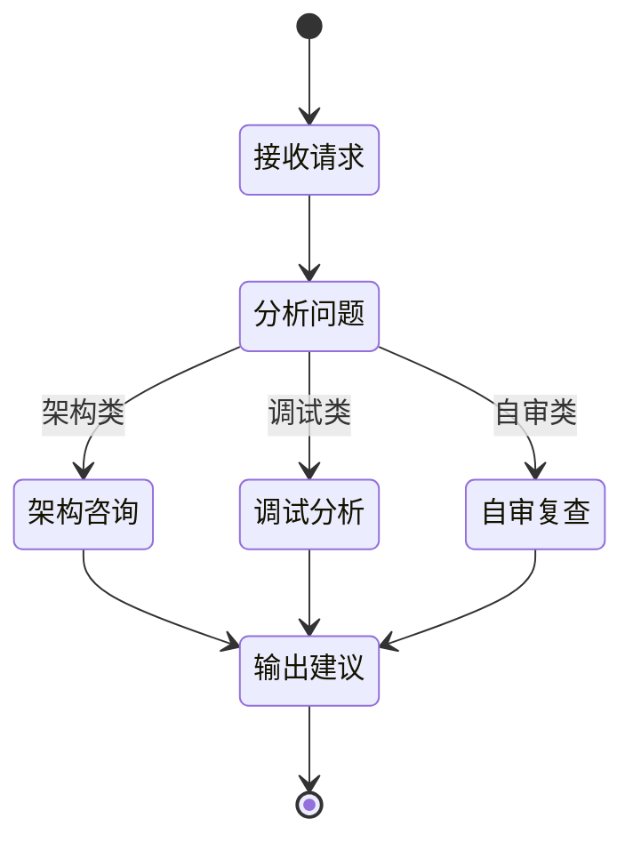

**使用时机**:
| 场景 | 触发条件 |
|------|----------|
| 架构决策 | 多系统权衡、陌生模式 |
| 自审 | 完成重大实现后 |
| 困难调试 | 2+ 次修复失败 |

**避免使用**:
- 简单文件操作
- 首次修复尝试
- 从代码可推断的问题
- 琐碎决策（变量命名、格式化）

**决策框架**:
```
务实极简主义:
1. 偏向简单: 满足实际需求的最简方案
2. 利用现有: 优先修改现有代码而非引入新组件
3. 开发体验: 可读性 > 理论性能
4. 单一路径: 给出一个主要建议
5. 深度匹配: 简单问题简单答
```

**输出结构**:
```
Essential:
- 结论 (2-3 句)
- 行动计划 (步骤/清单)
- 工作量估计 (Quick/Short/Medium/Large)

Expanded (相关时):
- 原因分析
- 风险警示

Edge cases (必要时):
- 升级触发条件
- 备选方案概述
```

**关键配置**:
```typescript
{
  mode: "subagent",
  temperature: 0.1,
  thinking: { type: "enabled", budgetTokens: 32000 },
  // 工具限制: 禁止 write, edit, task, delegate_task
}
```

---

### 4. Librarian - 外部知识搜索 Agent

**命名来源**: 图书管理员，检索外部知识与开源实现。

**核心定位**: 多仓库分析、官方文档检索、开源示例查找。

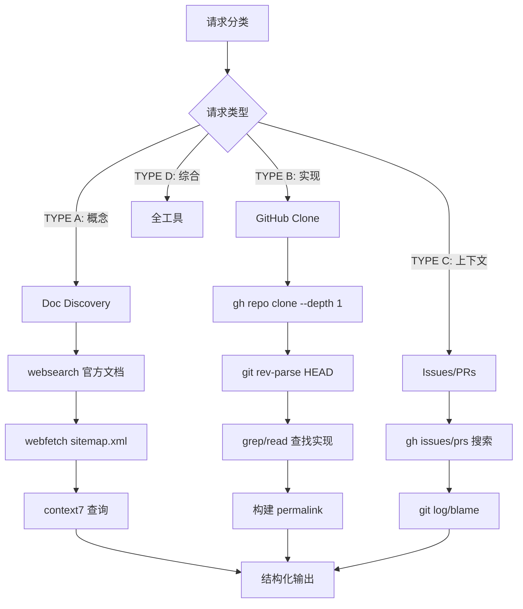

**请求分类**:

| 类型 | 触发示例 | 工具链 |
|------|----------|--------|
| **TYPE A: 概念** | "如何使用 X?" | Doc Discovery → context7 + websearch |
| **TYPE B: 实现** | "X 如何实现 Y?" | gh clone + read + blame |
| **TYPE C: 上下文** | "为什么这样改?" | gh issues/prs + git log |
| **TYPE D: 综合** | 复杂/模糊请求 | 全部工具 |

**Doc Discovery 流程**:
1. `websearch("library-name official documentation")` - 查找官方文档
2. `webfetch(docs_url + "/sitemap.xml")` - 获取文档结构
3. `context7_query-docs(libraryId, topic)` - 精确查询

**关键配置**:
```typescript
{
  mode: "subagent",
  temperature: 0.1,
  // 工具限制: 禁止 write, edit, task, delegate_task, call_omo_agent
}
```

---

### 5. Explore - 代码探索 Agent

**命名来源**: 探索者，快速定位代码。

**核心定位**: 代码库搜索专家，回答 "在哪里"/"哪个文件" 类问题。

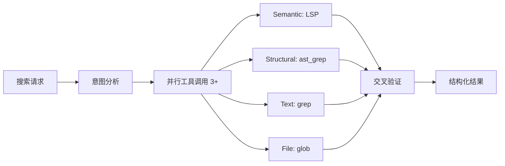

**必须交付**:

1. **意图分析** (Required)
   ```
   <analysis>
   **Literal Request**: [字面请求]
   **Actual Need**: [实际需求]
   **Success Looks Like**: [成功标准]
   </analysis>
   ```

2. **并行执行** - 首次动作启动 3+ 工具

3. **结构化结果**
   ```
   <results>
   <files>
   - /absolute/path/file.ts — [相关性说明]
   </files>
   <answer>[直接回答]</answer>
   <next_steps>[后续步骤]</next_steps>
   </results>
   ```

**工具选择策略**:

| 目标 | 工具 |
|------|------|
| 定义/引用 | LSP 工具 |
| 结构模式 | ast_grep_search |
| 文本模式 | grep |
| 文件名 | glob |
| 历史 | git 命令 |

**关键配置**:
```typescript
{
  mode: "subagent",
  temperature: 0.1,
  cost: "FREE",
  // 只读: 不能创建、修改、删除文件
}
```

---

### 6. Prometheus - 规划 Agent

**命名来源**: 普罗米修斯，为人类带来火种（知识/远见）。

**核心定位**: 战略规划顾问，创建工作计划但**绝不执行**。

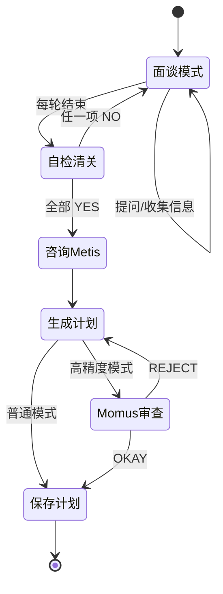

**核心约束**:

| 你是 | 你不是 |
|------|--------|
| 战略顾问 | 代码编写者 |
| 需求收集者 | 任务执行者 |
| 计划设计师 | 实现代理 |

**自检清关清单**:
```
□ 核心目标明确?
□ 范围边界确立?
□ 无关键歧义?
□ 技术方案决定?
□ 测试策略确认?
□ 无阻塞问题?
→ 全部 YES? 进入计划生成
→ 任一 NO? 继续面谈
```

**输出位置**:
- 计划: `.sisyphus/plans/{plan-name}.md`
- 草稿: `.sisyphus/drafts/{name}.md`

**单计划原则**: 无论任务多大，所有内容放入**一个工作计划**。

---

### 7. Metis - 预规划顾问 Agent

**命名来源**: 希腊智慧女神墨提斯，掌管深思熟虑。

**核心定位**: 在规划前分析用户请求，预防 AI 失败。

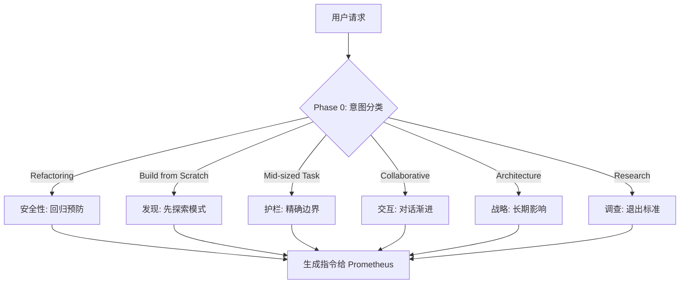

**意图类型分析**:

| 意图 | 信号 | 主要关注 |
|------|------|----------|
| Refactoring | "重构"、"清理" | 安全: 行为保留 |
| Build from Scratch | "创建新"、"添加功能" | 发现: 先探索模式 |
| Mid-sized Task | 有限范围功能 | 护栏: 精确交付物 |
| Collaborative | "帮我规划"、"讨论" | 交互: 渐进清晰 |
| Architecture | "如何构建"、系统设计 | 战略: Oracle 推荐 |
| Research | 需要调查、目标明确路径不明 | 调查: 并行探针 |

**AI-Slop 模式检测**:

| 模式 | 示例 | 询问 |
|------|------|------|
| 范围膨胀 | "顺便也测试相邻模块" | "需要超出 [目标] 范围吗?" |
| 过早抽象 | "提取到工具类" | "要抽象还是内联?" |
| 过度验证 | "3 个输入 15 个错误检查" | "错误处理: 最小 or 全面?" |
| 文档膨胀 | "到处加 JSDoc" | "文档: 无/最小/完整?" |

---

### 8. Momus - 计划审查 Agent

**命名来源**: 希腊讽刺与批评之神莫姆斯，以挑剔著称。

**核心定位**: 务实的工作计划审查者，验证可执行性。

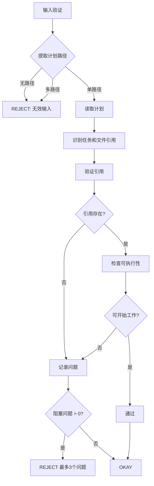

**审查原则**:
- **默认批准**: 疑虑时，批准。80% 清晰就足够好。
- **只检查阻塞问题**: 开发者可以解决小问题。

**检查项**:

| 检查 | 通过条件 | 失败条件 |
|------|----------|----------|
| 引用验证 | 文件存在且相关 | 引用不存在或完全错误 |
| 可执行性 | 每个任务有起点 | 完全不知从哪开始 |
| 阻塞检测 | 无阻塞信息缺失 | 工作完全无法进行 |

**不检查** (不因此拒绝):
- 方案是否最优
- 边缘情况是否完备
- 验收标准是否完美
- 架构是否理想

---

### 9. Multimodal-Looker - 多模态分析 Agent

**命名来源**: 多模态观察者，处理非文本文件。

**核心定位**: 分析媒体文件（PDF、图片、图表）。

**使用场景**:

| 使用 | 不使用 |
|------|--------|
| Read 工具无法解释的媒体文件 | 源代码或纯文本 |
| 从文档提取特定信息 | 需要后续编辑的文件 |
| 描述图像/图表中的视觉内容 | 不需要解释的简单文件读取 |

**处理能力**:
- **PDF**: 提取文本、结构、表格、特定章节数据
- **图片**: 描述布局、UI 元素、文本、图表
- **图表**: 解释关系、流程、架构

**关键配置**:
```typescript
{
  mode: "subagent",
  temperature: 0.1,
  // 工具白名单: 仅 read
}
```

---

### 10. Sisyphus-Junior - 聚焦执行 Agent

**命名来源**: 小西西弗斯，专注执行的子代理。

**核心定位**: 聚焦的任务执行者，由 `delegate_task(category=...)` 生成。

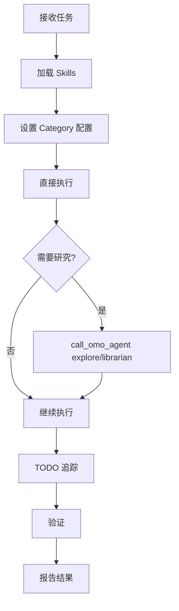

**核心约束**:

| 允许 | 禁止 |
|------|------|
| `call_omo_agent` (spawns explore/librarian) | `task` |
| 所有实现工具 | `delegate_task` |
| TODO 管理 | 进一步分发 |

**TODO 纪律**:
```
2+ 步骤 → todowrite 原子分解
开始前 → 标记 in_progress (一次一个)
完成后 → 立即标记 completed
多步工作无 TODO = 不完整工作
```

**验证要求**:
- `lsp_diagnostics` 清理已修改文件
- 构建通过 (如适用)
- 所有 TODO 标记完成

**关键配置**:
```typescript
{
  mode: "subagent",
  temperature: 由 category 配置决定 (0.1 - 0.9),
  maxTokens: 64000,
  thinking: { type: "enabled", budgetTokens: 32000 }
}
```

---

## Agent 协作架构

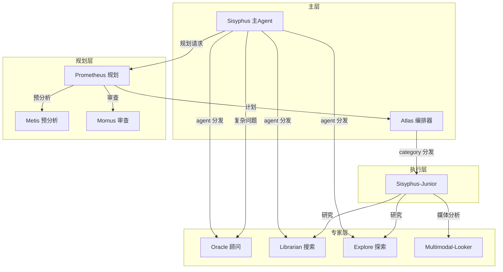

---

## 权限与工具限制

| Agent | 禁用工具 | 原因 |
|-------|----------|------|
| Oracle | write, edit, task, delegate_task | 只读顾问 |
| Librarian | write, edit, task, delegate_task, call_omo_agent | 纯搜索 |
| Explore | write, edit, task, delegate_task, call_omo_agent | 纯探索 |
| Prometheus | 非 .md 文件写入 (Hook 强制) | 仅输出计划 |
| Momus | write, edit, task, delegate_task | 只读审查 |
| Sisyphus-Junior | task, delegate_task | 禁止再分发 |
| Multimodal-Looker | 仅允许 read | 纯分析 |

---

## 核心代码解读

### 1. Agent 创建工厂模式

所有 Agent 都通过工厂函数创建，返回 `AgentConfig` 对象：

```typescript
// oh-my-opencode/src/agents/sisyphus.ts

export function createSisyphusAgent(
  model: string,
  availableAgents?: AvailableAgent[],
  availableToolNames?: string[],
  availableSkills?: AvailableSkill[],
  availableCategories?: AvailableCategory[]
): AgentConfig {
  // 动态构建工具分类
  const tools = availableToolNames ? categorizeTools(availableToolNames) : []
  const skills = availableSkills ?? []
  const categories = availableCategories ?? []
  
  // 动态构建 Prompt（核心！包含所有可用 Agent、工具、技能信息）
  const prompt = buildDynamicSisyphusPrompt(availableAgents, tools, skills, categories)

  // 权限配置：允许提问，禁止直接调用 omo_agent
  const permission = { question: "allow", call_omo_agent: "deny" }
  
  const base = {
    description: "Powerful AI orchestrator...",
    mode: MODE,          // "primary" - 遵循用户选择的模型
    model,
    maxTokens: 64000,
    prompt,
    color: "#00CED1",
    permission,
  }

  // GPT 模型使用 reasoningEffort，其他使用 thinking
  if (isGptModel(model)) {
    return { ...base, reasoningEffort: "medium" }
  }
  return { ...base, thinking: { type: "enabled", budgetTokens: 32000 } }
}

// 静态属性用于预实例化时访问模式
createSisyphusAgent.mode = MODE
```

**设计要点**:
- 工厂函数接收动态参数（可用 Agent、工具、技能）
- Prompt 是动态生成的，包含当前环境的完整信息
- 支持不同模型类型的配置差异（GPT vs Claude）

---

### 2. 动态 Prompt 构建器

Prompt 按模块化方式构建，每个 Agent 的元数据决定其在 Prompt 中的呈现：

```typescript
// oh-my-opencode/src/agents/dynamic-agent-prompt-builder.ts

// Agent 元数据接口
export interface AvailableAgent {
  name: BuiltinAgentName
  description: string
  metadata: AgentPromptMetadata  // 包含 triggers、useWhen、avoidWhen 等
}

// 工具自动分类
export function categorizeTools(toolNames: string[]): AvailableTool[] {
  return toolNames.map((name) => {
    let category: "lsp" | "ast" | "search" | "session" | "command" | "other" = "other"
    if (name.startsWith("lsp_")) category = "lsp"
    else if (name.startsWith("ast_grep")) category = "ast"
    else if (name === "grep" || name === "glob") category = "search"
    // ...
    return { name, category }
  })
}

// 构建关键触发器区块
export function buildKeyTriggersSection(agents: AvailableAgent[]): string {
  const keyTriggers = agents
    .filter((a) => a.metadata.keyTrigger)  // 只包含有 keyTrigger 的 Agent
    .map((a) => `- ${a.metadata.keyTrigger}`)

  return `### Key Triggers (check BEFORE classification):
${keyTriggers.join("\n")}
- **"Look into" + "create PR"** → Not just research. Full implementation cycle expected.`
}

// 构建工具与 Agent 选择表
export function buildToolSelectionTable(agents: AvailableAgent[], tools: AvailableTool[]): string {
  const rows = ["| Resource | Cost | When to Use |", "|----------|------|-------------|"]
  
  // 先列出免费工具
  if (tools.length > 0) {
    rows.push(`| ${formatToolsForPrompt(tools)} | FREE | Not Complex, Scope Clear |`)
  }
  
  // 按成本排序列出 Agent
  const sortedAgents = [...agents]
    .filter((a) => a.metadata.category !== "utility")
    .sort((a, b) => costOrder[a.metadata.cost] - costOrder[b.metadata.cost])

  for (const agent of sortedAgents) {
    rows.push(`| \`${agent.name}\` | ${agent.metadata.cost} | ${agent.description} |`)
  }
  
  return rows.join("\n")
}
```

**设计要点**:
- Prompt 的每个区块都是独立函数生成
- Agent 元数据驱动 Prompt 内容（无需手动更新 Prompt）
- 工具自动按前缀分类

---

### 3. delegate_task 工具核心实现

这是 Agent 分发的核心工具，处理 Category 解析、Skill 加载、Session 继续等：

```typescript
// oh-my-opencode/src/tools/delegate-task/tools.ts

export function createDelegateTask(options: DelegateTaskToolOptions): ToolDefinition {
  return tool({
    description: `Spawn agent task with category-based or direct agent selection...`,
    args: {
      load_skills: schema.array(schema.string()).describe("Skill names to inject. REQUIRED"),
      description: schema.string().describe("Short task description"),
      prompt: schema.string().describe("Full detailed prompt"),
      run_in_background: schema.boolean().describe("true=async, false=sync"),
      category: schema.string().optional().describe("Category name"),
      subagent_type: schema.string().optional().describe("Agent name"),
      session_id: schema.string().optional().describe("Existing session to continue"),
    },
    
    async execute(args: DelegateTaskArgs, toolContext) {
      // 1. 验证参数
      if (args.run_in_background === undefined) {
        throw new Error("'run_in_background' parameter is REQUIRED")
      }
      
      // 2. 加载 Skills
      let skillContent: string | undefined
      if (args.load_skills.length > 0) {
        const { resolved, notFound } = await resolveMultipleSkillsAsync(args.load_skills)
        if (notFound.length > 0) {
          return `Skills not found: ${notFound.join(", ")}`
        }
        skillContent = Array.from(resolved.values()).join("\n\n")
      }

      // 3. 获取父会话信息（用于模型继承等）
      const parentModel = prevMessage?.model
      const parentAgent = ctx.agent ?? sessionAgent ?? firstMessageAgent

      // 4. Session 继续模式
      if (args.session_id) {
        if (runInBackground) {
          // 后台恢复
          const task = await manager.resume({ sessionId: args.session_id, prompt: args.prompt })
          return `Background task continued. Session ID: ${task.sessionID}`
        }
        
        // 同步恢复：直接发送 prompt 到已有 session
        await client.session.prompt({
          path: { id: args.session_id },
          body: {
            agent: resumeAgent,
            model: resumeModel,
            tools: { task: false, delegate_task: false },  // 阻止再分发
            parts: [{ type: "text", text: args.prompt }],
          },
        })
        
        // 等待消息稳定，返回最终结果
        return `Task continued. Session ID: ${args.session_id}\n${textContent}`
      }
      
      // 5. 新任务：解析 Category 配置
      // ...后续处理...
    },
  })
}
```

**Session 继续的关键**:
```typescript
// Session ID 复用机制
if (args.session_id) {
  // 恢复已有 Session，子 Agent 拥有完整对话上下文
  // 节省 70%+ tokens（无需重复读取文件、探索）
  await client.session.prompt({
    path: { id: args.session_id },
    body: { parts: [{ type: "text", text: args.prompt }] },
  })
}
```

---

### 4. Category 解析与模型选择

Category 系统为不同任务类型配置最优模型：

```typescript
// oh-my-opencode/src/tools/delegate-task/constants.ts

// 默认 Category 配置
export const DEFAULT_CATEGORIES: Record<string, CategoryConfig> = {
  "visual-engineering": { model: "google/gemini-3-pro" },           // 视觉任务用 Gemini
  ultrabrain: { model: "openai/gpt-5.2-codex", variant: "xhigh" },  // 深度推理用 GPT-5
  deep: { model: "openai/gpt-5.2-codex", variant: "medium" },       // 自主问题解决
  artistry: { model: "google/gemini-3-pro", variant: "max" },       // 创意任务
  quick: { model: "anthropic/claude-haiku-4-5" },                   // 快速任务用小模型
  "unspecified-low": { model: "anthropic/claude-sonnet-4-5" },      // 中等复杂度
  "unspecified-high": { model: "anthropic/claude-opus-4-5", variant: "max" },  // 高复杂度
  writing: { model: "google/gemini-3-flash" },                      // 写作任务
}

// 每个 Category 的 Prompt 附加内容
export const CATEGORY_PROMPT_APPENDS: Record<string, string> = {
  "visual-engineering": `<Category_Context>
You are working on VISUAL/UI tasks.
Design-first mindset: Bold aesthetic choices, unexpected layouts...
</Category_Context>`,

  ultrabrain: `<Category_Context>
You are working on DEEP LOGICAL REASONING tasks.
BEFORE writing ANY code, SEARCH the existing codebase...
</Category_Context>`,

  quick: `<Category_Context>
You are working on SMALL / QUICK tasks.
</Category_Context>

<Caller_Warning>
THIS CATEGORY USES A LESS CAPABLE MODEL (claude-haiku-4-5).
Your prompt MUST be EXHAUSTIVELY EXPLICIT...
</Caller_Warning>`,
  // ...
}
```

**Category 解析流程**:
```typescript
// oh-my-opencode/src/tools/delegate-task/tools.ts

export function resolveCategoryConfig(
  categoryName: string,
  options: { userCategories?, inheritedModel?, systemDefaultModel?, availableModels? }
): { config: CategoryConfig; promptAppend: string; model: string } | null {
  
  // 1. 检查模型可用性
  const categoryReq = CATEGORY_MODEL_REQUIREMENTS[categoryName]
  if (categoryReq?.requiresModel && availableModels) {
    if (!isModelAvailable(categoryReq.requiresModel, availableModels)) {
      return null  // 模型不可用，拒绝此 Category
    }
  }

  // 2. 合并用户覆盖与默认配置
  const defaultConfig = DEFAULT_CATEGORIES[categoryName]
  const userConfig = userCategories?.[categoryName]
  
  // 3. 模型优先级: 用户覆盖 > Category 默认 > 系统默认
  const model = resolveModel({
    userModel: userConfig?.model,
    inheritedModel: defaultConfig?.model,
    systemDefault: systemDefaultModel,
  })

  // 4. 合并 Prompt 附加内容
  let promptAppend = CATEGORY_PROMPT_APPENDS[categoryName] ?? ""
  if (userConfig?.prompt_append) {
    promptAppend = promptAppend + "\n\n" + userConfig.prompt_append
  }

  return { config, promptAppend, model }
}
```

---

### 5. BackgroundManager 后台任务管理

后台任务通过队列和并发控制实现：

```typescript
// oh-my-opencode/src/features/background-agent/manager.ts

export class BackgroundManager {
  private tasks: Map<string, BackgroundTask>
  private queuesByKey: Map<string, QueueItem[]> = new Map()
  private processingKeys: Set<string> = new Set()
  private concurrencyManager: ConcurrencyManager

  async launch(input: LaunchInput): Promise<BackgroundTask> {
    // 1. 创建任务（状态 = pending）
    const task: BackgroundTask = {
      id: `bg_${crypto.randomUUID().slice(0, 8)}`,
      status: "pending",
      queuedAt: new Date(),
      description: input.description,
      prompt: input.prompt,
      agent: input.agent,
      parentSessionID: input.parentSessionID,
      model: input.model,
    }
    this.tasks.set(task.id, task)

    // 2. 加入队列（按 provider/model 分组）
    const key = this.getConcurrencyKeyFromInput(input)
    const queue = this.queuesByKey.get(key) ?? []
    queue.push({ task, input })
    this.queuesByKey.set(key, queue)

    // 3. 触发处理（fire-and-forget）
    this.processKey(key)

    return task
  }

  private async processKey(key: string): Promise<void> {
    if (this.processingKeys.has(key)) return  // 已在处理中
    this.processingKeys.add(key)

    try {
      const queue = this.queuesByKey.get(key)
      while (queue && queue.length > 0) {
        const item = queue[0]

        // 等待并发槽位
        await this.concurrencyManager.acquire(key)

        if (item.task.status === "cancelled") {
          this.concurrencyManager.release(key)
          queue.shift()
          continue
        }

        try {
          await this.startTask(item)  // 启动任务
        } catch (error) {
          log("[background-agent] Error starting task:", error)
        }

        queue.shift()
      }
    } finally {
      this.processingKeys.delete(key)
    }
  }

  private async startTask(item: QueueItem): Promise<void> {
    const { task, input } = item

    // 1. 创建子 Session
    const createResult = await this.client.session.create({
      body: {
        parentID: input.parentSessionID,
        title: `Background: ${input.description}`,
        permission: [{ permission: "question", action: "deny", pattern: "*" }],
      },
    })

    const sessionID = createResult.data.id
    subagentSessions.add(sessionID)  // 标记为子 Agent Session

    // 2. 更新任务状态
    task.status = "running"
    task.startedAt = new Date()
    task.sessionID = sessionID

    // 3. 发送 Prompt（fire-and-forget）
    // ...
  }
}
```

**并发控制**:
```typescript
// oh-my-opencode/src/features/background-agent/concurrency.ts

export class ConcurrencyManager {
  // 按 provider/model 限制并发数
  // 例如：anthropic/claude-sonnet 最多 3 个并行任务
  
  async acquire(key: string): Promise<void> {
    // 等待直到有可用槽位
  }
  
  release(key: string): void {
    // 释放槽位
  }
}
```

---

### 6. Atlas 编排器 Prompt 结构

Atlas 的 Prompt 是高度结构化的，包含完整的分发协议：

```typescript
// oh-my-opencode/src/agents/atlas.ts

export const ATLAS_SYSTEM_PROMPT = `
<identity>
You are Atlas - the Master Orchestrator.
You DELEGATE, COORDINATE, and VERIFY. You never write code yourself.
</identity>

<delegation_system>
## 6-Section Prompt Structure (MANDATORY)

Every delegate_task() prompt MUST include ALL 6 sections:

## 1. TASK
[Quote EXACT checkbox item. Be obsessively specific.]

## 2. EXPECTED OUTCOME
- [ ] Files created/modified: [exact paths]
- [ ] Verification: \`[command]\` passes

## 3. REQUIRED TOOLS
- [tool]: [what to search/check]

## 4. MUST DO
- Follow pattern in [reference file:lines]

## 5. MUST NOT DO
- Do NOT modify files outside [scope]

## 6. CONTEXT
### Inherited Wisdom
[From notepad - conventions, gotchas, decisions]
</delegation_system>

<verification_rules>
## QA Protocol

After each delegation:
1. lsp_diagnostics at PROJECT level
2. Run build command
3. Run test suite
4. Read changed files manually
5. Confirm requirements met
</verification_rules>

<critical_overrides>
**NEVER**: Write/edit code yourself - always delegate
**ALWAYS**: 
- Store session_id from every delegation output
- Use session_id for retries, fixes, and follow-ups
</critical_overrides>
`

function buildDynamicOrchestratorPrompt(ctx?: OrchestratorContext): string {
  // 动态插入 Category、Agent、Skill 信息
  return ATLAS_SYSTEM_PROMPT
    .replace("{CATEGORY_SECTION}", buildCategorySection())
    .replace("{AGENT_SECTION}", buildAgentSelectionSection())
    .replace("{SKILLS_SECTION}", buildSkillsSection())
}
```

---

### 7. Oracle Agent 只读约束实现

Oracle 通过工具限制实现只读：

```typescript
// oh-my-opencode/src/agents/oracle.ts

export function createOracleAgent(model: string): AgentConfig {
  // 创建工具限制：禁用写入相关工具
  const restrictions = createAgentToolRestrictions([
    "write",         // 禁止写入文件
    "edit",          // 禁止编辑文件
    "task",          // 禁止创建任务
    "delegate_task", // 禁止分发任务
  ])

  return {
    description: "Read-only consultation agent. High-IQ reasoning specialist...",
    mode: "subagent",  // 使用自己的 fallback chain
    model,
    temperature: 0.1,
    ...restrictions,   // 应用工具限制
    prompt: ORACLE_SYSTEM_PROMPT,
  }
}

// oh-my-opencode/src/shared/permission-compat.ts

export function createAgentToolRestrictions(blockedTools: string[]) {
  const permission: Record<string, "deny"> = {}
  for (const tool of blockedTools) {
    permission[tool] = "deny"
  }
  return { permission }
}
```

---

### 8. Librarian 请求分类与执行

Librarian 通过 TYPE 分类决定执行策略：

```typescript
// oh-my-opencode/src/agents/librarian.ts (Prompt 片段)

`## PHASE 0: REQUEST CLASSIFICATION (MANDATORY FIRST STEP)

| Type | Trigger Examples | Tools |
|------|------------------|-------|
| **TYPE A: CONCEPTUAL** | "How do I use X?" | Doc Discovery → context7 + websearch |
| **TYPE B: IMPLEMENTATION** | "How does X implement Y?" | gh clone + read + blame |
| **TYPE C: CONTEXT** | "Why was this changed?" | gh issues/prs + git log |
| **TYPE D: COMPREHENSIVE** | Complex/ambiguous | ALL tools |

## PHASE 0.5: DOCUMENTATION DISCOVERY

### Step 1: Find Official Documentation
websearch("library-name official documentation site")

### Step 2: Version Check
websearch("library-name v{version} documentation")

### Step 3: Sitemap Discovery
webfetch(official_docs_base_url + "/sitemap.xml")

### Step 4: Targeted Investigation
webfetch(specific_doc_page_from_sitemap)
context7_query-docs(libraryId: id, query: "specific topic")
`
```

**工具链执行**:
```
TYPE A (概念问题):
  1. websearch → 找到官方文档
  2. webfetch(sitemap.xml) → 理解文档结构
  3. context7_query-docs → 精确查询

TYPE B (实现查找):
  1. gh repo clone --depth 1 → 克隆到临时目录
  2. git rev-parse HEAD → 获取 commit SHA
  3. grep/read → 查找实现
  4. 构建 permalink → 带行号的 GitHub 链接

TYPE C (上下文):
  1. gh search issues/prs → 查找相关讨论
  2. git log/blame → 查看历史
```

---

### 9. Skill 加载机制

Skill 是注入到子 Agent Prompt 中的专业指令：

```typescript
// oh-my-opencode/src/features/opencode-skill-loader/skill-content.ts

export async function resolveMultipleSkillsAsync(
  skillNames: string[],
  options?: { gitMasterConfig?, browserProvider? }
): Promise<{ resolved: Map<string, string>; notFound: string[] }> {
  const resolved = new Map<string, string>()
  const notFound: string[] = []

  for (const name of skillNames) {
    const content = await loadSkillContent(name, options)
    if (content) {
      resolved.set(name, content)
    } else {
      notFound.push(name)
    }
  }

  return { resolved, notFound }
}

// Skill 内容被拼接到系统 Prompt 开头
export function buildSystemContent(input: BuildSystemContentInput): string {
  const parts: string[] = []

  if (input.skillContent) {
    parts.push(input.skillContent)  // Skill 内容
  }

  if (input.categoryPromptAppend) {
    parts.push(input.categoryPromptAppend)  // Category 附加内容
  }

  return parts.join("\n\n")
}
```

**Skill 文件示例** (`.opencode/skill/playwright.md`):
```markdown
# Playwright Testing Skill

## Browser Automation Best Practices

1. Always use page.waitForSelector() before interactions
2. Prefer data-testid attributes for element selection
3. Use page.screenshot() for visual regression testing
...
```

---

### 10. Agent 元数据驱动设计

每个 Agent 的元数据决定其在系统中的行为：

```typescript
// oh-my-opencode/src/agents/types.ts

export interface AgentPromptMetadata {
  category: "exploration" | "specialist" | "advisor" | "utility"
  cost: "FREE" | "CHEAP" | "EXPENSIVE"
  promptAlias?: string  // Prompt 中显示的名称
  
  // 关键触发器（出现在 Phase 0）
  keyTrigger?: string  // e.g., "External library mentioned → fire librarian"
  
  // 分发触发器（出现在 Delegation Table）
  triggers: {
    domain: string   // e.g., "Architecture decisions"
    trigger: string  // e.g., "Multi-system tradeoffs"
  }[]
  
  // 使用/避免场景
  useWhen?: string[]
  avoidWhen?: string[]
}

// 示例：Oracle Agent 元数据
export const ORACLE_PROMPT_METADATA: AgentPromptMetadata = {
  category: "advisor",
  cost: "EXPENSIVE",
  promptAlias: "Oracle",
  triggers: [
    { domain: "Architecture decisions", trigger: "Multi-system tradeoffs" },
    { domain: "Self-review", trigger: "After completing significant implementation" },
    { domain: "Hard debugging", trigger: "After 2+ failed fix attempts" },
  ],
  useWhen: [
    "Complex architecture design",
    "2+ failed fix attempts",
    "Security/performance concerns",
  ],
  avoidWhen: [
    "Simple file operations",
    "First attempt at any fix",
    "Trivial decisions",
  ],
}
```

**元数据如何驱动 Prompt 生成**:
```typescript
// 动态生成分发表
export function buildDelegationTable(agents: AvailableAgent[]): string {
  const rows = ["| Domain | Delegate To | Trigger |", "|--------|-------------|---------|"]

  for (const agent of agents) {
    for (const trigger of agent.metadata.triggers) {
      rows.push(`| ${trigger.domain} | \`${agent.name}\` | ${trigger.trigger} |`)
    }
  }

  return rows.join("\n")
}
// 输出:
// | Domain | Delegate To | Trigger |
// |--------|-------------|---------|
// | Architecture decisions | `oracle` | Multi-system tradeoffs |
// | Self-review | `oracle` | After completing significant implementation |
// ...
```
