# OpenCode 详细分析原理

## 概述

OpenCode 是一个基于 TypeScript/Bun 的 AI 编程助手框架，提供完整的会话管理、Agent 系统、工具注册、权限控制和插件扩展能力。

---

## 1. 核心架构

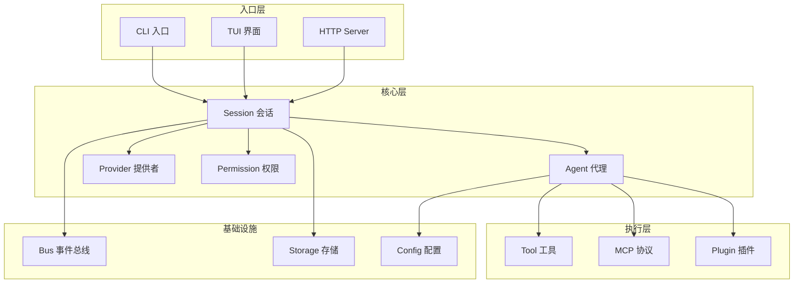

---

## 2. Session 会话系统

### 2.1 会话数据结构

```typescript
// Session.Info 定义
{
  id: string,              // 会话 ID (session_xxx)
  slug: string,            // URL 友好的标识
  projectID: string,       // 项目 ID
  directory: string,       // 工作目录
  parentID?: string,       // 父会话 ID (用于子会话)
  title: string,           // 会话标题
  version: string,         // 版本号
  time: {
    created: number,
    updated: number,
    compacting?: number,   // 压缩时间
    archived?: number,     // 归档时间
  },
  permission?: Ruleset,    // 会话级权限
  summary?: {              // 变更摘要
    additions: number,
    deletions: number,
    files: number,
    diffs: FileDiff[],
  },
  share?: { url: string }, // 分享链接
  revert?: {               // 回滚信息
    messageID: string,
    partID?: string,
    snapshot?: string,
    diff?: string,
  },
}
```

### 2.2 会话生命周期

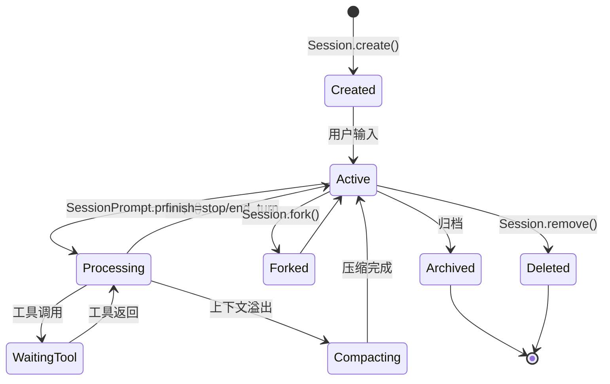

### 2.3 核心操作

| 操作 | 函数 | 描述 |
|------|------|------|
| 创建会话 | `Session.create()` | 创建新会话，可指定父会话 |
| 分叉会话 | `Session.fork()` | 从指定消息点分叉新会话 |
| 触发更新 | `Session.touch()` | 更新会话时间戳 |
| 获取消息 | `Session.messages()` | 获取会话消息列表 |
| 删除会话 | `Session.remove()` | 递归删除会话及子会话 |
| 获取子会话 | `Session.children()` | 获取所有子会话 |

---

## 3. Message 消息系统

### 3.1 消息类型

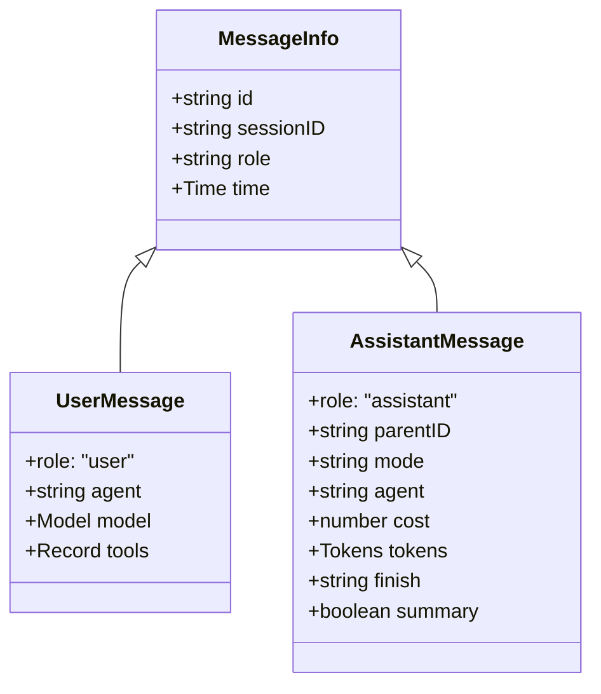

### 3.2 消息部分 (Parts)

```typescript
// 消息可包含多种类型的 Part
type Part = 
  | TextPart        // 文本内容
  | FilePart        // 文件附件
  | AgentPart       // Agent 调用
  | SubtaskPart     // 子任务
  | ToolPart        // 工具调用
  | ReasoningPart   // 推理过程
  | CompactionPart  // 压缩标记
```

### 3.3 工具调用 Part 状态机

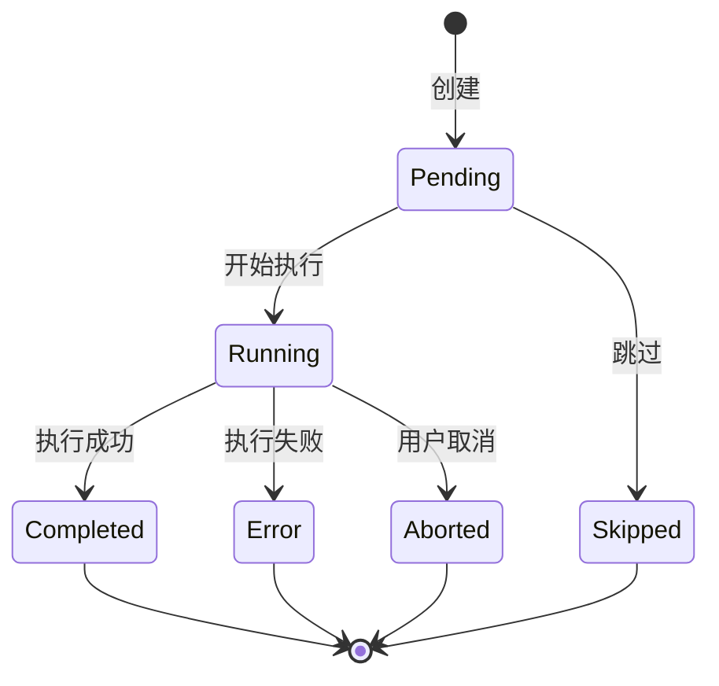

---

## 4. Agent 代理系统

### 4.1 Agent 定义

```typescript
Agent.Info = {
  name: string,                    // Agent 名称
  description?: string,            // 描述
  mode: "subagent" | "primary" | "all",  // 模式
  native: boolean,                 // 是否内置
  hidden?: boolean,                // 是否隐藏
  topP?: number,                   // 采样参数
  temperature?: number,            // 温度参数
  color?: string,                  // UI 颜色
  permission: Ruleset,             // 权限规则
  model?: { modelID, providerID }, // 指定模型
  prompt?: string,                 // 系统提示词
  options: Record<string, any>,    // 额外选项
  steps?: number,                  // 最大步骤数
}
```

### 4.2 内置 Agent

| Agent | 模式 | 描述 |
|-------|------|------|
| **build** | primary | 默认 Agent，执行工具并请求权限 |
| **plan** | primary | 规划模式，禁用编辑工具 |
| **general** | subagent | 通用 Agent，用于并行执行 |
| **explore** | subagent | 代码探索 Agent，只读 |
| **compaction** | primary | 上下文压缩 Agent (隐藏) |
| **title** | primary | 标题生成 Agent (隐藏) |
| **summary** | primary | 摘要生成 Agent (隐藏) |

### 4.3 Agent 权限配置

```typescript
// 默认权限
const defaults = {
  "*": "allow",
  doom_loop: "ask",
  external_directory: {
    "*": "ask",
    [Truncate.DIR]: "allow",
  },
  question: "deny",
  plan_enter: "deny",
  plan_exit: "deny",
  read: {
    "*": "allow",
    "*.env": "ask",
    "*.env.*": "ask",
  },
}

// Plan Agent 特殊权限
plan: {
  question: "allow",
  plan_exit: "allow",
  edit: {
    "*": "deny",
    ".opencode/plans/*.md": "allow",
  },
}

// Explore Agent 特殊权限
explore: {
  "*": "deny",
  grep: "allow",
  glob: "allow",
  read: "allow",
  bash: "allow",
  websearch: "allow",
}
```

---

## 5. Tool 工具系统

### 5.1 工具架构

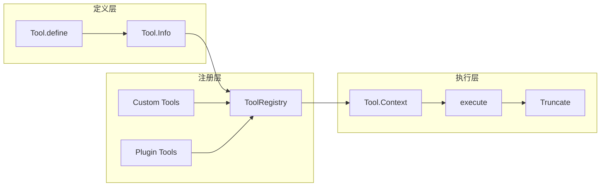

### 5.2 工具定义

```typescript
Tool.Info = {
  id: string,
  init: (ctx?: InitContext) => Promise<{
    description: string,
    parameters: ZodSchema,
    execute(args, ctx: Context): Promise<{
      title: string,
      metadata: Record<string, any>,
      output: string,
      attachments?: FilePart[],
    }>,
    formatValidationError?(error: ZodError): string,
  }>,
}
```

### 5.3 内置工具列表

| 工具 | 描述 | 权限 |
|------|------|------|
| `bash` | 执行 Shell 命令 | bash |
| `read` | 读取文件内容 | read |
| `write` | 写入文件 | edit |
| `edit` | 编辑文件 | edit |
| `glob` | 文件模式匹配 | glob |
| `grep` | 搜索文件内容 | grep |
| `task` | 创建子任务 | task |
| `todowrite` | 写入 TODO | todowrite |
| `todoread` | 读取 TODO | todoread |
| `webfetch` | 获取网页 | webfetch |
| `websearch` | 网页搜索 | websearch |
| `codesearch` | 代码搜索 | codesearch |
| `question` | 向用户提问 | question |
| `skill` | 加载技能 | skill |
| `apply_patch` | 应用补丁 (GPT) | edit |
| `lsp` | LSP 操作 | lsp |
| `batch` | 批量操作 (实验性) | batch |
| `plan_enter` | 进入规划模式 | plan_enter |
| `plan_exit` | 退出规划模式 | plan_exit |

### 5.4 工具执行上下文

```typescript
Tool.Context = {
  sessionID: string,
  messageID: string,
  agent: string,
  abort: AbortSignal,
  callID?: string,
  extra?: Record<string, any>,
  messages: MessageV2.WithParts[],
  
  // 方法
  metadata(input: { title?, metadata? }): void,
  ask(request: PermissionRequest): Promise<void>,
}
```

### 5.5 工具输出截断

```typescript
// 自动截断大输出
const result = await execute(args, ctx)
const truncated = await Truncate.output(result.output, {}, agent)
return {
  ...result,
  output: truncated.content,
  metadata: {
    ...result.metadata,
    truncated: truncated.truncated,
    outputPath: truncated.outputPath,
  },
}
```

---

## 6. Plugin 插件系统

### 6.1 插件架构

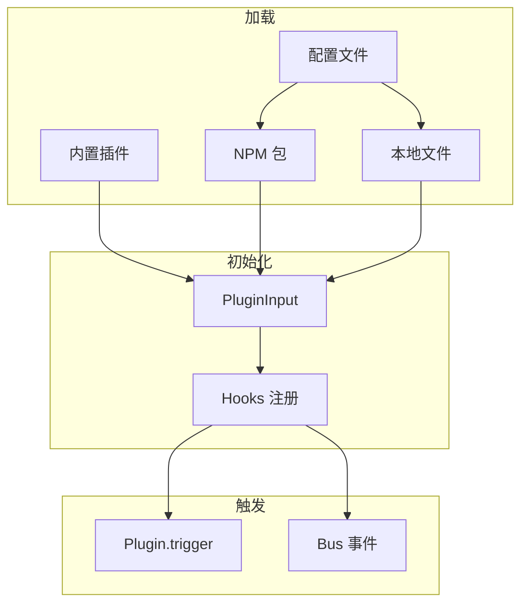

### 6.2 Plugin 输入

```typescript
PluginInput = {
  client: OpencodeClient,  // SDK 客户端
  project: Project,        // 项目信息
  worktree: string,        // 工作树路径
  directory: string,       // 工作目录
  serverUrl: string,       // 服务器 URL
  $: BunShell,            // Bun Shell
}
```

### 6.3 Hook 类型

| Hook 名称 | 触发时机 | 参数 |
|-----------|----------|------|
| `config` | 配置加载后 | config |
| `event` | Bus 事件 | { event } |
| `tool.execute.before` | 工具执行前 | { tool, sessionID, callID } |
| `tool.execute.after` | 工具执行后 | { tool, sessionID, callID }, result |
| `experimental.chat.system.transform` | 系统提示变换 | { model }, { system } |
| `experimental.chat.messages.transform` | 消息变换 | {}, { messages } |

### 6.4 插件触发机制

```typescript
// trigger 实现
async function trigger<Name>(
  name: Name,
  input: Input,
  output: Output
): Promise<Output> {
  for (const hook of await state().hooks) {
    const fn = hook[name]
    if (!fn) continue
    await fn(input, output)  // 依次调用每个插件的 hook
  }
  return output
}

// Bus 事件订阅
Bus.subscribeAll(async (event) => {
  for (const hook of hooks) {
    hook.event?.({ event })
  }
})
```

### 6.5 内置插件

| 插件 | 描述 |
|------|------|
| `CodexAuthPlugin` | OpenAI Codex 认证 |
| `CopilotAuthPlugin` | GitHub Copilot 认证 |
| `opencode-anthropic-auth` | Anthropic 认证 (NPM) |
| `@gitlab/opencode-gitlab-auth` | GitLab 认证 (NPM) |

---

## 7. Permission 权限系统

### 7.1 权限规则

```typescript
PermissionNext.Rule = {
  permission: string,  // 权限名称 (工具ID 或特殊权限)
  pattern: string,     // 匹配模式 (支持通配符)
  action: "allow" | "deny" | "ask",
}

// 示例
[
  { permission: "*", pattern: "*", action: "allow" },
  { permission: "read", pattern: "*.env", action: "ask" },
  { permission: "edit", pattern: "*", action: "deny" },
]
```

### 7.2 权限合并

```typescript
// 多层权限合并 (后者优先级高)
PermissionNext.merge(
  defaults,      // 默认权限
  agent.permission,  // Agent 权限
  session.permission, // 会话权限
  user.permission,   // 用户权限
)
```

### 7.3 权限检查流程

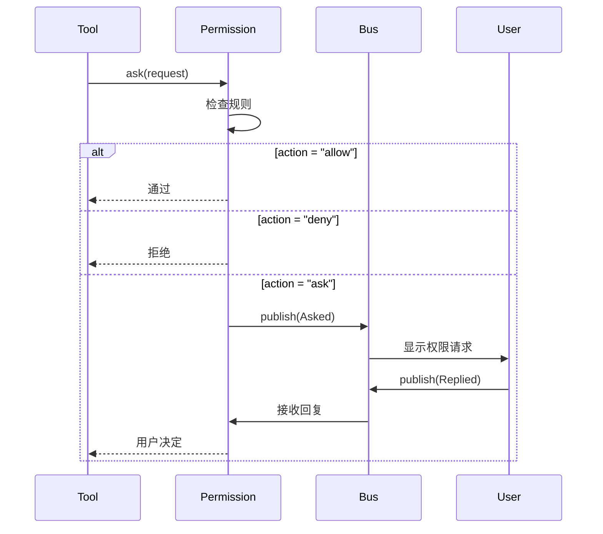

### 7.4 特殊权限

| 权限 | 描述 |
|------|------|
| `*` | 通配所有权限 |
| `doom_loop` | 防止无限循环 |
| `external_directory` | 外部目录访问 |
| `question` | 向用户提问 |
| `plan_enter` | 进入规划模式 |
| `plan_exit` | 退出规划模式 |

---

## 8. Provider 提供者系统

### 8.1 Provider 架构

```mermaid
flowchart LR
    subgraph SDK
        Anthropic[@ai-sdk/anthropic]
        OpenAI[@ai-sdk/openai]
        Google[@ai-sdk/google]
        Azure[@ai-sdk/azure]
        Others[...]
    end
    
    subgraph Loader
        Bundled[内置加载]
        Custom[自定义加载]
        Plugin[插件加载]
    end
    
    subgraph Model
        ModelInfo[Model.Info]
        Language[LanguageModel]
        Auth[认证信息]
    end
    
    SDK --> Bundled
    Bundled --> ModelInfo
    Custom --> ModelInfo
    Plugin --> ModelInfo
    
    ModelInfo --> Language
    Auth --> Language
```

### 8.2 内置 Provider

| Provider | SDK 包 |
|----------|--------|
| anthropic | @ai-sdk/anthropic |
| openai | @ai-sdk/openai |
| google | @ai-sdk/google |
| azure | @ai-sdk/azure |
| bedrock | @ai-sdk/amazon-bedrock |
| vertex | @ai-sdk/google-vertex |
| openrouter | @openrouter/ai-sdk-provider |
| xai | @ai-sdk/xai |
| mistral | @ai-sdk/mistral |
| groq | @ai-sdk/groq |
| deepinfra | @ai-sdk/deepinfra |
| cerebras | @ai-sdk/cerebras |
| cohere | @ai-sdk/cohere |
| togetherai | @ai-sdk/togetherai |
| perplexity | @ai-sdk/perplexity |
| vercel | @ai-sdk/vercel |
| gitlab | @gitlab/gitlab-ai-provider |
| github-copilot | 自定义兼容层 |

### 8.3 模型信息

```typescript
Provider.Model = {
  id: string,           // 模型 ID
  providerID: string,   // Provider ID
  api: {
    id: string,         // API 模型 ID
  },
  cost?: {
    input: number,
    output: number,
    cache?: {
      read: number,
      write: number,
    },
  },
}
```

---

## 9. MCP 协议支持

### 9.1 MCP 架构

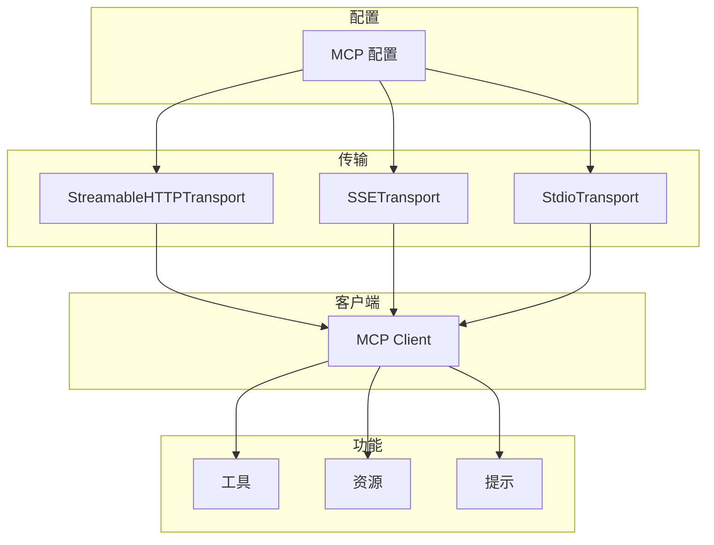

### 9.2 MCP 配置

```typescript
Config.Mcp = {
  type: "sse" | "http" | "stdio",
  enabled?: boolean,
  timeout?: number,
  
  // SSE/HTTP 类型
  url?: string,
  headers?: Record<string, string>,
  
  // Stdio 类型
  command?: string,
  args?: string[],
  env?: Record<string, string>,
}
```

### 9.3 MCP 状态

```typescript
MCP.Status = 
  | { status: "connected" }
  | { status: "disabled" }
  | { status: "failed", error: string }
  | { status: "needs_auth" }
  | { status: "needs_client_registration", error: string }
```

### 9.4 MCP 工具转换

```typescript
// MCP 工具 → AI SDK 工具
function convertMcpTool(mcpTool, client, timeout): Tool {
  return dynamicTool({
    description: mcpTool.description,
    inputSchema: jsonSchema(mcpTool.inputSchema),
    execute: async (args) => {
      return client.callTool({
        name: mcpTool.name,
        arguments: args,
      }, CallToolResultSchema, {
        resetTimeoutOnProgress: true,
        timeout,
      })
    },
  })
}
```

---

## 10. Bus 事件总线

### 10.1 事件架构

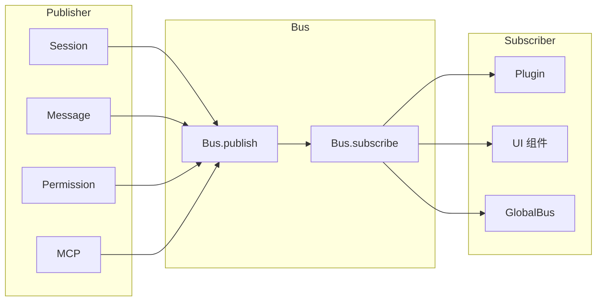

### 10.2 事件定义

```typescript
BusEvent.define("session.created", z.object({
  info: Session.Info,
}))

// 示例事件
Session.Event = {
  Created,
  Updated,
  Deleted,
  Diff,
  Error,
}

MessageV2.Event = {
  Updated,
  Removed,
  PartUpdated,
  PartRemoved,
}

PermissionNext.Event = {
  Asked,
  Replied,
}
```

### 10.3 事件订阅

```typescript
// 订阅特定事件
Bus.subscribe(Session.Event.Created, (event) => {
  console.log("Session created:", event.properties.info)
})

// 订阅所有事件
Bus.subscribeAll((event) => {
  console.log("Event:", event.type, event.properties)
})

// 一次性订阅
Bus.once(Session.Event.Created, (event) => {
  return "done"  // 返回 "done" 取消订阅
})
```

---

## 11. Config 配置系统

### 11.1 配置优先级

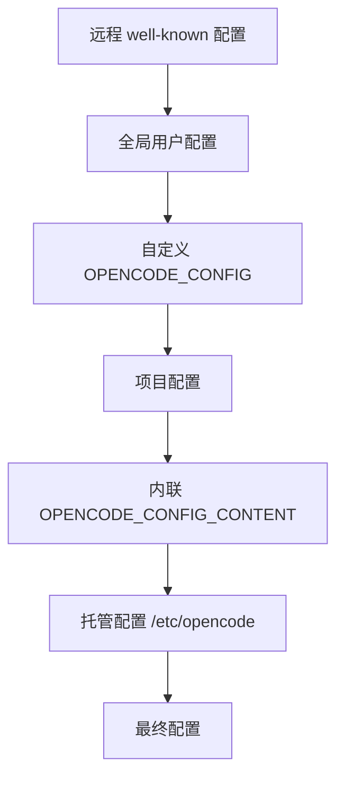

### 11.2 配置目录扫描

| 目录 | 内容 |
|------|------|
| `~/.opencode/` | 全局用户配置 |
| `.opencode/` | 项目配置 |
| `/etc/opencode` (Linux) | 企业托管配置 |
| `/Library/Application Support/opencode` (macOS) | 企业托管配置 |

### 11.3 配置文件

| 文件/目录 | 描述 |
|-----------|------|
| `opencode.json` / `opencode.jsonc` | 主配置文件 |
| `agent/*.{md,txt,yaml}` | Agent 定义 |
| `mode/*.{md,txt,yaml}` | Mode 定义 |
| `command/*.{md,txt,yaml}` | 命令定义 |
| `tool/*.{js,ts}` | 自定义工具 |
| `skill/*.{md,txt,yaml}` | 技能定义 |

### 11.4 核心配置项

```typescript
Config.Info = {
  $schema?: string,
  username?: string,
  
  // Agent 配置
  agent?: Record<string, AgentConfig>,
  default_agent?: string,
  
  // 权限配置
  permission?: Permission,
  
  // 插件配置
  plugin?: string[],
  instructions?: string[],
  
  // MCP 配置
  mcp?: Record<string, Mcp>,
  
  // Provider 配置
  provider?: Record<string, ProviderConfig>,
  
  // 实验性功能
  experimental?: {
    batch_tool?: boolean,
    openTelemetry?: boolean,
  },
}
```

---

## 12. SessionPrompt 处理流程

### 12.1 主循环

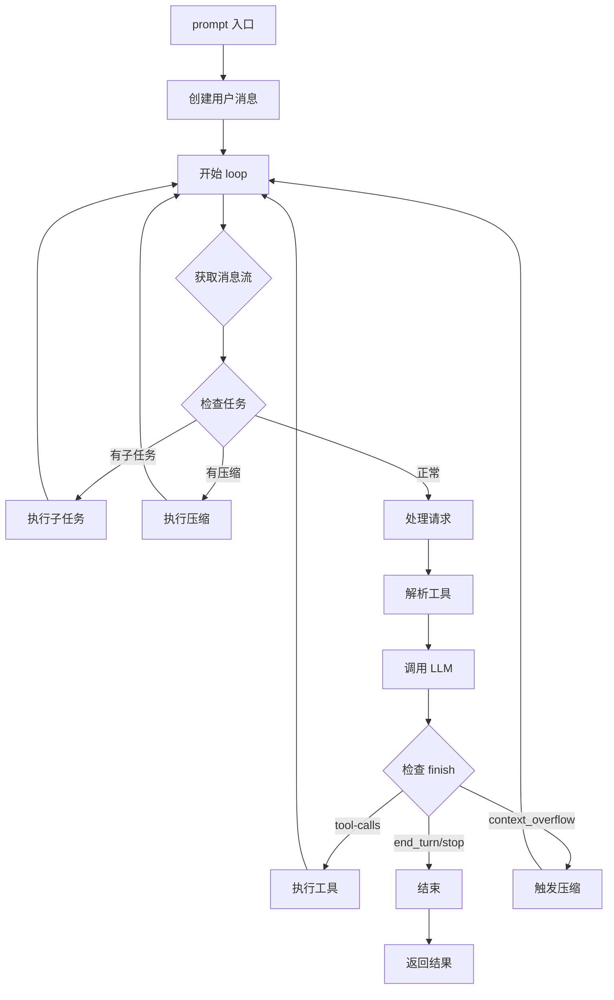

### 12.2 工具解析

```typescript
async function resolveTools({
  agent,
  session,
  model,
  tools,
  processor,
  bypassAgentCheck,
  messages,
}) {
  // 1. 获取注册工具
  const registeredTools = await ToolRegistry.tools(model, agent)
  
  // 2. 获取 MCP 工具
  const mcpTools = await MCP.tools()
  
  // 3. 合并工具
  const allTools = [...registeredTools, ...mcpTools]
  
  // 4. 权限过滤
  const filteredTools = await filterByPermission(allTools, agent)
  
  // 5. 转换为 AI SDK 格式
  return toAITools(filteredTools)
}
```

### 12.3 System Prompt 构建

```typescript
SystemPrompt = {
  // 获取基础指令
  instructions(): string,
  
  // 按模型选择 prompt
  provider(model): string[] {
    if (model.includes("gpt-5")) return [PROMPT_CODEX]
    if (model.includes("gpt-")) return [PROMPT_BEAST]
    if (model.includes("gemini-")) return [PROMPT_GEMINI]
    if (model.includes("claude")) return [PROMPT_ANTHROPIC]
    return [PROMPT_ANTHROPIC_WITHOUT_TODO]
  },
  
  // 环境信息
  environment(model): string[] {
    return [
      `Model: ${model.id}`,
      `Working directory: ${Instance.directory}`,
      `Git repo: ${project.vcs === "git"}`,
      `Platform: ${process.platform}`,
      `Date: ${new Date().toDateString()}`,
    ]
  },
}
```

---

## 13. Storage 存储系统

### 13.1 存储结构

```
~/.local/share/opencode/
├── session/
│   └── {projectID}/
│       └── {sessionID}.json
├── message/
│   └── {sessionID}/
│       └── {messageID}.json
├── part/
│   └── {messageID}/
│       └── {partID}.json
├── session_diff/
│   └── {sessionID}.json
└── plans/
    └── *.md
```

### 13.2 存储操作

```typescript
Storage = {
  read<T>(path: string[]): Promise<T | undefined>,
  write(path: string[], data: unknown): Promise<void>,
  remove(path: string[]): Promise<void>,
  list(prefix: string[]): Promise<string[][]>,
}
```

---

## 14. 关键设计模式

### 14.1 Instance 状态管理

```typescript
// 每个 Instance (工作目录) 独立状态
Instance.state(
  async () => { /* 初始化 */ },
  async (state) => { /* 清理 */ },
)

// 使用
const data = await state()
```

### 14.2 函数验证装饰器

```typescript
// fn 包装器：自动 Zod 验证
export const create = fn(
  z.object({
    parentID: z.string().optional(),
    title: z.string().optional(),
  }),
  async (input) => {
    // input 已经过验证
  },
)
```

### 14.3 事件驱动架构

```typescript
// 发布
Bus.publish(Session.Event.Created, { info: session })

// 订阅
Bus.subscribe(Session.Event.Created, handler)

// 跨进程
GlobalBus.emit("event", { directory, payload })
```

### 14.4 插件 Hook 链

```typescript
// 顺序调用所有插件的 hook
for (const hook of hooks) {
  await hook[name]?.(input, output)
  // output 可被修改，传递给下一个 hook
}
```

---

## 15. 扩展点

| 扩展点 | 方式 | 位置 |
|--------|------|------|
| 自定义 Agent | 配置文件 / .opencode/agent/ | opencode.json |
| 自定义工具 | .opencode/tool/*.ts | 自动加载 |
| 自定义命令 | .opencode/command/*.md | 配置文件 |
| 自定义技能 | .opencode/skill/*.md | 配置文件 |
| MCP 服务器 | 配置文件 mcp 字段 | opencode.json |
| 插件 | npm 包 / 本地文件 | plugin 字段 |
| Provider | 配置文件 provider 字段 | opencode.json |

---

## 16. 核心代码解读

### 16.1 Session 主循环 (SessionPrompt.loop)

Session 的核心是一个无限循环，处理 LLM 交互和工具调用：

```typescript
// opencode/packages/opencode/src/session/prompt.ts

export const loop = fn(Identifier.schema("session"), async (sessionID) => {
  // 1. 启动控制器（防止并发）
  const abort = start(sessionID)
  if (!abort) {
    // 已有循环在运行，等待其完成
    return new Promise<MessageV2.WithParts>((resolve, reject) => {
      const callbacks = state()[sessionID].callbacks
      callbacks.push({ resolve, reject })
    })
  }

  using _ = defer(() => cancel(sessionID))  // 自动清理

  let step = 0
  const session = await Session.get(sessionID)
  
  while (true) {
    SessionStatus.set(sessionID, { type: "busy" })
    log.info("loop", { step, sessionID })
    if (abort.aborted) break
    
    // 2. 获取消息历史（过滤已压缩的）
    let msgs = await MessageV2.filterCompacted(MessageV2.stream(sessionID))

    // 3. 查找关键消息
    let lastUser: MessageV2.User | undefined
    let lastAssistant: MessageV2.Assistant | undefined
    let lastFinished: MessageV2.Assistant | undefined
    let tasks: (MessageV2.CompactionPart | MessageV2.SubtaskPart)[] = []
    
    for (let i = msgs.length - 1; i >= 0; i--) {
      const msg = msgs[i]
      // ... 查找最后的 user/assistant 消息
      // ... 收集待处理的 subtask/compaction
    }

    // 4. 检查退出条件
    if (
      lastAssistant?.finish &&
      !["tool-calls", "unknown"].includes(lastAssistant.finish) &&
      lastUser.id < lastAssistant.id
    ) {
      log.info("exiting loop", { sessionID })
      break
    }

    step++
    if (step === 1) ensureTitle({ session, modelID, providerID, history: msgs })

    // 5. 处理待处理任务
    const task = tasks.pop()
    
    // 5.1 处理 subtask
    if (task?.type === "subtask") {
      const taskTool = await TaskTool.init()
      // 执行 task 工具并更新消息
      continue
    }

    // 5.2 处理 compaction
    if (task?.type === "compaction") {
      await SessionCompaction.process({ messages: msgs, parentID: lastUser.id, abort, sessionID })
      continue
    }

    // 5.3 检查上下文溢出
    if (await SessionCompaction.isOverflow({ tokens: lastFinished.tokens, model })) {
      await SessionCompaction.create({ sessionID, agent, model, auto: true })
      continue
    }

    // 6. 正常处理：调用 LLM
    const agent = await Agent.get(lastUser.agent)
    const processor = SessionProcessor.create({ ... })
    
    // 7. 解析工具
    const tools = await resolveTools({ agent, session, model, processor, messages: msgs })

    // 8. 调用 LLM
    const result = await processor.process({
      prompt: buildSystemPrompt({ agent, model }),
      messages: toAIMessages(msgs),
      tools,
      maxTokens: OUTPUT_TOKEN_MAX,
    })
    
    // 循环继续，直到 finish 不是 tool-calls
  }
})
```

**关键设计**:
- **防并发**: 同一 Session 只能有一个循环在运行
- **任务队列**: subtask 和 compaction 在主循环中处理
- **自动压缩**: 检测上下文溢出并触发压缩

---

### 16.2 工具注册表 (ToolRegistry)

工具系统支持内置工具、自定义工具和插件工具：

```typescript
// opencode/packages/opencode/src/tool/registry.ts

export namespace ToolRegistry {
  // Instance 级别状态（每个工作目录独立）
  export const state = Instance.state(async () => {
    const custom = [] as Tool.Info[]
    
    // 1. 扫描 .opencode/tool/ 目录
    const glob = new Bun.Glob("{tool,tools}/*.{js,ts}")
    for (const dir of await Config.directories()) {
      for await (const match of glob.scan({ cwd: dir, absolute: true })) {
        const namespace = path.basename(match, path.extname(match))
        const mod = await import(match)
        for (const [id, def] of Object.entries<ToolDefinition>(mod)) {
          custom.push(fromPlugin(id === "default" ? namespace : `${namespace}_${id}`, def))
        }
      }
    }

    // 2. 加载插件工具
    const plugins = await Plugin.list()
    for (const plugin of plugins) {
      for (const [id, def] of Object.entries(plugin.tool ?? {})) {
        custom.push(fromPlugin(id, def))
      }
    }

    return { custom }
  })

  // 所有工具列表（按需过滤）
  async function all(): Promise<Tool.Info[]> {
    const custom = await state().then((x) => x.custom)
    const config = await Config.get()

    return [
      InvalidTool,      // 占位工具（LLM 调用不存在的工具时返回提示）
      QuestionTool,     // 向用户提问
      BashTool,         // Shell 命令
      ReadTool,         // 读文件
      GlobTool,         // 文件匹配
      GrepTool,         // 搜索
      EditTool,         // 编辑
      WriteTool,        // 写入
      TaskTool,         // 子任务
      WebFetchTool,     // 网页获取
      TodoWriteTool,    // TODO 写入
      TodoReadTool,     // TODO 读取
      WebSearchTool,    // 网页搜索（需要 API）
      CodeSearchTool,   // 代码搜索（需要 API）
      SkillTool,        // 技能加载
      ApplyPatchTool,   // GPT 补丁格式
      // 实验性工具
      ...(config.experimental?.batch_tool ? [BatchTool] : []),
      ...custom,        // 自定义工具
    ]
  }

  // 按模型和 Agent 过滤工具
  export async function tools(model: { providerID, modelID }, agent?: Agent.Info) {
    const tools = await all()
    const result = await Promise.all(
      tools
        .filter((t) => {
          // GPT 模型使用 apply_patch，其他使用 edit/write
          const usePatch = model.modelID.includes("gpt-") && !model.modelID.includes("gpt-4")
          if (t.id === "apply_patch") return usePatch
          if (t.id === "edit" || t.id === "write") return !usePatch
          return true
        })
        .map(async (t) => ({ id: t.id, ...(await t.init({ agent })) })),
    )
    return result
  }
}
```

**关键设计**:
- **自动发现**: 扫描 `.opencode/tool/` 目录
- **模型适配**: GPT 使用 apply_patch 格式，其他使用 edit
- **延迟初始化**: 工具在使用时才初始化

---

### 16.3 权限系统 (PermissionNext)

权限系统支持三种动作：allow、deny、ask，使用通配符匹配：

```typescript
// opencode/packages/opencode/src/permission/next.ts

export namespace PermissionNext {
  // 规则定义
  export const Rule = z.object({
    permission: z.string(),  // 权限名（支持通配符）
    pattern: z.string(),     // 文件模式（支持通配符）
    action: z.enum(["allow", "deny", "ask"]),
  })

  // 评估权限
  export function evaluate(permission: string, pattern: string, ...rulesets: Ruleset[]): Rule {
    const merged = merge(...rulesets)
    // 从后往前找第一个匹配的规则（后面的覆盖前面的）
    const match = merged.findLast(
      (rule) => Wildcard.match(permission, rule.permission) && Wildcard.match(pattern, rule.pattern),
    )
    return match ?? { action: "ask", permission, pattern: "*" }  // 默认询问
  }

  // 请求权限
  export const ask = fn(
    Request.partial({ id: true }).extend({ ruleset: Ruleset }),
    async (input) => {
      const s = await state()
      
      for (const pattern of request.patterns ?? []) {
        const rule = evaluate(request.permission, pattern, ruleset, s.approved)
        
        if (rule.action === "deny") {
          throw new DeniedError(ruleset.filter(...))  // 直接拒绝
        }
        
        if (rule.action === "ask") {
          // 发布事件，等待 UI 响应
          return new Promise<void>((resolve, reject) => {
            const info: Request = { id, ...request }
            s.pending[id] = { info, resolve, reject }
            Bus.publish(Event.Asked, info)
          })
        }
        
        // action === "allow" → 继续检查下一个 pattern
      }
    },
  )

  // 响应权限请求
  export const reply = fn(
    z.object({ requestID, reply: z.enum(["once", "always", "reject"]) }),
    async (input) => {
      const s = await state()
      const existing = s.pending[input.requestID]
      
      if (input.reply === "reject") {
        existing.reject(new RejectedError())
        // 拒绝同一 Session 的所有待处理权限
        for (const [id, pending] of Object.entries(s.pending)) {
          if (pending.info.sessionID === existing.info.sessionID) {
            delete s.pending[id]
            pending.reject(new RejectedError())
          }
        }
        return
      }
      
      if (input.reply === "once") {
        existing.resolve()  // 单次允许
        return
      }
      
      if (input.reply === "always") {
        // 永久允许：添加到已批准列表
        for (const pattern of existing.info.always) {
          s.approved.push({
            permission: existing.info.permission,
            pattern,
            action: "allow",
          })
        }
        existing.resolve()
        
        // 自动解决其他可以通过的请求
        for (const [id, pending] of Object.entries(s.pending)) {
          const ok = pending.info.patterns.every(
            (pattern) => evaluate(pending.info.permission, pattern, s.approved).action === "allow",
          )
          if (ok) {
            delete s.pending[id]
            pending.resolve()
          }
        }
      }
    },
  )
}
```

**关键设计**:
- **规则优先级**: 后定义的规则覆盖前面的
- **通配符匹配**: 支持 `*` 匹配任意字符
- **批量处理**: "always" 响应自动解决其他待处理请求

---

### 16.4 Agent 定义与权限合并

Agent 系统支持内置和自定义 Agent：

```typescript
// opencode/packages/opencode/src/agent/agent.ts

export namespace Agent {
  export const Info = z.object({
    name: z.string(),
    mode: z.enum(["subagent", "primary", "all"]),  // 模式
    permission: PermissionNext.Ruleset,             // 权限规则
    prompt: z.string().optional(),                  // 系统提示词
    model: z.object({ modelID, providerID }).optional(),  // 指定模型
    steps: z.number().positive().optional(),        // 最大步骤数
    // ...
  })

  const state = Instance.state(async () => {
    const cfg = await Config.get()

    // 1. 默认权限
    const defaults = PermissionNext.fromConfig({
      "*": "allow",
      doom_loop: "ask",       // 防止死循环
      question: "deny",       // 默认不允许提问
      plan_enter: "deny",     // 默认不允许进入 plan 模式
      read: {
        "*": "allow",
        "*.env": "ask",       // .env 文件需要确认
      },
    })
    
    // 2. 用户自定义权限
    const user = PermissionNext.fromConfig(cfg.permission ?? {})

    // 3. 内置 Agent
    const result: Record<string, Info> = {
      build: {
        name: "build",
        mode: "primary",
        // 权限合并：defaults + 特殊权限 + user 覆盖
        permission: PermissionNext.merge(
          defaults,
          PermissionNext.fromConfig({
            question: "allow",   // build 允许提问
            plan_enter: "allow", // build 允许进入 plan
          }),
          user,  // 用户覆盖最高优先级
        ),
      },
      explore: {
        name: "explore",
        mode: "subagent",
        prompt: PROMPT_EXPLORE,
        // 只读权限
        permission: PermissionNext.merge(
          defaults,
          PermissionNext.fromConfig({
            "*": "deny",      // 默认禁用所有
            grep: "allow",    // 只允许搜索
            glob: "allow",
            read: "allow",
            bash: "allow",
            websearch: "allow",
          }),
          user,
        ),
      },
      plan: {
        name: "plan",
        mode: "primary",
        // 只能编辑 .md 文件
        permission: PermissionNext.merge(
          defaults,
          PermissionNext.fromConfig({
            plan_exit: "allow",
            edit: {
              "*": "deny",
              ".opencode/plans/*.md": "allow",  // 只能编辑计划文件
            },
          }),
          user,
        ),
      },
      // ...更多内置 Agent
    }

    // 4. 加载自定义 Agent（从 .opencode/agent/ 目录）
    const glob = new Bun.Glob("{agent,agents}/*.md")
    for (const dir of await Config.directories()) {
      for await (const file of glob.scan({ cwd: dir, absolute: true })) {
        const content = await fs.readFile(file, "utf-8")
        const parsed = parseAgentMarkdown(content)
        result[parsed.name] = {
          ...parsed,
          // 自定义 Agent 权限也合并 defaults 和 user
          permission: PermissionNext.merge(defaults, parsed.permission ?? [], user),
        }
      }
    }

    return result
  })
}
```

**关键设计**:
- **权限层叠**: defaults → agent 特殊权限 → user 覆盖
- **模式区分**: primary（使用用户选择的模型）vs subagent（可能使用不同模型）
- **Markdown 定义**: 支持 `.opencode/agent/*.md` 格式定义 Agent

---

### 16.5 插件系统 (Plugin)

插件系统支持 Hook 链和事件订阅：

```typescript
// opencode/packages/opencode/src/plugin/index.ts

export namespace Plugin {
  // 内置插件（直接 import）
  const INTERNAL_PLUGINS: PluginInstance[] = [CodexAuthPlugin, CopilotAuthPlugin]
  
  // 默认插件（npm 包）
  const BUILTIN = ["opencode-anthropic-auth@0.0.13", "@gitlab/opencode-gitlab-auth@1.3.2"]

  const state = Instance.state(async () => {
    // 1. 创建 SDK 客户端供插件使用
    const client = createOpencodeClient({
      baseUrl: "http://localhost:4096",
      fetch: async (...args) => Server.App().fetch(...args),
    })
    
    // 2. 插件输入上下文
    const input: PluginInput = {
      client,                       // OpenCode SDK 客户端
      project: Instance.project,    // 项目信息
      worktree: Instance.worktree,  // 工作树路径
      directory: Instance.directory, // 工作目录
      serverUrl: Server.url(),      // 服务器 URL
      $: Bun.$,                     // Bun shell
    }

    const hooks: Hooks[] = []

    // 3. 加载内置插件
    for (const plugin of INTERNAL_PLUGINS) {
      const init = await plugin(input)
      hooks.push(init)
    }

    // 4. 加载配置中的插件
    for (let plugin of config.plugin ?? []) {
      if (!plugin.startsWith("file://")) {
        // npm 包：安装后 import
        plugin = await BunProc.install(pkg, version)
      }
      const mod = await import(plugin)
      for (const [_, fn] of Object.entries<PluginInstance>(mod)) {
        const init = await fn(input)
        hooks.push(init)
      }
    }

    return { hooks, input }
  })

  // 触发 Hook（所有插件顺序调用）
  export async function trigger<Name extends keyof Hooks>(
    name: Name,
    input: Parameters<Hooks[Name]>[0],
    output: Parameters<Hooks[Name]>[1],
  ): Promise<typeof output> {
    for (const hook of await state().then((x) => x.hooks)) {
      const fn = hook[name]
      if (!fn) continue
      await fn(input, output)  // output 可被修改
    }
    return output
  }

  // 初始化：订阅所有事件并转发给插件
  export async function init() {
    Bus.subscribeAll(async (input) => {
      const hooks = await state().then((x) => x.hooks)
      for (const hook of hooks) {
        hook["event"]?.({ event: input })  // 转发事件
      }
    })
  }
}
```

**关键设计**:
- **Hook 链**: 所有插件顺序调用，output 可被修改传递
- **事件转发**: 所有 Bus 事件自动转发给插件
- **npm 安装**: 自动安装配置的 npm 包

---

### 16.6 MCP 工具转换

MCP 服务器的工具被转换为 OpenCode 工具格式：

```typescript
// opencode/packages/opencode/src/mcp/index.ts

export namespace MCP {
  // MCP 工具转换为 OpenCode 工具
  function mcpToolToOpenCodeTool(
    serverID: string,
    tool: mcpTool,
    client: McpClient,
  ): Tool.Info {
    return {
      id: `mcp_${serverID}_${tool.name}`,
      init: async () => ({
        description: tool.description ?? "",
        parameters: jsonSchemaToZod(tool.inputSchema),
        
        async execute(args, ctx) {
          // 调用 MCP 服务器
          const result = await client.callTool({
            name: tool.name,
            arguments: args,
          })
          
          // 转换结果
          return {
            title: `mcp.${serverID}.${tool.name}`,
            output: formatMcpResult(result),
            metadata: {},
          }
        },
      }),
    }
  }

  // 获取所有 MCP 工具
  export async function tools(): Promise<Tool.Info[]> {
    const result: Tool.Info[] = []
    
    for (const [serverID, client] of await clients()) {
      if (!client.connected) continue
      
      const toolList = await client.listTools()
      for (const tool of toolList.tools) {
        result.push(mcpToolToOpenCodeTool(serverID, tool, client))
      }
    }
    
    return result
  }
}
```

**关键设计**:
- **命名空间**: MCP 工具 ID 格式为 `mcp_{serverID}_{toolName}`
- **Schema 转换**: JSON Schema 转换为 Zod Schema
- **延迟连接**: MCP 服务器在需要时才连接

---

### 16.7 消息压缩 (SessionCompaction)

当上下文溢出时，自动压缩历史消息：

```typescript
// opencode/packages/opencode/src/session/compaction.ts

export namespace SessionCompaction {
  // 检查是否溢出
  export async function isOverflow(opts: { tokens: Tokens, model: Model }): Promise<boolean> {
    const contextWindow = model.contextWindow ?? 128000
    const threshold = contextWindow * 0.85  // 85% 阈值
    const used = tokens.input + tokens.output + tokens.reasoning
    return used > threshold
  }

  // 创建压缩任务
  export async function create(opts: CreateInput): Promise<void> {
    await Session.updatePart({
      id: Identifier.ascending("part"),
      messageID: opts.messageID,
      sessionID: opts.sessionID,
      type: "compaction",
      auto: opts.auto,
    })
  }

  // 处理压缩
  export async function process(opts: ProcessInput): Promise<"continue" | "stop"> {
    const { messages, sessionID, abort } = opts
    
    // 1. 使用 compaction Agent 生成摘要
    const agent = await Agent.get("compaction")
    const model = await Provider.getModel(...)
    
    const prompt = buildCompactionPrompt(messages)
    const result = await LLM.generate({
      model,
      messages: [{ role: "user", content: prompt }],
      system: agent.prompt,
    })
    
    // 2. 创建摘要消息
    const summary = extractSummary(result)
    
    // 3. 标记旧消息为已压缩
    for (const msg of messages.slice(0, -5)) {  // 保留最近 5 条
      await MessageV2.markCompacted(msg.info.id)
    }
    
    // 4. 插入摘要消息
    await Session.updatePart({
      type: "text",
      text: `[Context Summary]\n${summary}`,
      synthetic: true,  // 标记为合成消息
    })
    
    return "continue"
  }
}
```

**关键设计**:
- **85% 阈值**: 在上下文用满前触发压缩
- **保留最近消息**: 压缩时保留最近 5 条消息
- **合成标记**: 摘要消息标记为 synthetic
