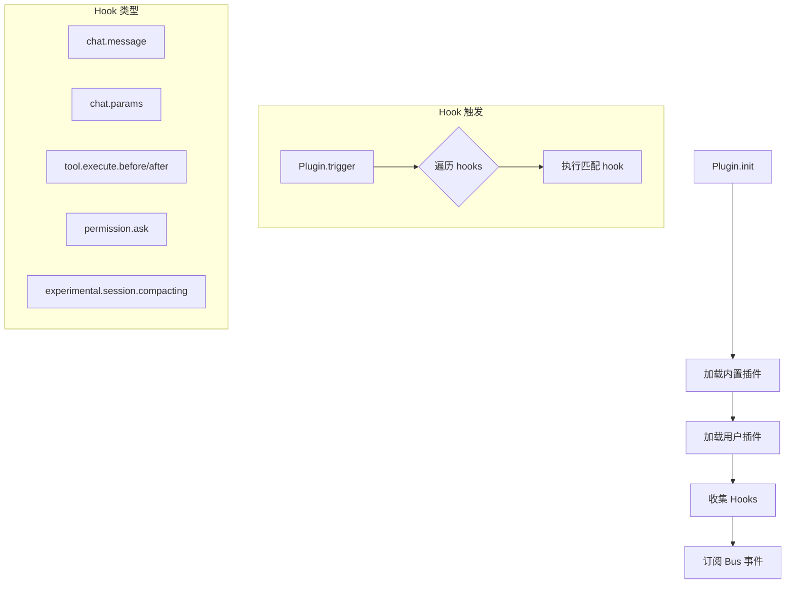

# opencode 插件 Hook 逻辑

## 概述
opencode 是开源 AI coding agent，采用插件架构，通过 Hook 系统实现可扩展能力。

## 核心流程


## 关键文件与函数

| 文件 | 类/函数 | 作用 |
|------|---------|------|
| [opencode/packages/plugin/src/index.ts](../../../opencode/packages/plugin/src/index.ts) | `Plugin` 类型, `Hooks` 接口 | 插件 API 定义，声明所有可用 hook 类型 |
| [opencode/packages/opencode/src/plugin/index.ts](../../../opencode/packages/opencode/src/plugin/index.ts) | `Plugin.init`, `Plugin.trigger`, `Plugin.list` | 插件加载、hook 触发、hooks 列表 |
| [opencode/packages/opencode/src/bus/index.ts](../../../opencode/packages/opencode/src/bus/index.ts) | `Bus` | 事件总线，用于向插件广播事件 |

## Hook 类型

| Hook 名称 | 触发时机 | 用途 |
|-----------|----------|------|
| `chat.message` | 新消息到达时 | 拦截/修改用户消息 |
| `chat.params` | 发送请求前 | 修改 LLM 参数（temperature、topP 等） |
| `chat.headers` | 发送请求前 | 修改请求头 |
| `tool.execute.before` | 工具执行前 | 修改工具参数 |
| `tool.execute.after` | 工具执行后 | 修改工具输出 |
| `permission.ask` | 权限请求时 | 自动授权/拒绝 |
| `command.execute.before` | 命令执行前 | 注入额外内容 |
| `experimental.chat.messages.transform` | 消息发送前 | 消息变换 |
| `experimental.chat.system.transform` | 系统提示生成时 | 修改系统提示 |
| `experimental.session.compacting` | 会话压缩前 | 注入压缩上下文 |
| `experimental.text.complete` | 文本补全时 | 修改补全结果 |

见 [opencode/packages/plugin/src/index.ts#L130-L227](../../../opencode/packages/plugin/src/index.ts)

## 插件加载流程

```typescript
// opencode/packages/opencode/src/plugin/index.ts
export namespace Plugin {
  export async function init() {
    // 1. 加载内置插件
    for (const plugin of INTERNAL_PLUGINS) {
      const init = await plugin(input)
      hooks.push(init)
    }

    // 2. 加载用户配置插件
    for (let plugin of plugins) {
      const mod = await import(plugin)
      for (const [_name, fn] of Object.entries(mod)) {
        const init = await fn(input)
        hooks.push(init)
      }
    }

    // 3. 订阅 Bus 事件
    Bus.subscribeAll(async (input) => {
      for (const hook of hooks) {
        hook["event"]?.(input)
      }
    })
  }

  export async function trigger(name, input, output) {
    for (const hook of hooks) {
      const fn = hook[name]
      if (fn) await fn(input, output)
    }
    return output
  }
}
```

见 [opencode/packages/opencode/src/plugin/index.ts](../../../opencode/packages/opencode/src/plugin/index.ts)

## 内置插件

| 插件 | 用途 | 源文件 |
|------|------|--------|
| CodexAuthPlugin | OpenAI Codex 认证 | [codex.ts](../../../opencode/packages/opencode/src/plugin/codex.ts) |
| CopilotAuthPlugin | GitHub Copilot 认证 | [copilot.ts](../../../opencode/packages/opencode/src/plugin/copilot.ts) |

## PluginInput 结构

```typescript
export type PluginInput = {
  client: ReturnType<typeof createOpencodeClient>  // API 客户端
  project: Project                                  // 项目信息
  directory: string                                 // 工作目录
  worktree: string                                  // Git worktree
  serverUrl: URL                                    // 服务器 URL
  $: BunShell                                       // Shell 执行器
}
```

见 [opencode/packages/plugin/src/index.ts#L25-L32](../../../opencode/packages/plugin/src/index.ts)
