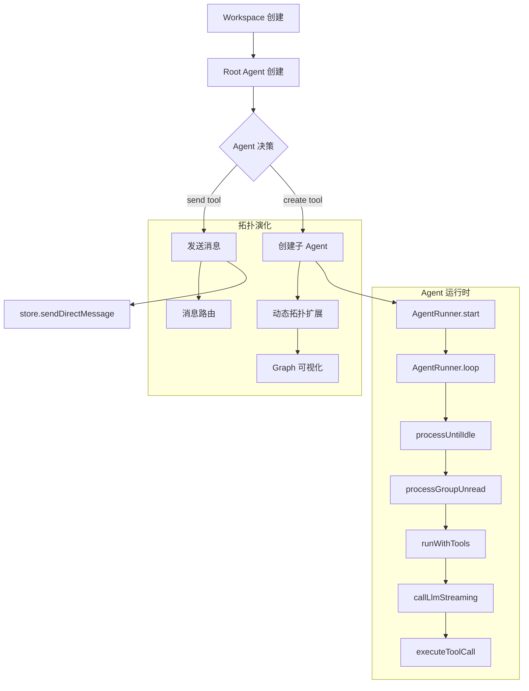

# swarm-ide 拓扑逻辑

## 概述
swarm-ide 是自组织 Agent 蜂群系统，支持动态创建子代理、消息分发与图形化协作视图。

## 设计哲学
- **极简原语**：系统只依赖少量通信原语（create + send）即可表达多 Agent 行为
- **液态拓扑**：拓扑不预设、在运行中自演化；遇到复杂任务时由 Agent 主动"雇佣"下属
- **扁平协作**：人类可以像聊天一样介入任意层级，使复杂拓扑可观察、可调试、可介入

## 核心流程


## 关键文件与函数

| 文件 | 类/函数 | 作用 |
|------|---------|------|
| [swarm-ide/backend/src/runtime/agent-runtime.ts](../../../swarm-ide/backend/src/runtime/agent-runtime.ts) | `AgentRunner`, `AgentRunner.loop`, `processUntilIdle`, `runWithTools`, `executeToolCall` | Agent 运行时核心，消息处理与工具执行 |
| [swarm-ide/backend/src/runtime/event-bus.ts](../../../swarm-ide/backend/src/runtime/event-bus.ts) | `AgentEventBus`, `emit`, `subscribe` | 事件总线，用于 agent 间事件通信 |
| [swarm-ide/backend/src/runtime/ui-bus.ts](../../../swarm-ide/backend/src/runtime/ui-bus.ts) | `getWorkspaceUIBus` | 向前端推送 UI 事件 |
| [swarm-ide/backend/src/lib/storage.ts](../../../swarm-ide/backend/src/lib/storage.ts) | `store` | 数据存储层（agent、group、message） |

## Agent 运行时

### AgentRunner 类
```typescript
class AgentRunner {
  private wake = createDeferred<void>()
  private started = false
  private running = false

  constructor(
    private readonly agentId: UUID,
    private readonly bus: AgentEventBus,
    private readonly ensureRunner: (agentId: UUID) => void,
    private readonly wakeAgent: (agentId: UUID) => void
  ) {}

  start() { /* 启动事件循环 */ }
  wakeup(reason) { /* 唤醒 agent */ }
  private async loop() { /* 主循环 */ }
  private async processUntilIdle() { /* 处理未读消息直到空闲 */ }
  private async processGroupUnread() { /* 处理 group 未读消息 */ }
  private async runWithTools() { /* LLM 调用与工具执行 */ }
  private async executeToolCall() { /* 执行单个工具调用 */ }
}
```

见 [swarm-ide/backend/src/runtime/agent-runtime.ts](../../../swarm-ide/backend/src/runtime/agent-runtime.ts)

### 事件总线
```typescript
class AgentEventBus {
  emit(agentId: string, event: AgentEvent) { /* 发送事件 */ }
  subscribe(agentId: string, listener: Listener) { /* 订阅事件 */ }
}
```

事件类型：
- `agent.wakeup`：Agent 被唤醒
- `agent.unread`：有未读消息
- `agent.stream`：LLM 流式输出
- `agent.done`：处理完成
- `agent.error`：发生错误

见 [swarm-ide/backend/src/runtime/event-bus.ts](../../../swarm-ide/backend/src/runtime/event-bus.ts)

## Agent 内置 Tools

| Tool | 作用 | 参数 |
|------|------|------|
| `create` | 创建子 agent | `role`, `guidance` |
| `self` | 获取当前 agent 身份 | - |
| `list_agents` | 列出 workspace 所有 agent | - |
| `send` | 向指定 agent 发送消息 | `to`, `content` |
| `list_groups` | 列出可见 group | - |
| `list_group_members` | 列出 group 成员 | `groupId` |
| `create_group` | 创建 group | `memberIds`, `name` |
| `send_group_message` | 向 group 发送消息 | `groupId`, `content` |
| `send_direct_message` | 直接消息 | `toAgentId`, `content` |
| `get_group_messages` | 获取 group 消息历史 | `groupId` |
| `bash` | 执行 shell 命令 | `command`, `cwd`, `timeoutMs` |

见 [swarm-ide/backend/src/runtime/agent-runtime.ts#L30-L170](../../../swarm-ide/backend/src/runtime/agent-runtime.ts)

## 拓扑设计要点

### 动态创建
Agent 通过 `create` tool 动态创建子 agent，拓扑在运行时自演化。

```typescript
// create tool 定义
{
  name: "create",
  description: "Create a sub-agent with the given role for delegation.",
  parameters: {
    properties: {
      role: { type: "string", description: "Role name for the new agent" },
      guidance: { type: "string", description: "Extra system guidance" }
    },
    required: ["role"]
  }
}
```

### 消息路由
Agent 通过 `send`/`send_direct_message`/`send_group_message` 向任意 agent 发送消息。

消息流程：
1. Agent 调用 send tool
2. `store.sendDirectMessage()` 创建/复用 P2P group
3. 目标 Agent 的 `AgentRunner.wakeup()` 被触发
4. 目标 Agent 处理消息并可能回复

### 事件驱动
`AgentEventBus` 管理 agent 事件，支持 SSE 实时推送到前端。

### Graph 可视化
前端通过 SSE 订阅拓扑与消息流动，实时渲染协作图。

见 [swarm-ide/backend/app/graph/](../../../swarm-ide/backend/app/graph/)

## 技术栈

- **后端**：Next.js Route Handlers + Bun
- **数据库**：PostgreSQL + Drizzle ORM
- **缓存/事件**：Redis
- **LLM**：GLM / OpenRouter（可配置）
- **前端**：React + Tailwind CSS

见 [swarm-ide/backend/package.json](../../../swarm-ide/backend/package.json)
