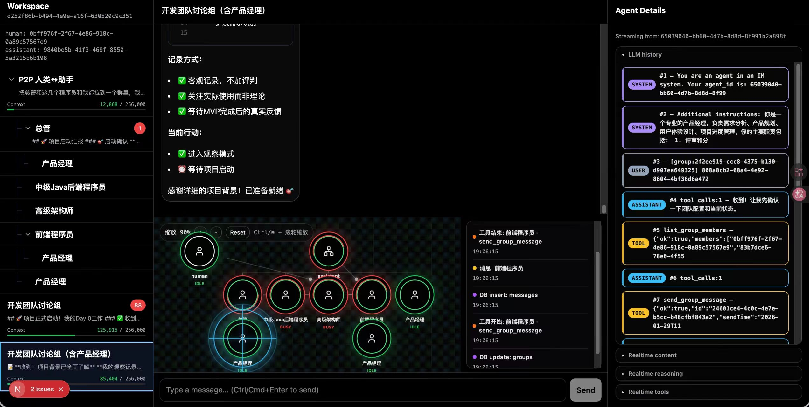

# Swarm-IDE: Self-Organizing Agent Swarm

[](https://www.bilibili.com/video/BV1X163BQE5c/?share_source=copy_web&vd_source=e0705640ea2f51669a392fb07684e286)

## 🎬 Video (Open‑source Kimi‑K2.5 Multi‑Agent Swarm)
- Demo (inline playback):
<video src="https://github.com/user-attachments/assets/4ebd88c6-bbdb-4714-87a5-54d1fed08db8" width="100%" controls></video>
- Bilibili full demo: https://www.bilibili.com/video/BV1X163BQE5c/?share_source=copy_web&vd_source=e0705640ea2f51669a392fb07684e286

## WeChat Group


## Advantages
- Create sub‑agents dynamically
- Message any agent directly
- WeChat‑style chat UI: intervene at any depth anytime
- Streaming graph that visualizes collaboration in real time

## UI Design
- Graph shows swarm topology and live communication links
- Tree‑structured multi‑level dialogs: talk to any agent like a chat app (even deep ones)
- LLM history panel: shows the agent’s context; no more black box
- Streaming tool‑call parameters in real time

## Philosophy
- Minimal primitives: only a few communication primitives are required (core is create + send)
- Liquid topology: topology evolves during runtime; agents “hire” sub‑agents on demand
- Flat collaboration: humans can step into any layer at any time

## Concept
No complex nodes/edges abstraction — just think of “many people”:

Everyone can spawn children and talk to anyone.

With only these two capabilities, any structure can be built.

## How to Run
```
cd agent-wechat
cd backend

cp .env.example .env.local
# Fill your keys and model names in .env.local

docker compose up -d
curl -X POST http://127.0.0.1:3017/api/admin/init-db
bun install
bun dev
```

Open http://localhost:3017

Click init-db, then create a workspace to start.

Try: “Create 3 children, ask them to message each other, then have each create 3 grandchildren.”

## Zhihu
https://zhuanlan.zhihu.com/p/2000736341479138182

## Environment Variables
The backend reads `backend/.env.local`:
- `GLM_API_KEY` / `GLM_MODEL` (I use **GLM CodingPlan**)
- `OPENROUTER_API_KEY` / `OPENROUTER_MODEL` (I use **OpenRouter Kimi 2.5**)
- See `backend/.env.example` for all fields
